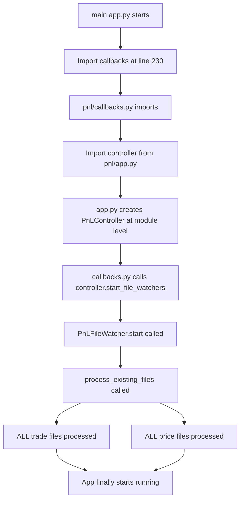
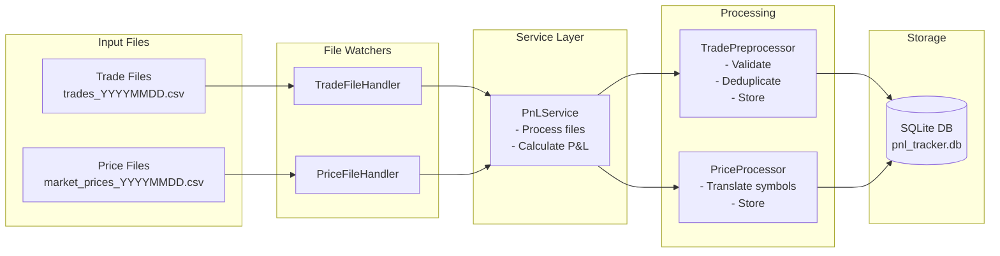

# P&L Preprocessing Flow Analysis

## Current Issues Identified

### 1. **DUPLICATE PROCESSING ON STARTUP**
The P&L system is processing ALL historical trade files during module import, causing slow startup times.

### 2. **Root Cause**
- `apps/dashboards/pnl/callbacks.py` calls `controller.start_file_watchers()` at module level (line 435)
- This happens during import, BEFORE the app starts
- File watchers immediately call `process_existing_files()` which processes ALL historical files synchronously

## Detailed Preprocessing Flow

### Startup Sequence



### File Processing Pipeline



### Detailed Processing Steps

#### 1. Trade File Processing
```
trade_ledger/trades_YYYYMMDD.csv
    ↓
PnLFileWatcher.process_existing_files()
    ↓
TradeFileHandler.callback(file_path)
    ↓
PnLService.process_trade_file(file_path)
    ↓
TradePreprocessor.process_file(file_path)
    ↓
    • Read CSV into DataFrame
    • Filter by cutover time (4pm CDT)
    • Validate required columns
    • Remove duplicates
    • Apply symbol translation
    • Store in database (trades table)
    • Mark file as processed
```

#### 2. Price File Processing
```
market_prices/futures/market_prices_YYYYMMDD.csv
    ↓
PnLFileWatcher.process_existing_files()
    ↓
PriceFileHandler.callback(file_path)
    ↓
PnLService.process_market_price_file(file_path)
    ↓
PriceProcessor.process_file(file_path)
    ↓
    • Read CSV into DataFrame
    • Select prices (3pm if weekday, 5pm if Friday)
    • Translate symbols (Actant → Bloomberg)
    • Store in database (market_prices table)
    • Mark file as processed
```

## Problems with Current Flow

### 1. **Synchronous Blocking**
- All file processing happens synchronously during import
- Blocks app startup until complete
- No progress indication to user

### 2. **No Incremental Processing**
- `process_existing_files()` processes ALL files every time
- Even if files were already processed in previous runs
- Database has `processed_files` table but it's not checked efficiently

### 3. **Multiple Processing Layers**
- Controller → Service → Preprocessor
- Each layer adds overhead
- Symbol translation happens multiple times

### 4. **Inefficient File Discovery**
- Uses `glob("trades_*.csv")` which returns all files
- Then processes each one individually
- No batching or parallel processing

## Enhancement Recommendations

### 1. **Lazy Initialization**
```python
# In callbacks.py - DON'T start watchers at module level
# Instead, start them on first user interaction or with a startup callback

@callback(
    Output("startup-complete", "data"),
    Input("startup-trigger", "n_intervals"),
    prevent_initial_call=False
)
def initialize_watchers(n):
    if not controller.watcher_started:
        controller.start_file_watchers()
    return True
```

### 2. **Smart File Processing**
```python
def process_existing_files_smart(self):
    """Only process files that haven't been processed yet"""
    
    # Get list of already processed files from database
    processed = self.service.get_processed_files()
    processed_set = set(processed)
    
    # Only process new files
    trade_files = sorted(self.trade_dir.glob("trades_*.csv"))
    new_trade_files = [f for f in trade_files if f.name not in processed_set]
    
    if new_trade_files:
        logger.info(f"Processing {len(new_trade_files)} new trade files...")
        for file_path in new_trade_files:
            self.trade_handler.callback(str(file_path), 'trades')
```

### 3. **Async Processing**
```python
# Use threading or asyncio for file processing
import concurrent.futures

def process_files_async(self, files):
    with concurrent.futures.ThreadPoolExecutor(max_workers=4) as executor:
        futures = []
        for file in files:
            future = executor.submit(self.process_single_file, file)
            futures.append(future)
        
        # Wait for all to complete
        concurrent.futures.wait(futures)
```

### 4. **Progress Tracking**
```python
# Add progress callback to show startup progress
def process_with_progress(self, files, progress_callback):
    total = len(files)
    for i, file in enumerate(files):
        self.process_file(file)
        progress_callback(i + 1, total)
```

### 5. **Batch Processing**
```python
# Process multiple files in one database transaction
def process_files_batch(self, files):
    all_trades = []
    
    for file in files:
        df = self.read_and_validate(file)
        all_trades.append(df)
    
    # Combine and process all at once
    combined_df = pd.concat(all_trades)
    self.storage.store_trades_batch(combined_df)
```

## Immediate Fix

For an immediate fix to reduce startup time:

```python
# In apps/dashboards/pnl/callbacks.py
# Comment out the automatic start
# try:
#     controller.start_file_watchers()
#     logger.info("P&L file watchers started successfully")
# except Exception as e:
#     logger.error(f"Failed to start P&L file watchers: {e}")

# Add a callback to start watchers on demand
@callback(
    Output("watcher-status", "children"),
    Input("start-watchers-button", "n_clicks"),
    prevent_initial_call=True
)
def start_watchers_on_demand(n_clicks):
    if n_clicks and not controller.watcher_started:
        controller.start_file_watchers()
        return "Watchers started"
    return "Watchers already running"
```

This will prevent the automatic processing of all files on startup and only process them when explicitly requested. 