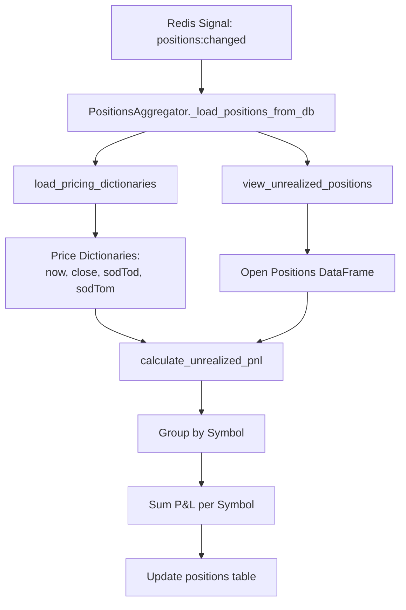

# Unrealized P&L Calculation Flow

## Overview

This document describes the exact flow of unrealized P&L calculation as implemented by the `PositionsAggregator` in production.

## Calculation Triggers

Unrealized P&L is recalculated when:

1. **New trades arrive** - Trade Ledger Watcher publishes `positions:changed`
2. **Prices update** - Price updates publish `positions:changed`

## Calculation Flow



## Key Functions

### 1. `view_unrealized_positions(conn, method)`
- Queries `trades_fifo` or `trades_lifo` for positions with `quantity > 0`
- Returns DataFrame with: symbol, quantity, price, buySell, sequenceId, time

### 2. `load_pricing_dictionaries(conn)`
- Loads all prices from `pricing` table
- Returns dict with 4 price types:
  - `now`: Current market price
  - `close`: Today's close/settle price
  - `sodTod`: Start of Day Today price
  - `sodTom`: Start of Day Tomorrow price

### 3. `calculate_unrealized_pnl(positions_df, price_dicts, method)`
- Core calculation logic with multiple components:

#### Pmax Logic (Entry Price Determination)
```python
# If trade is from before yesterday 5pm Chicago → use SOD price
# If trade is from after yesterday 5pm Chicago → use actual trade price
```

#### Time-Based Calculation
- **Before 2pm Chicago**: Use sodTod as intermediate price
- **After 2pm Chicago**: Use sodTom as intermediate price

#### P&L Formula
```python
# Before 2pm:
pnl = ((sodTod - entry_price) * qty + (now_price - sodTod) * qty) * 1000

# After 2pm:
pnl = ((sodTom - entry_price) * qty + (now_price - sodTom) * qty) * 1000

# Short positions (Sell): negate the P&L
```

## Price Fallback Logic

If any price is missing from the `pricing` table:
- Falls back to the actual trade price
- This ensures calculation doesn't fail but P&L will be 0

## Aggregation by Symbol

The PositionsAggregator groups positions by symbol:
1. Calculates P&L for each individual position
2. Sums total P&L for all positions of the same symbol
3. Updates the `positions` table with aggregated values

## Precision

- All P&L values are rounded to 2 decimal places
- Point value multiplier is 1000 for futures contracts

## Database Tables Involved

### Input Tables
- `trades_fifo` / `trades_lifo` - Open positions
- `pricing` - Current market prices

### Output Table
- `positions` - Aggregated P&L by symbol

## Example Calculation

```
Position: Buy 2 TYU5 @ 110.250
Trade Time: Yesterday 3pm (before 5pm cutoff)
Current Time: Today 3pm (after 2pm)

Prices:
- sodTod: 110.280
- sodTom: 110.300  
- now: 110.320

Entry Price: 110.250 (actual, since after yesterday 5pm)
Intermediate: 110.300 (sodTom, since after 2pm)

P&L = ((110.300 - 110.250) * 2 + (110.320 - 110.300) * 2) * 1000
    = (0.050 * 2 + 0.020 * 2) * 1000
    = (0.100 + 0.040) * 1000
    = $140.00
```

## Close P&L Variation

When calculating "Close P&L" (displayed separately in UI):
- Uses same logic but replaces `now` price with `close` price
- Only calculated if today's close price exists in `pricing` table