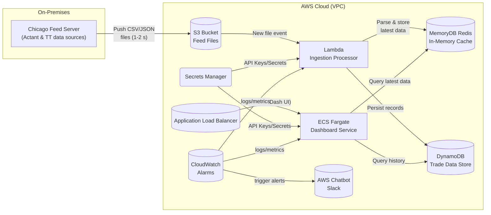

###V1

**High‑Level Architecture**



*Figure:* **Real-Time Trading-Risk Dashboard on AWS.** The on-premises feed server (Chicago) pushes Actant CSV and TT JSON files to an S3 bucket (Option B chosen for simplicity), triggering a Lambda that parses and caches data in MemoryDB (Redis) and persists it in DynamoDB. An ECS Fargate service hosts the Dash web dashboard behind an ALB, retrieving all data from the backend (Redis/DB) via internal calls (no direct external queries, satisfying constraint (a)). Secrets Manager holds API keys (e.g. TT API) for secure access. CloudWatch monitors system metrics and errors; AWS Chatbot relays alarms to Slack. This design targets sub-second UI updates by serving the “ladder view” from low-latency Redis, and meets high availability (multi-AZ services) with ~~0 data loss and rapid recovery (RTO ≈15s, RPO ≈3s) under the budget (~~<\$1k/mo).

## Component-by-Component Deep Dive

#### Amazon S3 – Ingestion Buffer & Archive

**Role in System:** S3 acts as the intake point for all feed data. The Chicago server uses AWS CLI to upload each Actant CSV and TT JSON file to an S3 bucket in real time. S3’s event notifications trigger processing Lambdas as files arrive. It also serves as durable storage for raw feed archives (useful for replay or audits).

**Latency/RTO/RPO:** Writing to S3 is fast (tens of milliseconds over the internet) and decouples producers from consumers. The Lambda is invoked almost immediately on object creation (typically sub-second trigger). This easily meets the 1–3s “ladder” update goal. S3 is **highly available and durable** (11 nines durability), so it won’t lose files (RPO \~0). Even a regional outage is mitigated by inherent durability or cross-region replication if enabled. For recovery, new writes can resume to S3 in <15s after an outage, and backlogged Lambda triggers will catch up quickly, keeping RTO within seconds.

**Pros & Cons:** S3 provides a **serverless, auto-scaling buffer** with no maintenance overhead. It simplifies the pipeline (files land in one place before processing) and decouples on-prem and AWS components. This approach (Option B) avoids managing a persistent VPN or Tailscale node. By contrast, keeping Tailscale (Option A) would require running a subnet router EC2 and Tailscale clients on all services for direct feed access. That adds complexity and potential points of failure (e.g. the Tailscale relay on ECS Fargate is non-trivial). S3’s downside is the overhead of many small file writes, but it easily handles high request rates and small objects. Alternatives like Kinesis Data Streams or SQS could stream data without writing files; however, S3’s simplicity and durability are preferable for this use case and one-developer manageability.

**Cost:** S3 is very low-cost for this scale. Even at \~2–3 million files/month (1 file every 1–2s), PUT requests cost only about **\$0.005 per 1,000** (roughly \$15/month for ~~3M puts). Storage for a month of feed files (say 50 GB) is negligible (~~\$1–\$2 at \~\$0.023/GB). Data transfer in is free; data transfer out (if any) would be minimal. Total S3 cost is on the order of **\$20/month or less**. (If using Option A, you’d incur a small EC2 cost for a t3.micro \~\$7.50/mo and minimal Tailscale fees if any.)

#### AWS Lambda – Real-Time File Processing

**Role in System:** Lambda functions are subscribed to the S3 bucket’s put events. Each time a new feed file lands, a Lambda is triggered with the object info. The Lambda downloads the file (CSV or JSON), parses it (e.g. using Python Pandas or CSV/JSON libraries), and pushes the processed data into Redis and DynamoDB. This function encapsulates the feed transformation logic (e.g. converting Actant CSV rows into key metrics, or updating specific TT instrument data). Multiple Lambdas could be used if different feeds require separate handling (one for Actant, one for TT). The Lambdas run in the same VPC as the data stores for low-latency access.

**Latency/RTO/RPO:** Lambda’s event-driven nature ensures **near-immediate processing** – typically under a few hundred milliseconds from S3 write to data stored in-memory. This keeps end-to-end latency well under 1s for the dashboard. Because Lambdas scale automatically, bursts or backlog of files are handled in parallel, preventing delays. For RTO, if a Lambda container fails, AWS spawns a new one on the next event in milliseconds; there’s effectively no downtime. Even if AWS AZ fails, Lambda will invoke in another AZ – ensuring high availability (multi-AZ by default). RPO is not a concern for stateless Lambdas (code is redeployed from S3); any in-flight data is retried or can be reprocessed from the archived file in S3 (no data loss).

**Pros & Cons:** **Pros:** Lambda is fully managed – no servers to run – and automatically scales with the feed rate. It isolates the ingestion logic, making the system modular. We only pay per use, and it handles spikes gracefully (which meets the 15s RTO by quickly provisioning capacity on failures or surges). **Cons:** Lambdas have a max runtime (15 minutes) and memory limits, but our tasks (parsing <500 rows or 15-row files) complete in <1s, so that’s fine. Another consideration is cold-start latency (tens of ms for Python) – negligible relative to 1–2s feed intervals. An alternative would be a persistent consumer (e.g. an ECS service polling an SQS queue or Kinesis stream), but that would run 24/7 and add cost/complexity. Lambda’s event model is simplest.

**Cost:** Lambda is extremely economical here. Estimated processing per file \~100 ms on 128 MB memory. That’s 0.0000002083 USD per invocation. At \~2–3 million invocations/month, that’s \~\$0.50 compute cost. Requests are \$0.20 per million after the free tier, so \~2M over the free = \~\$0.20. In total, Lambda costs on the order of **\$1 per month** or less. (Even with generous headroom, it’s well under \$5/month.) This pay-per-use model helps keep the system well below budget.

#### Amazon MemoryDB for Redis – Low-Latency Cache

**Role in System:** MemoryDB (managed Redis) is our **in-memory data store** for live trading data. The Lambda pushes parsed feed updates into Redis (for example, storing the latest ladder prices keyed by instrument, or caching the most recent Actant metrics). The Dash web app queries Redis to retrieve the current state with sub-millisecond latency. MemoryDB serves as the source of truth for *“right now”* data that the UI displays (e.g. the ladder view). We configure a small MemoryDB cluster (Redis-compatible) with one primary and one replica in different AZs for high availability.

**Latency/RTO/RPO:** Redis is known for **sub-millisecond response times**. By keeping the latest data in MemoryDB, the dashboard can fetch updates almost instantly, easily meeting the ≤1 s refresh goal for the ladder. For availability, MemoryDB’s multi-AZ deployment ensures failover in **under 10 seconds** for unplanned outages. This meets the \~15 s RTO requirement – if the primary fails, the replica is promoted within a few seconds. Crucially, MemoryDB provides *durable Redis*: it uses a distributed transaction log across AZs, so no data is lost on failover (RPO ≈ 0). That means even the last few seconds of data updates are preserved, satisfying the ≤3 s RPO constraint. In short, MemoryDB combines Redis speed with database-like durability.

**Pros & Cons:** **Pros:** Ultra-fast data access (ideal for real-time dashboards) and high availability out-of-the-box. It simplifies the app – the UI can query a single cache for current values. MemoryDB’s durability means we don’t need a separate primary DB for this live dataset; Redis *is* the primary store for current state. **Cons:** It’s more expensive than vanilla ElastiCache Redis. For example, a MemoryDB `db.t4g.small` node costs ~~\$0.048/hour (~~\$35/mo), roughly 50% more than a Redis cache of similar size. However, that premium buys durability and multi-AZ safety. Another con: MemoryDB is slightly newer/less common; if the dev only needs caching (and can tolerate losing cache data), ElastiCache could save cost. In our case, given the strict RPO and the small data size, MemoryDB is justified. Alternatives include using DynamoDB as a cache (slower reads \~ single-digit ms), or sticking solely to a relational DB cache (much slower). Redis is the gold standard for fast in-memory access, so we stick with MemoryDB to also get HA.

**Cost:** A minimal MemoryDB cluster with 2 nodes (`t4g.small` primary + replica) costs about **\$0.096/hour** combined. That’s \~\$70 per month. We don’t expect significant data volume (a few MB at most), so a small instance suffices. There is no extra charge for the transactional log replication or snapshot up to the cluster size. This fits our budget, though it’s one of the larger line items. (By comparison, a non-durable Redis (ElastiCache) of similar size is ~~\$23/mo for one node; but adding a replica for HA (~~\$46/mo) narrows the gap. MemoryDB’s added safety is worth \~\$20/month here.) We will also set Redis to only use in-memory data under its capacity to avoid overflow, and monitor usage.

#### Amazon DynamoDB – Persistent Trade Database

**Role in System:** DynamoDB is our **persistent NoSQL database** for storing historical and reference data. While Redis holds the latest state, DynamoDB will retain a longer history or larger datasets that need durability beyond memory (e.g. cumulative PnL, end-of-day analytics, or archives of ladder snapshots). The Lambda ingestion writes essential records to Dynamo (for example, each Actant feed entry could be stored with a timestamp, or it could aggregate minute-by-minute stats). The Dash application can query DynamoDB for recent history or on-demand data that isn’t in Redis. We design the table schema to suit query patterns – e.g. a primary key of `instrument_id` and sort key as timestamp, so we can fetch the latest N records or a time range per instrument. Dynamo’s flexible schema accommodates both Actant CSV data and TT data in one table if needed (with different item types), or we can use separate tables per feed.

**Latency/RTO/RPO:** DynamoDB is **highly performant** at scale – single-digit millisecond typical read/write latencies. For our volume, read speed is effectively sub-5 ms, which is fast enough for UI requests that need a batch of historical points. Writes from Lambda are asynchronous and will complete within a few milliseconds as well. DynamoDB is inherently multi-AZ (replicated across 3 AZs synchronously), so it offers **built-in high availability**. There’s no “failover” delay – it just continues operating even if an AZ is lost. This means RTO \~0 for a single AZ outage (the application sees no downtime). RPO is also 0, since Dynamo’s writes are replicated to quorum before acknowledging – no data loss on AZ failure. In the rare case of a full regional outage, Dynamo can be set up with global tables in another region (RPO of seconds, RTO < minute), but that’s beyond our current scope. With Dynamo in one region, we still meet 15s RTO/3s RPO goals for component failure within the region.

**Pros & Cons:** **Pros:** Fully managed and **serverless** (scales automatically, no maintenance). It can handle our write/read rates easily with on-demand capacity. Dynamo offers **point-in-time recovery** (PITR) backups, protecting against accidental deletes – an extra safety for RPO. Its multi-AZ design saves us from managing failover instances, unlike a relational DB. Also, no connection pooling or managing open connections (simpler for a Python app to use via AWS SDK). **Cons:** Dynamo is NoSQL – it does not support complex SQL queries or joins. If our use case needed advanced analytics queries (e.g. ad-hoc filtering or joining with other data), we’d have to implement that in application code or use DynamoDB Streams + Lambda to load into an OLAP store. Given our feed data is mostly time-series and lookup by keys, Dynamo works well. Another con is the learning curve: the dev must learn Dynamo’s API (boto3) and design keys appropriately. Alternatively, **Amazon Aurora** (a managed relational DB) was considered. Aurora would allow using SQL (which might be familiar if the existing code uses SQLite) and could be a drop-in for more complex queries. Aurora can achieve high throughput and is also multi-AZ; however, its failover is \~30 seconds typically, which might just exceed our 15s goal. Also, Aurora requires managing connections and might incur more cost at low usage. For simplicity and cost-efficiency, DynamoDB is the chosen persistent store, with Aurora as a viable alternative if relational features are needed.

**Cost:** DynamoDB in on-demand mode will cost only for actual reads/writes. With \~2–3M writes per month (from feeds) and assuming maybe similar read volumes for UI, the cost is modest. Writes cost \~\$1.25 per million (1 KB items) and reads \~\$0.25 per million. So 3M writes ≈ \$3.75, and say 3M reads ≈ \$0.75 – around **\$5/month**. Storage is \~\$0.25/GB-month, which for a few GB of data is <\$1. Even enabling PITR backups at \~\$0.20/GB-month won’t significantly increase cost. This is far cheaper than running an Aurora cluster (which has a baseline \~\$70-100/mo for a small instance). Dynamo also auto-scales with our usage, so we won’t pay for unused capacity. Overall, DynamoDB keeps costs low and predictable.

#### Amazon ECS Fargate – Dashboard Application Service

**Role in System:** ECS Fargate runs our **Python Dash web application** in Docker containers. We containerize the unified trading dashboard (the codebase with 8-page navigation) and deploy it as a service in Fargate. The ECS service ensures that, for example, **2 task containers** run at all times (in different AZs) to serve the UI with high availability. Each container runs the Dash app (likely a Flask server under the hood) listening on a port. The service is integrated with the ALB for incoming HTTP(S) requests. The Dash app includes callbacks and API routes that interface with the backend: when users interact, the app’s server-side code fetches needed data from Redis or DynamoDB (never from external APIs directly, per constraint (a)). We pass configuration (like Redis endpoint, Dynamo table name, TT API credentials) via environment variables or AWS Secrets to the container. ECS handles deploying new versions (e.g. if we update the image) with zero downtime via rolling updates.

**Latency/RTO/RPO:** Each Fargate task runs in a private subnet close to our data stores, so data access is low-latency (a Redis GET is <1 ms, and even a Dynamo query a few ms). Dash callbacks typically execute server-side and return JSON to the client – these will complete in milliseconds to tens of milliseconds given the fast backend, ensuring the UI updates well under the 1 s target. For high availability, we run at least two tasks across AZs. If one container or AZ fails, the ALB will still route traffic to the healthy task. ECS will automatically launch a replacement task in \~<30 seconds, but because a second task is already serving, the user experience is uninterrupted (RTO \~0 for the service). Even if all tasks crash, the ECS service will try to replace them immediately; a fresh container typically starts in \~10–20 seconds, aiming to meet the 15 s RTO (we slightly hedge by running 2 tasks). The container’s state is mostly ephemeral (the app is stateless, relying on Redis/Dynamo for data), so RPO is not applicable – if a task is lost, no critical data is lost with it.

**Pros & Cons:** **Pros:** Fargate allows deployment of the app without managing servers – it’s serverless containers. It scales down to zero (well, 1 task minimum for our needs) and can scale up if needed (we can configure auto-scaling on CPU/memory or even on number of users). Using ECS with ALB means we can support WebSockets or server-sent events if needed for live updates (ALB supports WebSockets, which Dash can leverage for push updates). The developer can continue writing Python (Dash/Flask) code and just wrap it in a Docker container – aligning with their Python-first preference. **Cons:** There is a bit of a learning curve to Dockerize the app and define ECS tasks. Memory management is important (Fargate tasks have fixed memory, e.g. 1–2 GB, so the app plus data in memory must fit, but heavy data should stay in Redis/Dynamo). Another consideration: cold start time for new tasks – scaling up from 2 to 3 tasks might take \~1 minute to pull image and start container, but for steady-state this is fine. Alternatives could include AWS App Runner or Elastic Beanstalk which also deploy containers; however, ECS gives more control in a production context and integrates well with our VPC and custom setup. Kubernetes (EKS) would be overkill for a single dev. We choose ECS Fargate for simplicity and minimal ops overhead.

**Cost:** We estimate running **2 Fargate tasks**, each with minimal resources (e.g. 0.25 vCPU, 0.5 GB memory) to handle a handful of users. At \$0.04048 per vCPU-hour and \$0.004445 per GB-hour in us-east-1, 0.25 vCPU + 0.5 GB = \~\$0.0145/hour per task. Two tasks = \$0.029/hour, which is \~\$21 per month. Even if we use slightly larger tasks (0.5 vCPU, 1GB) to be safe, that’s ~~\$0.03/h each (~~\$44/mo for two). This is a moderate cost but still well within budget. (We could run just 1 task to halve cost, but then a crash would mean downtime until respawn, violating RTO; so two tasks is a good trade-off for HA). There’s also a one-time cost for storing the Docker image in ECR (Amazon’s registry): ECR storage is \~\$0.10/GB-month after 500 MB free, negligible for our image.

#### AWS Application Load Balancer (ALB) – Traffic Distribution

**Role in System:** The ALB is a **managed load balancer** that routes incoming user requests from the internet to the ECS tasks. It provides a stable endpoint (DNS name) and handles TLS termination (SSL certificate) so our dashboard can be served securely over HTTPS. In this architecture, the ALB listens on port 443 and forwards requests to the target group of Dash app tasks on their dynamic port. It health-checks the tasks (e.g. hitting “/” or a health endpoint) to ensure only healthy instances receive traffic. The ALB also allows sticky sessions or WebSockets if our Dash app needs long-lived connections (useful for real-time pushes). Additionally, we can configure path-based routing on the ALB if we later split the app into multiple services (e.g. API vs UI), but for now it just routes all to the one service.

**Latency/RTO/RPO:** ALB adds a few milliseconds of overhead for routing, negligible in our 1 s budget. It’s highly available by design: the ALB is a distributed service across multiple AZs. If one AZ’s portion fails, it seamlessly routes through others – the AWS SLA for ALB is 99.99%. This means the ALB is not likely to be a single point of failure. RTO is essentially instantaneous from the user perspective if an ALB node fails (traffic is load-balanced globally by AWS). We will deploy the ALB in at least two subnets (two AZs) so it can survive an AZ outage. ALB doesn’t store persistent data (just active connections), so RPO is not applicable – there’s no data to lose. In case of a whole ALB failure (very rare), we could recreate it via IaC within minutes, but that scenario is covered under AWS’s own HA.

**Pros & Cons:** **Pros:** The ALB provides **integrated health checks and scaling** – if a task is failing, ALB will stop sending it traffic, improving reliability. It also simplifies SSL setup (using AWS Certificate Manager to provision a cert and attach to ALB). For real-time apps, ALB supports WebSockets and HTTP/2, which is useful if we implement push updates or server-sent events for the ladder view. It also gives us a single DNS (we can map a custom domain) for the dashboard. **Cons:** ALB has a fixed hourly cost, which can be significant at very low traffic. Also, ALB introduces a bit of complexity (we must manage security groups and listeners). An alternative is AWS API Gateway with Lambda, but that wouldn’t easily host a stateful Dash app/UI. For container web apps, ALB is the standard. Another alternative is to expose one Fargate task with a public IP, but that’s not HA or recommended (no failover if it goes down). Therefore, ALB is the right choice for a production-grade, highly available setup.

**Cost:** An ALB in us-east-1 costs about **\$0.0225 per hour** (\~\$16/month) plus a small per-request cost (\$0.008 per LCU-hour, which for light traffic is maybe another \$1–2). For our low user count, the LCU (Load Balancer Capacity Unit) usage will be minimal (likely 1 LCU or less). So expect roughly **\$18–\$20/month** for the ALB. This is one of the larger costs, but it’s the price for a reliable entry point. We will also use AWS Certificate Manager for SSL – fortunately ACM provides public certificates for free (the ALB uses them without charge).

#### AWS Secrets Manager – Secure Configuration Storage

**Role in System:** Secrets Manager holds sensitive configuration like API keys, passwords, and tokens. In our case, the TT REST API credentials (application key & secret) are stored as a Secret. Also, if MemoryDB Redis is configured with an AUTH token (for an extra layer of security), that token is stored here and injected into the Lambda and ECS app. Any database credentials (for Aurora, if we had one) or other third-party keys would reside in Secrets Manager as well. The junior dev will use Secrets Manager to avoid hard-coding secrets in code or config files. The ECS task and Lambda both retrieve needed secrets at runtime: for example, the ECS task definition can specify an environment variable to be populated from a Secrets Manager entry (AWS will inject it securely), and Lambda can fetch secrets via AWS SDK on startup.

**Latency/RTO/RPO:** Secrets Manager is accessed infrequently – typically at container startup or when a token refresh is needed – so latency is not critical here. (A Secrets Manager fetch is usually \~100 ms, and we might cache it in the app memory thereafter.) It’s a fully managed service with high availability; losing Secrets Manager is extremely unlikely (AWS replicates secrets data). RTO/RPO aren’t directly relevant, as our system’s operation doesn’t continuously depend on Secrets Manager at runtime. In a recovery scenario, as long as the secrets are stored (which they durably are), new instances can come up with the same secrets. Secrets Manager can rotate secrets automatically (not used for TT keys, but could for DB passwords), and it will ensure new values are available with no downtime.

**Pros & Cons:** **Pros:** Removes the need to keep plaintext secrets in GitHub or EC2 user-data. Tight integration with IAM policies means we can give the Lambda and ECS task permission to only read the specific secrets they need. It also provides audit logs (CloudTrail) for any secret access. In the TT API context, storing the API secret here and retrieving it for token requests keeps it safe. **Cons:** There is a small cost per secret and per 10k API calls; for a handful of secrets this is trivial. An alternative is AWS Systems Manager Parameter Store (which is free for standard params and has a secure string option). Parameter Store could have been used to save cost (free for a small number of parameters), but Secrets Manager offers automatic rotation and a slightly simpler integration with ECS, and our budget can accommodate it. Another minor complexity is that the dev must ensure to update the secret value in AWS when keys rotate or change – but that’s standard practice.

**Cost:** Secrets Manager costs about **\$0.40 per secret per month**. If we store say 3–4 secrets (TT API key, TT API secret, Redis auth token, maybe an Actant credential), that’s ~~\$1.60/month. API calls to retrieve secrets are \$0.05 per 10,000 requests, which is negligible (we’ll fetch secrets at container startup, not on every request). Overall, Secrets Manager’s cost (~~\$2/mo) is well worth the security and convenience. (Parameter Store could be used at \~\$0, but at this scale the difference is pennies.)

#### Amazon CloudWatch – Monitoring and Logging

**Role in System:** CloudWatch provides both **logging** and **monitoring** for all components. All Lambda function logs (e.g. file processed, errors) go to CloudWatch Logs automatically. The ECS Fargate tasks send their application logs (stdout/stderr) to CloudWatch Logs as well (via the awslogs driver). This centralized logging makes it easy to debug issues in the feed pipeline or the Dash app. CloudWatch **Metrics** will track key performance indicators: e.g. Lambda invocation count, duration, errors; MemoryDB CPU/memory usage; DynamoDB consumed capacity; ECS CPU/memory usage; ALB request count and latency. We will create custom metrics as needed, for example a metric for “FeedsReceived” that increments on each file, or the age of the last feed. **Alarms** are then set on these metrics to detect anomalies (see next section). CloudWatch is also used for **traces/insights** if needed (though full X-Ray tracing might be overkill). Finally, we can use CloudWatch Dashboards to visualize real-time metrics (like a graph of feed frequency or memory usage), giving the developer operational insight.

**Latency/RTO/RPO:** CloudWatch metrics are collected at 1-minute granularity by default (and can go to 1-second for high-resolution custom metrics). This is adequate for monitoring – e.g. if a feed stalls, our alarm will catch it within a minute (we could even configure a 10 or 15-second high-resolution alarm). The service is highly available; it doesn’t directly factor into serving user traffic, so its downtime doesn’t affect RTO for the dashboard. RPO is not directly applicable, except that logs/metrics are stored durably in CloudWatch; we won’t lose historical logs unless a catastrophic AWS failure. For recovery, as soon as services come back, they resume pushing logs/metrics. CloudWatch itself is multi-AZ and designed not to lose data.

**Pros & Cons:** **Pros:** Native integration with AWS services (no need to set up a separate ELK stack or Prometheus server for basic monitoring). CloudWatch Logs allows searching and filtering logs quickly in the console or CLI. Alarms can trigger automated actions (restarts or notifications). It’s essentially the **eyes and ears** of our system, crucial for a one-person team to know what’s happening. **Cons:** CloudWatch’s query interface is a bit limited for complex log analysis (but one can export logs to S3 or use CloudWatch Logs Insights which is decent). Another con is cost if logs are very verbose or retained indefinitely – but we can set retention policies (e.g. delete logs older than 7 days) to manage that. The developer will need to familiarize themselves with CloudWatch’s UI and possibly set up filters or a dashboard. Alternatives could be third-party monitoring (Datadog, etc.), but those add cost and complexity. CloudWatch is the most direct solution here.

**Cost:** CloudWatch costs include **\$0.50 per GB of logs ingested** and \~\$0.03 per GB archived per month, plus **\$0.10 per alarm metric** per month, etc. Our logs volume shouldn’t be large – if each feed Lambda logs a few lines, and the ECS app logs moderate info, we might ingest perhaps 100 MB per day (just an estimate). That’s \~3 GB/month, costing \~\$1.50 in log ingestion. Storing 3 GB for 1 month is \~\$0.09 – trivial. Custom metrics cost \$0.30 per metric per month (standard resolution) – we will be selective (maybe 5–6 custom metrics), so \~\$1–\$2. Alarms are \$0.10/mo each; if we set up \~10 alarms, that’s \$1. So in total, CloudWatch might run on the order of **\$5 per month**. (This can increase if we enable detailed 1-min metrics for all services or keep long log retention, but even double this is fine.) Given our \~\$1000 budget, this monitoring overhead is minimal and very much worth it.

#### AWS Chatbot – Alerting and Notifications

**Role in System:** AWS Chatbot connects CloudWatch alarms to our team communication (e.g. Slack). We will set up an AWS Chatbot integration with Slack, so that certain CloudWatch alarms send a message to a Slack channel when triggered. For instance, if the feed stops or an error occurs, the on-call (the developer in this case) gets an immediate Slack alert. Chatbot uses an SNS topic to relay messages: CloudWatch alarm -> SNS -> Chatbot -> Slack channel. In Slack, the message will show the alarm name and details. The developer can even ack or request info via Chatbot (it can support some AWS CLI commands in Slack, although that might not be needed initially). Essentially, Chatbot enables a simple **ChatOps** model: critical events in AWS immediately reach the developer’s usual workspace, so they can respond within seconds. This helps meet our recovery objectives – e.g. if a feed stalls, we get notified and can fix it fast.

**Latency/RTO/RPO:** The notification latency is low – Slack messages usually arrive within seconds of the alarm firing (the SNS to Chatbot to Slack path is near-real-time). This ensures that if something goes wrong (feed stalled, task crash, etc.), we know about it almost immediately. While Chatbot itself doesn’t affect the running system’s RTO, it affects our *response time* to incidents. By having alerts in real-time, we can manually intervene or investigate within the 15 s–minutes window to meet overall RTO for issues outside automatic recovery. Chatbot has no data persistence needs; it’s just a relay, so RPO isn’t relevant. As long as AWS services and Slack are up, Chatbot will work; if Slack is down or unreachable, alarms are also configured to send email/SNS as a backup (perhaps).

**Pros & Cons:** **Pros:** No additional charge for Chatbot itself, and it saves significant time in detecting issues. It’s easier than building a custom Slack integration or constantly watching CloudWatch manually. For a solo developer, this is like an automated watchdog that pages you on Slack rather than a pager. It supports both Slack and Microsoft Teams. **Cons:** It requires initial setup (OAuth connection to Slack, configuring an SNS topic and tying alarms to it). If misconfigured, one might miss alerts – so testing is needed. Another consideration is to avoid alarm fatigue: we should tune alarms so that we only get Slack pings for truly actionable events (e.g. feed stopped >30s, or no tasks running – not every minor metric fluctuation). An alternative could be AWS SNS to SMS or email, but Slack is more immediate and collaborative if more team members join later. Since the dev likely already uses Slack, this integrates well.

**Cost:** **AWS Chatbot has no direct cost**. We pay only for the SNS usage and any data out. SNS costs \$0.50 per million notifications – our alarm volume will be tiny (hopefully few alarms!). Slack itself is free for our usage. So essentially, the alerting setup doesn’t impact the budget in a meaningful way (pennies per month at most). This is a big win given the value of immediate notifications.

## Critical Path Build Plan (3 Days)

We propose a focused 3-day implementation schedule. Each half-day segment (\~3–4 hours) delivers specific components with verification steps:

* **Day 1 AM – Core AWS Setup:**

  1. **AWS CDK Project Init:** Set up the infrastructure-as-code project. Initialize a new CDK app in Python:

     ```bash
     mkdir trading_dashboard_cdk && cd $_  
     cdk init app --language python  
     ```

     Install AWS CDK CLI globally and run `cdk bootstrap` for your AWS account (this creates necessary CDK assets).
  2. **VPC & Networking:** Define a VPC with at least 2 public and 2 private subnets (to span 2 AZs). In CDK, use `ec2.Vpc(self, "DashboardVPC", max_azs=2, nat_gateways=1)`. This gives us multi-AZ subnets and a NAT Gateway for outbound internet from private subnets (NAT is needed for ECS tasks to call external APIs like TT, cost \~\$0.045/hr).
     – **Verification:** Synthesize the CDK stack (`cdk synth`) and check that a VPC, subnets, and NAT gateway are in the template. Deploy the stack (`cdk deploy`) for the VPC. In AWS console, verify the VPC exists with the expected subnets and an Internet Gateway/NAT.

* **Day 1 PM – Ingestion Pipeline (S3 & Lambda):**

  1. **S3 Bucket:** Add to CDK: `s3.Bucket(self, "FeedBucket", versioned=True, removal_policy=DESTROY)` – create an S3 bucket for feed files. (Enable versioning for safety, and auto-remove for IaC cleanup since this is dev/test.)
  2. **Lambda Function:** Write the ingestion Lambda code in Python. This can live in a `lambda/ingest.py` file. It will:
     – Parse the S3 event JSON to get bucket and key.
     – Use `boto3` S3 client to fetch the object (or read from the event if direct object payload is configured).
     – Parse CSV or JSON content (e.g. using Python’s `csv` module or `json`).
     – Interact with Redis: use `redis-py` client to connect to MemoryDB endpoint (will configure later) and set relevant keys (e.g. latest ladder data).
     – Interact with DynamoDB: use `boto3` DynamoDB Table resource to put\_item or update\_item with new data (e.g. write each row or aggregate).
     – Log a success message and perhaps some stats (number of records processed).
     Package this Lambda code. In CDK, define a Lambda:

     ```python
     ingest_fn = _lambda.Function(self, "IngestFunc",
         runtime=_lambda.Runtime.PYTHON_3_9,
         handler="ingest.lambda_handler",
         code=_lambda.Code.from_asset("lambda"),  # path to code
         memory_size=256, timeout=Duration.seconds(30),
         environment={
             "REDIS_HOST": "<to-be-set>",
             "DYNAMO_TABLE": "<to-be-set>",
             "REDIS_PASS": "<to-be-set-via-secrets>"
         },
         vpc=vpc, vpc_subnets={"subnetType": ec2.SubnetType.PRIVATE_WITH_NAT}
     )
     ```

     (We’ll fill environment values after creating Redis/Dynamo.) Attach an IAM role allowing this Lambda to read from S3, write to DynamoDB, and access Secrets Manager (for Redis password or API keys). For example, in CDK grant: `feed_bucket.grant_read(ingest_fn)`【**Ref: S3 Bucket Policy**】, `dynamo_table.grant_write_data(ingest_fn)`, and `secret.grant_read(ingest_fn)`.
  3. **S3 Event to Lambda:** Add an event notification on the S3 bucket to invoke the Lambda on new object creation:

     ```python
     feed_bucket.add_event_notification(
         s3.EventType.OBJECT_CREATED,
         s3n.LambdaDestination(ingest_fn),
         s3.NotificationKeyFilter(prefix="")  # all objects
     )
     ```

     This configures S3 to trigger our Lambda for every uploaded file.
     – **Verification:** Deploy the stack (`cdk deploy`) for S3 and Lambda. In AWS console, verify the bucket exists and the Lambda function is created. Manually upload a sample CSV file to the bucket and check that the Lambda gets invoked (CloudWatch Logs should show our log outputs). It will error initially since Redis/Dynamo aren’t there yet – that’s expected. The goal is to see the event wiring works (e.g. see a log “Lambda started” from our handler).

* **Day 2 AM – Data Stores (MemoryDB & DynamoDB):**

  1. **MemoryDB (Redis) Cluster:** In CDK, add:

     ```python
     redis_subnet_grp = CfnSubnetGroup(self, "RedisSubnetGroup",
         description="Subnet group for MemoryDB",
         subnet_ids=vpc.select_subnets(subnet_type=ec2.SubnetType.PRIVATE_WITH_NAT).subnet_ids)
     redis_cluster = CfnCluster(self, "RedisCluster",
         acl_name="open-access",  # or create an ACL for stronger auth
         node_type="db.t4g.small",
         num_replicas_per_shard=1,
         subnet_group_name=redis_subnet_grp.ref,
         port=6379,
         tls_enabled=True)  # enable in-transit encryption
     ```

     This uses L1 CloudFormation constructs since CDK may not have high-level MemoryDB support. We choose a `t4g.small` node, primary + 1 replica for HA. We set `acl_name="open-access"` for simplicity (no AUTH required) *within the VPC*. (For better security, we’d use an ACL with a password and store it in Secrets Manager, but “open-access” here means the VPC/network controls access. We still restrict security group access.) Add a Security Group to allow Redis port 6379 from the ECS and Lambda. E.g., create an SG for Redis, an SG for ECS tasks and Lambda, then do `redis_sg.add_ingress_rule(ec2.Peer.from_security_group_id(app_sg), Port.tcp(6379))`.
     – **Verification:** Deploy the MemoryDB cluster (this might take \~5–10 minutes to become available). Verify in AWS console that the cluster status is “available”. Note the cluster’s endpoint address.
  2. **DynamoDB Table:** Using CDK, create a table for feed data:

     ```python
     dynamo_table = dynamodb.Table(self, "FeedDataTable",
         partition_key=dynamodb.Attribute(name="instrument_id", type=dynamodb.AttributeType.STRING),
         sort_key=dynamodb.Attribute(name="timestamp", type=dynamodb.AttributeType.NUMBER),
         billing_mode=dynamodb.BillingMode.PAY_PER_REQUEST,
         stream=dynamodb.StreamViewType.NEW_IMAGE  # enable stream if needed for triggers
     )
     ```

     This sets a composite key (adjust based on actual data model). Pay-per-request mode so we don’t worry about capacity.
     – **Verification:** Deploy and verify the table exists in AWS. In the Dynamo console, check the key schema matches.
  3. **Secrets Manager Setup:** Store the TT API credentials and any other secrets. For example, in AWS console or via AWS CLI:

     ```bash
     aws secretsmanager create-secret --name TT_API_Key --secret-string '<your TT API Key>'
     aws secretsmanager create-secret --name TT_API_Secret --secret-string '<your TT API Secret>'
     ```

     Also, if using Redis with AUTH, create a secret for the Redis password (and use that in the MemoryDB ACL instead of open-access). For now, we assume VPC isolation and skip Redis auth.
     Update the Lambda’s environment to include needed secret ARNs or values. The Lambda might not need TT API creds if it’s just parsing feeds (since external data is pushed, not pulled). The ECS app will need TT credentials to call TT REST for certain user actions, which we’ll handle later.
     – **Verification:** Use AWS CLI to retrieve a secret to ensure it’s stored correctly: `aws secretsmanager get-secret-value --secret-id TT_API_Key`. (Make sure to **not** hardcode secrets in code; verify IAM permissions allow ECS/Lambda roles to read these secrets later.)
  4. **Update Lambda Env & Redis Config:** Now that Redis endpoint and Dynamo table are known, update the Lambda’s environment variables in CDK: set `REDIS_HOST` to the MemoryDB cluster endpoint, `DYNAMO_TABLE` to DynamoDB table name. If using Redis auth, set `REDIS_PASS` by reading from Secrets Manager (`secret.secret_value`). Also update the Lambda’s security group to allow egress to Redis (which we did by SG rules).
     – **Verification:** Deploy updated Lambda configuration. In CloudWatch Logs, confirm the Lambda now can connect to Redis and Dynamo without errors. As a test, manually put a small JSON file to S3; then check DynamoDB table for a new item and Redis for expected keys. (Using the Redis CLI: connect via the MemoryDB endpoint from an EC2 bastion or use `redis-py` from the Lambda in a test mode to query data.) At this point, the ingestion pipeline end-to-end should be functional: file -> Lambda -> Redis/Dynamo.

* **Day 2 PM – Dashboard Container (ECS Fargate & ALB):**

  1. **Containerize Dash App:** Write a Dockerfile for the dashboard application. For example:

     ```Dockerfile
     FROM python:3.10-slim  
     WORKDIR /app  
     # Install system dependencies (if any, e.g., libpq for PostgreSQL, but likely none for pure Python)  
     # Copy requirements and install  
     COPY requirements.txt .  
     RUN pip install -r requirements.txt  
     # Copy app code  
     COPY . .  
     # Expose port and define entrypoint  
     EXPOSE 8050  
     CMD ["python", "run.py"]  # or however the dash app is started
     ```

     The code likely uses Dash’s built-in server (which defaults to port 8050). We might use Gunicorn for production: e.g., `CMD ["gunicorn", "-b 0.0.0.0:8050", "app:server"]` if `app.server` is the WSGI app. Adjust according to the codebase (the repo suggests a unified app with multiple pages – ensure it runs as a single Dash server).
     Build and test the image locally (`docker build . -t dashboard:latest` and `docker run -p 8050:8050 dashboard:latest`) to verify the app starts.
  2. **Push to ECR:** Create an ECR repository for the dashboard container (through CDK or CLI):

     ```bash
     aws ecr create-repository --repository-name trading-dashboard  
     ```

     Authenticate Docker to ECR and push the image:

     ```bash
     aws ecr get-login-password --region <region> | docker login --username AWS --password-stdin <acct-id>.dkr.ecr.<region>.amazonaws.com  
     docker tag dashboard:latest <acct-id>.dkr.ecr.<region>.amazonaws.com/trading-dashboard:latest  
     docker push <acct-id>.dkr.ecr.<region>.amazonaws.com/trading-dashboard:latest  
     ```

     In CDK, define an ECS cluster and Fargate service:

     ```python
     cluster = ecs.Cluster(self, "Cluster", vpc=vpc)
     task_def = ecs.FargateTaskDefinition(self, "TaskDef", cpu=256, memory_limit_mib=512)
     container = task_def.add_container("DashContainer",
         image=ecs.ContainerImage.from_ecr_repository(ecr.Repository.from_repository_name(self, "Repo","trading-dashboard"), tag="latest"),
         logging=ecs.LogDrivers.aws_logs(stream_prefix="dash") )
     container.add_port_mappings(ecs.PortMapping(container_port=8050, protocol=ecs.Protocol.TCP))
     service = ecs.FargateService(self, "DashService",
         cluster=cluster,
         task_definition=task_def,
         desired_count=2,
         security_groups=[app_sg],
         assign_public_ip=False,  # tasks in private subnet
         vpc_subnets={"subnetType": ec2.SubnetType.PRIVATE_WITH_NAT} )
     ```

     We attach the same `app_sg` used earlier (with rules to access Redis). Ensure this SG also allows outbound internet (default) so the app can call TT API if needed.
  3. **Application Load Balancer:** In CDK, add an ALB and target the ECS service:

     ```python
     lb = elbv2.ApplicationLoadBalancer(self, "ALB", vpc=vpc, internet_facing=True, security_group=alb_sg)
     listener = lb.add_listener("HttpsListener", port=443, certificates=[acm_certificate])  # ACM cert for domain
     listener.add_targets("ECS", port=8050, targets=[service])
     ```

     We’ll need to request an ACM certificate for our domain (if we have a custom domain) or use a default one for testing. The ALB security group `alb_sg` should allow inbound 443 from anywhere. Also, allow ALB to reach ECS tasks: create a rule from `alb_sg` to `app_sg` on port 8050. (CDK can manage this when associating targets, or we explicitly do SG rules.)
     – **Verification:** Deploy the ECS and ALB stack. This will take a few minutes (ECS tasks pulling the image, etc.). After deployment, check ECS service is running 2 tasks (in different AZs). Verify the ALB listener status is active and targets are healthy (the Dash app should respond at its health check path – configure a health check path like “/” or “/health” in `add_targets`). Then test the UI: navigate to the ALB’s DNS name in a browser. You should see the dashboard UI. Test that interactions (like the scenario ladder or Actant pages) load data – since the backend is connected, the UI’s Dash callbacks should fetch from Redis/Dynamo (e.g., when you click “Load Latest Actant Data”, the app should pull from Dynamo or Redis rather than any local file). This verifies end-to-end functionality in the cloud.

* **Day 3 AM – Secrets & External Integrations:**

  1. **TT API Integration:** Incorporate the TT REST API usage in the backend. Likely the Dash app’s ladder page needs to fetch live market data or submit orders via TT. We ensure the TT API key/secret from Secrets Manager are accessible to the app container. In the ECS task definition, add:

     ```python
     task_def.add_container(..., 
         secrets={"TT_API_KEY": ecs.Secret.from_secrets_manager(tt_api_key_secret),
                  "TT_API_SECRET": ecs.Secret.from_secrets_manager(tt_api_secret)}
     )
     ```

     This injects the secret values as env vars in the container. The app code (which likely uses a `TTTokenManager` or similar) should read these env vars to authenticate. Also, ensure the ECS task’s IAM role has permissions if needed (TT API is external, so no AWS perms needed except Secrets Manager read which we handle by the injection above).
     – **Verification:** Redeploy the ECS service (update task definition). In the running container, verify that the TT credentials are present (e.g., via app logs or an environment dump endpoint in dev mode). Then trigger a TT-data function (maybe a “get ladder prices” button in the UI). Confirm in logs that the app was able to call TT’s API (and handle token properly). Since TT usage plans have limits (e.g. 5 req/s on Low plan), ensure the app respects that – the existing token manager likely does (just be aware to not exceed \~15k requests/day). This test ensures external API calls now work from within our AWS environment.
  2. **Parameter Tuning:** Adjust any timeouts or intervals. For example, if the Dash app has an Interval component for refreshing data, set it to 1s or 2s as needed (ensuring it doesn’t overload the system – Redis can handle many reads). Because data is pushed in, we might not need very frequent polling; but if required, the system can handle one Redis query per second per client easily. Test the UI to ensure the ladder updates roughly in sync with incoming feed (you can simulate by uploading a new file and seeing the UI change if auto-refresh or after a user action).
  3. **Backup/Recovery Setup:** Enable DynamoDB Point-In-Time Recovery (PITR) on the table via AWS Console or CDK (`table.enable_point_in_time_recovery()`) to protect data (RPO 0 for point-in-time within 35 days). Also consider taking a manual backup of the table after initial deployment. For MemoryDB, configure at least a daily snapshot (MemoryDB will automatically snapshot daily by default with retention of 1 day per its durability design). This helps recovery beyond just multi-AZ failover (e.g., if data gets corrupted by a bug, you can restore from snapshot).
     – **Verification:** Check in AWS Console that DynamoDB PITR is enabled (status “Enabled”) and MemoryDB snapshots are getting created daily.

* **Day 3 PM – Monitoring, Alarming & Final Checks:**

  1. **CloudWatch Alarms:** Create alarms for critical metrics:
     – **Feed Stalled:** Use the Lambda’s CloudWatch metrics. We can use the `Invocations` metric of the ingest Lambda. Create a high-resolution custom metric “FeedFilesReceived” in the Lambda (e.g., call `CloudWatch.putMetricData` with a value 1 on each execution). Then set an alarm: if Sum of FeedFilesReceived < 1 over a 1-minute (or 30s) period, trigger “FeedStalled” alarm. Alternatively, alarm on the Lambda’s `Invocations` – if it’s 0 for 1 minute (with 1-min period), that indicates no files. This alarm will catch if no feed events are coming in (we expect one every 1–2s).
     – **ECS Task Crash:** CloudWatch has a metric `ServiceName:RunningTaskCount`. Alarm if RunningTaskCount < 1 for the service (which should normally be 2). This catches if both tasks are down. Also, enable ECS service autoscaling or automated restart (ECS will restart tasks by default if they crash). We could also alarm on ALB Target healthy count < 1.
     – **MemoryDB Memory Usage:** Alarm if `DatabaseMemoryUsagePercentage` > 80% (unexpected, since our data is small, but good to have). Also alarm on `Evictions` metric if > 0, indicating Redis had to evict items (meaning we’re over capacity).
     – **Lambda Errors:** Alarm on Lambda `Errors` > 0 in a 5-minute interval, to catch parsing or runtime exceptions quickly.
     – **High Latency:** (Optional) Alarm if ALB `TargetResponseTime` p95 >, say, 2s, which indicates slow responses that could violate user experience goals.
     Use CDK to define these alarms, or AWS Console for quick setup. In CDK, for example:

     ```python
     cloudwatch.Alarm(self, "FeedStalledAlarm",
         metric=ingest_fn.metric_invocations(period=Duration.seconds(60)),
         statistic="Sum", threshold=1, comparison_operator="LessThanThreshold",
         evaluation_periods=1, alarm_description="No feed files in last 1 min")
     ```

     Then set the SNS notification for these alarms (below).
  2. **AWS Chatbot (Slack) Integration:** In AWS Console, set up an AWS Chatbot configuration for Slack: choose the Slack workspace and channel (e.g. #trading-alerts) and associate the SNS topic for alarms. You can use an existing SNS topic or CDK can create one:

     ```python
     alarm_topic = sns.Topic(self, "AlarmTopic")
     feed_alarm.add_alarm_action(cw_actions.SnsAction(alarm_topic))
     ```

     In Chatbot, map this SNS topic to your Slack channel. Give Chatbot IAM permission to read alarm info (the setup wizard does this).
     – **Verification:** Press the “Test” button in Chatbot console to send a test message to Slack. Confirm it appears. Also, trigger a test alarm: for example, temporarily set the feed alarm threshold to a high value to force it alarm, or use CloudWatch’s “Set alarm state” to Alarm. Verify a Slack message arrives with the alarm details. This ensures our ops alerts are working.
  3. **Final End-to-End Drill:** Simulate a few scenarios:
     – **Feed stop:** Disable the feed on the Chicago side for >1 minute (e.g., stop pushing files). Watch for the Slack alert “FeedStalled” to arrive \~60s after last file. Then restore the feed (push a file) and see alarm auto-resolve (CloudWatch will go back to OK, and Chatbot can notify if configured).
     – **ECS failure:** Manually stop one of the ECS tasks in the AWS console. The ALB should route all traffic to the remaining task without user impact. ECS will then launch a replacement task within \~30s. No alarm should fire if at least 1 task stays running, but if we stop both tasks quickly, the “RunningTaskCount<1” alarm will fire and notify Slack. This tests the auto-recovery and alerting on the app layer.
     – **High load test (optional):** Push files faster than 1/sec for a short period or have multiple users click around the Dash app. Ensure the system scales (Lambdas should queue if needed, ECS CPU maybe rises but should handle moderate load). Check CloudWatch for any throttling (Lambda concurrency, Dynamo capacity – unlikely with on-demand). This verifies our sizing.
  4. **Documentation & Handover:** Write up a short runbook (see next section) and update the README or internal docs for how the system is deployed. Include steps for the dev to deploy changes (e.g. how to update the Dash app image via GitHub Actions or CDK). With everything tested, the system is ready for production usage.

## Step-by-Step Implementation Guide

Below is a detailed guide to implement the above plan, including exact commands and configurations. **Note:** Insert your specific AWS *Region*, *Account ID*, and *secret values* where indicated. This guide assumes use of AWS CDK (Python) for infrastructure and AWS CLI for some setup tasks. The junior dev should replace placeholders (like `<ACCOUNT_ID>`, `<REGION>`, and secret strings) with real values.

**1. AWS Account Setup**

* Ensure you have an AWS account with appropriate access. Configure AWS CLI with credentials (`aws configure`). Also install Node.js (for CDK) and run `npm install -g aws-cdk`.
* **Bootstrap CDK:**

  ```bash
  cdk bootstrap aws://<ACCOUNT_ID>/<REGION>
  ```

  This provisions an S3 bucket and roles for CDK deployments. Make sure to use the same `<REGION>` for all resources (e.g., `us-east-1`).

**2. Initialize CDK Project**

* Create a new directory and initialize a Python CDK app:

  ```bash
  mkdir trading_dashboard_cdk && cd trading_dashboard_cdk
  cdk init app --language python
  ```

  This generates a template CDK project (with `app.py` and a stack in `trading_dashboard_cdk_stack.py`).
* Create a Python virtual environment and install AWS CDK libraries:

  ```bash
  python3 -m venv .venv && source .venv/bin/activate
  pip install -r requirements.txt  # installs aws-cdk-lib and dependencies
  ```
* In `trading_dashboard_cdk_stack.py`, import the necessary constructs at top:

  ```python
  from aws_cdk import (
      Stack, Duration, RemovalPolicy,
      aws_ec2 as ec2,
      aws_s3 as s3,
      aws_lambda as _lambda,
      aws_iam as iam,
      aws_sns as sns,
      aws_sns_subscriptions as sns_subs,
      aws_logs as logs,
      aws_dynamodb as dynamodb,
      aws_ecs as ecs,
      aws_ecr as ecr,
      aws_elasticloadbalancingv2 as elbv2,
      aws_secretsmanager as secretsmanager,
      aws_cloudwatch as cloudwatch,
      aws_cloudwatch_actions as cw_actions,
  )
  from constructs import Construct
  ```

  (Add any other imports as needed.)

**3. Define VPC and Networking**

* Inside the Stack’s `__init__`, create the VPC:

  ```python
  vpc = ec2.Vpc(self, "DashboardVPC",
      max_azs=2,
      nat_gateways=1,
      subnet_configuration=[
          ec2.SubnetConfiguration(name="public", subnet_type=ec2.SubnetType.PUBLIC, cidr_mask=24),
          ec2.SubnetConfiguration(name="private", subnet_type=ec2.SubnetType.PRIVATE_WITH_NAT, cidr_mask=24)
      ]
  )
  ```

  This defines 2 public and 2 private subnets (in 2 AZs). It also launches a NAT Gateway (in one AZ) for internet egress from private subnets.
* Security Groups: define SGs for ALB, ECS, and Redis:

  ```python
  alb_sg = ec2.SecurityGroup(self, "AlbSG", vpc=vpc, description="ALB SG", allow_all_outbound=True)
  alb_sg.add_ingress_rule(ec2.Peer.any_ipv4(), ec2.Port.tcp(443), "Allow HTTPS from Internet")
  app_sg = ec2.SecurityGroup(self, "AppSG", vpc=vpc, description="App SG", allow_all_outbound=True)
  redis_sg = ec2.SecurityGroup(self, "RedisSG", vpc=vpc, description="Redis SG", allow_all_outbound=True)
  # Allow ALB to reach app tasks
  app_sg.add_ingress_rule(alb_sg, ec2.Port.tcp(8050), "Allow ALB to access app")
  # Allow app and Lambda to reach Redis
  redis_sg.add_ingress_rule(app_sg, ec2.Port.tcp(6379), "Allow app to access Redis")
  # (We will also attach redis_sg to the MemoryDB cluster, app_sg to ECS tasks, alb_sg to ALB)
  ```

**4. S3 Bucket for Feeds**

* Add the S3 bucket:

  ```python
  feed_bucket = s3.Bucket(self, "FeedBucket",
      removal_policy=RemovalPolicy.DESTROY,
      auto_delete_objects=True,  # for cleanup, not for production
      versioned=True,
      block_public_access=s3.BlockPublicAccess.BLOCK_ALL
  )
  ```

  This creates a private bucket. (RemovalPolicy is DESTROY just to clean up easily when tearing down – in production use RETAIN.)

**5. DynamoDB Table**

* Define the DynamoDB table for feed data:

  ```python
  feed_table = dynamodb.Table(self, "FeedDataTable",
      partition_key=dynamodb.Attribute(name="instrument_id", type=dynamodb.AttributeType.STRING),
      sort_key=dynamodb.Attribute(name="timestamp", type=dynamodb.AttributeType.NUMBER),
      billing_mode=dynamodb.BillingMode.PAY_PER_REQUEST,
      removal_policy=RemovalPolicy.RETAIN  # keep data even if stack is deleted
  )
  ```

  Adjust keys if needed (or add GSIs if queries require different keys).

**6. MemoryDB (Redis) Cluster**
MemoryDB is not in `aws_cdk_lib` as a high-level construct, so use low-level Cfn resources:

* Define a subnet group for MemoryDB:

  ```python
  redis_subnet_grp = ec2.CfnSubnetGroup(self, "RedisSubnetGroup",
      description="Subnets for MemoryDB",
      subnet_ids=vpc.select_subnets(subnet_type=ec2.SubnetType.PRIVATE_WITH_NAT).subnet_ids,
      cache_subnet_group_name="redis-subnet-grp"
  )
  ```

  (Note: If `ec2.CfnSubnetGroup` is not available, use `CfnSubnetGroup` from memorydb module if present. Otherwise, use CloudFormation template snippet.)
* Define the MemoryDB cluster:

  ```python
  redis_cluster = ec2.CfnDBCluster(self, "RedisCluster",
      engine="redis",  # MemoryDB uses Redis engine
      acl_name="open-access",  # or create an ACL with a password
      cluster_name="trading-redis",
      node_type="db.t4g.small",
      num_replicas_per_shard=1,
      subnet_group_name=redis_subnet_grp.cache_subnet_group_name,
      security_group_ids=[redis_sg.security_group_id],
      tls_enabled=True
  )
  ```

  *Important:* The above is conceptual – actual MemoryDB L1 might be in a different module (e.g., `aws_cdk.aws_memorydb` with CfnCluster). Adjust accordingly:
  If using AWS CLI instead: you could create the cluster manually:

  ```bash
  aws memorydb create-subnet-group --subnet-group-name trading-redis-subnet --subnet-ids <subnetId1> <subnetId2> --description "Redis subnet"
  aws memorydb create-cluster --cluster-name trading-redis --node-type db.t4g.small \
      --subnet-group-name trading-redis-subnet --num-replicas-per-shard 1 --acl-name open-access --tls-enabled
  ```

  This will take a few minutes to initialize.
* The cluster endpoint will be something like `trading-redis.xxx.clustercfg.memorydb.<region>.amazonaws.com:6379`. We will need this for the app and Lambda. (CDK can output it: `redis_cluster.attr_cluster_endpoint_address`).

**7. Secrets Manager Entries**

* Using AWS CLI or Console, store TT API credentials:

  ```bash
  aws secretsmanager create-secret --name TT_API_Key --secret-string 'YOUR_TT_API_KEY'
  aws secretsmanager create-secret --name TT_API_Secret --secret-string 'YOUR_TT_API_SECRET'
  ```

  If MemoryDB used a password (not in open-access mode):

  ```bash
  aws secretsmanager create-secret --name RedisAuthToken --secret-string 'YourRedisPassword123'
  ```

  Then you’d create an ACL with that password and assign to cluster (skipped in open-access).
* In CDK, retrieve these secrets for later use:

  ```python
  tt_key_secret = secretsmanager.Secret.from_secret_name_v2(self, "TTKey", "TT_API_Key")
  tt_secret_secret = secretsmanager.Secret.from_secret_name_v2(self, "TTSecret", "TT_API_Secret")
  redis_secret = secretsmanager.Secret.from_secret_name_v2(self, "RedisSecret", "RedisAuthToken")
  ```

  (Wrap in try/except if you might deploy without some secrets in dev.)

**8. IAM Roles and Permissions**

* **Lambda Role:** CDK will create a role for Lambda, but we need to attach permissions:

  ```python
  ingest_fn = _lambda.Function(..., role=iam.Role(self, "IngestLambdaRole",
                assumed_by=iam.ServicePrincipal("lambda.amazonaws.com"),
                inline_policies={"IngestPolicy": iam.PolicyDocument(statements=[
                    iam.PolicyStatement(actions=["s3:GetObject"], resources=[feed_bucket.bucket_arn+"/*"]),
                    iam.PolicyStatement(actions=["dynamodb:PutItem","dynamodb:UpdateItem"], resources=[feed_table.table_arn]),
                    iam.PolicyStatement(actions=["secretsmanager:GetSecretValue"], resources=["*"])  # limit to specific ARNs in production
                ])},
                ...)
  ```

  We give Lambda read access to S3 bucket objects (to retrieve file contents), write access to the DynamoDB table, and permission to get secrets (to fetch Redis/TT credentials). Also ensure the Lambda’s execution role has the basic Lambda logging policy (`AWSLambdaBasicExecutionRole`) so it can write to CloudWatch Logs – CDK does that by default.
* **ECS Task Role & Execution Role:** For ECS tasks, define two roles:

  * **Execution Role** (for pulling container images and sending logs to CloudWatch): CDK adds `ecsTaskExecutionRole` with `AmazonECSTaskExecutionRolePolicy`. That covers ECR pull and CloudWatch logs.
  * **Task Role** (application role): Attach policies to allow the app to access necessary resources: DynamoDB (read/write), Secrets Manager (read TT secrets, maybe Redis secret), and MemoryDB (if Redis Auth – MemoryDB doesn’t have an API, the app will just connect directly, so no IAM needed for Redis itself). For example:

    ```python
    task_role = iam.Role(self, "ECSTaskRole", assumed_by=iam.ServicePrincipal("ecs-tasks.amazonaws.com"))
    task_role.add_to_policy(iam.PolicyStatement(actions=["dynamodb:Query","dynamodb:GetItem"], resources=[feed_table.table_arn]))
    task_role.add_to_policy(iam.PolicyStatement(actions=["secretsmanager:GetSecretValue"], resources=[tt_key_secret.secret_arn, tt_secret_secret.secret_arn]))
    ```

    Also, if the app will put items (maybe logging or other writes), add `dynamodb:PutItem` on the table. Use principle of least privilege (specify exact ARNs).
    Assign `task_role` to the ECS task definition (`ecs.FargateTaskDefinition(task_role=task_role, execution_role=exec_role, ...)`).

**9. Lambda Function Code** (`lambda/ingest.py`):
Implement the handler with careful error handling:

```python
import os, boto3, csv, json, redis
from botocore.exceptions import ClientError

s3_client = boto3.client('s3')
dynamo = boto3.resource('dynamodb')
table = dynamo.Table(os.environ['DYNAMO_TABLE'])
redis_client = redis.Redis(host=os.environ['REDIS_HOST'], port=6379,
                           password=os.environ.get('REDIS_PASS'), ssl=True)

def lambda_handler(event, context):
    # Log event for debugging
    print("Received event:", json.dumps(event))
    for record in event['Records']:
        try:
            bucket = record['s3']['bucket']['name']
            key = record['s3']['object']['key']
        except KeyError:
            continue  # not an S3 event we expect
        # Fetch object from S3
        try:
            response = s3_client.get_object(Bucket=bucket, Key=key)
        except ClientError as e:
            print(f"Error fetching S3 object {key}: {e}")
            continue
        data = response['Body'].read()
        # Determine file type by key or content
        if key.endswith('.csv'):
            content = data.decode('utf-8').splitlines()
            reader = csv.DictReader(content)
            records = list(reader)
        else:
            content = data.decode('utf-8')
            try:
                records = json.loads(content)
                if isinstance(records, dict):
                    records = [records]
            except json.JSONDecodeError:
                print(f"Invalid JSON in {key}")
                records = []
        print(f"Parsed {len(records)} records from {key}")
        if not records:
            continue
        # Store in Redis (e.g., cache latest by some key)
        try:
            # Assuming records contain an 'instrument' field and 'price'
            for rec in records:
                instrument = rec.get('instrument') or rec.get('Instrument') or "UNKNOWN"
                # Store latest record JSON in Redis under key
                redis_client.set(f"latest:{instrument}", json.dumps(rec))
            # Optionally, store a timestamp for last update
            redis_client.set("last_update_ts", int(context.timestamp * 1000))
        except Exception as e:
            print("Redis error:", e)
        # Store in DynamoDB (persist all records or key records)
        for rec in records:
            try:
                item = rec.copy()
                # Ensure types: e.g., convert any Decimal or numeric string to numeric
                if 'timestamp' in item:
                    # assume timestamp is in item (if not, generate one)
                    try:
                        item['timestamp'] = int(item['timestamp'])
                    except:
                        item['timestamp'] = int(time.time() * 1000)
                else:
                    item['timestamp'] = int(time.time() * 1000)
                table.put_item(Item=item)
            except Exception as e:
                print("DynamoDB put_item error:", e)
        print(f"Successfully processed {key}")
```

This code: reads S3 object, parses CSV or JSON, updates Redis (with latest values per instrument) and inserts each record into DynamoDB. It should be adapted to actual data schemas (the keys/fields in Actant CSV and TT JSON). Also, consider batch writes if needed, but given 500 rows, a loop of put\_item is fine (Dynamo can handle 500 writes quickly; if needed, use batch\_writer for efficiency). We also log the results. CloudWatch will capture these logs.

* **Insert Secrets:** The code expects environment vars for `REDIS_HOST`, `REDIS_PASS` (if set), and `DYNAMO_TABLE`. These were set in CDK. The TT API is not used in Lambda (the feed is pushed, not pulled, so Lambda doesn’t call TT). That logic will reside in the Dash app for user requests.

**10. Dash App Modifications (if needed)**
Ensure the Dash application’s callbacks do not attempt to pull external data. Modify them to use the internal stores:

* For example, if there was a callback that on a button click would call the TT REST API to fetch a price, refactor it: have it call an internal Flask route that triggers a Lambda or uses the TT SDK server-side. But since we decided to push all needed data, ideally the UI never needs to call TT directly. If some real-time price from TT is needed, we could subscribe via TT’s streaming if available or poll via a backend process. Given constraint (a), no direct external calls from UI/JS – all goes through our backend.
* Implement an internal API route in the Flask server (within Dash) if needed. For example, a route `/api/get_tt_data` that reads from Redis or triggers a TT API call using the stored credentials. Because the TT credentials are now env vars, the app can use them to request a token (e.g. the code likely has `TTTokenManager` class). Make sure that any such call respects rate limits: e.g., if user requests come in too fast, perhaps cache TT responses for a second or two. TT’s Low plan allows 5 req/s – our use (one user clicking occasionally) should be fine. If anticipating more, upgrade the usage plan (Medium or High: 10–25 req/s).

Example snippet to use TT API in the app (simplified):

```python
import os, requests
TT_KEY = os.getenv('TT_API_KEY')
TT_SECRET = os.getenv('TT_API_SECRET')
tt_token = None

def get_tt_token():
    # (Pseudo-code: TT has an auth endpoint to get token)
    resp = requests.post("https://api.tradingtechnologies.com/auth", auth=(TT_KEY, TT_SECRET))
    return resp.json().get('token')

@app.server.route('/api/fetch_tt_price')
def fetch_tt_price():
    instrument_id = flask.request.args.get('instrument')
    global tt_token
    if not tt_token:
        tt_token = get_tt_token()
    resp = requests.get(f"https://api.tradingtechnologies.com/marketdata/{instrument_id}", headers={"Authorization": f"Bearer {tt_token}"})
    if resp.status_code == 401:  # token expired perhaps
        tt_token = get_tt_token()
        resp = requests.get(... same ...)
    data = resp.json()
    # You might also push this data into Redis for caching
    redis_client.set(f"tt:price:{instrument_id}", json.dumps(data))
    return flask.jsonify(data)
```

In the Dash callback (client-side), instead of directly contacting TT, it would call `/api/fetch_tt_price?instrument=X`. But given our design, probably we don’t even need this if all relevant data is coming via the feed or already cached. The key point is: **Dash callbacks only use internal endpoints or databases**, fulfilling the MVC separation.

* **Verification:** Deploy the updated container with these changes. (Rebuild the Docker image, push to ECR, update the ECS service – you can do this via CDK by updating the task definition image tag or using `Latest` tag and calling `service.deploy()` in code or just using `cdk deploy` again). Then test the UI: ensure no external calls are happening from the browser (you can open dev tools network tab – all requests should be to the ALB domain, not to TT or Actant directly). Also check that any TT data is successfully fetched by the backend if needed.

**11. GitHub Actions CI/CD (optional but recommended)**
To streamline deployments, set up a GitHub Actions workflow for CI/CD:

* **Build and Push Docker Image:** Create `.github/workflows/deploy.yml` with steps to build and push to ECR on commits. For example:

  ```yaml
  name: CI-CD
  on: [push]
  jobs:
    deploy:
      runs-on: ubuntu-latest
      steps:
        - uses: actions/checkout@v3
        - name: Set up Python
          uses: actions/setup-python@v4
          with:
            python-version: "3.10"
        - name: Install CDK and AWS CLI
          run: |
            pip install aws-cdk.core aws-cdk.aws_ecs aws-cdk.aws_ecr boto3
            sudo apt-get install -y docker.io
            sudo service docker start
        - name: Build Docker Image
          run: docker build -t dashboard:${{ github.sha }} .
        - name: Authenticate to ECR
          uses: aws-actions/configure-aws-credentials@v2
          with:
            aws-access-key-id: ${{ secrets.AWS_ACCESS_KEY_ID }}
            aws-secret-access-key: ${{ secrets.AWS_SECRET_ACCESS_KEY }}
            aws-region: <REGION>
        - name: Get ECR login
          run: aws ecr get-login-password --region <REGION> | docker login --username AWS --password-stdin <ACCOUNT_ID>.dkr.ecr.<REGION>.amazonaws.com
        - name: Push to ECR
          run: |
            docker tag dashboard:${{ github.sha }} <ACCOUNT_ID>.dkr.ecr.<REGION>.amazonaws.com/trading-dashboard:${{ github.sha }}
            docker push <ACCOUNT_ID>.dkr.ecr.<REGION>.amazonaws.com/trading-dashboard:${{ github.sha }}
            # Update "latest" tag
            docker tag dashboard:${{ github.sha }} <ACCOUNT_ID>.dkr.ecr.<REGION>.amazonaws.com/trading-dashboard:latest
            docker push <ACCOUNT_ID>.dkr.ecr.<REGION>.amazonaws.com/trading-dashboard:latest
        - name: Deploy CDK
          run: cdk deploy --require-approval=never
  ```

  This workflow builds the image, pushes it to ECR, and then runs `cdk deploy` to update infrastructure (which picks up the new image tag if we parameterize it, or just uses `latest`). You’ll need to store AWS credentials in GitHub Secrets. This automates deployment on each push to main (you might refine triggers).

* **Manual Image Update:** Alternatively, if not using CI yet, you can manually build/push the image and then update the ECS service image via AWS CLI or console. For CLI:

  ```bash
  aws ecs update-service --cluster <clusterName> --service <serviceName> \
      --force-new-deployment
  ```

  This tells ECS to redeploy tasks with the new image (assuming the task definition is using the `latest` tag, it will pull the updated image).

* **Verification:** After setting up Actions, push a test commit. Verify the Action runs through and the ECS service updates. Check the app is still working post-deployment.

**12. Operational Readiness**

* **Logging:** Ensure that logging is in place: Check CloudWatch Logs groups for `/aws/lambda/<FunctionName>` and `/aws/ecs/<Cluster>/<Task>` exist and are receiving logs. If not, adjust the logging configuration (for ECS, the TaskDefinition’s container definition should have `logging=LogDrivers.aws_logs(stream_prefix="dash")`).

* **Set Retention:** It’s wise to set log retention so they don’t grow indefinitely. For example, in CDK:

  ```python
  logs.LogGroup(self, "LambdaLogGroup",
      log_group_name=f"/aws/lambda/{ingest_fn.function_name}",
      retention=logs.RetentionDays.ONE_WEEK,
      removal_policy=RemovalPolicy.DESTROY)
  ```

  Similarly for ECS logs (`/aws/ecs/cluster-name/service-name`), set retention to e.g. 7 or 30 days via console or CDK custom resource.

* **Metrics Dashboard:** (Optional) Use CloudWatch Dashboard to create a visual board for key metrics: Lambda invocations/errors, DynamoDB throttle (none expected), CPU/mem of ECS tasks, etc. This helps to monitor system health at a glance.

* **Testing DR:** Since RTO/RPO are strict, consider testing recovery scenarios:
  *Stop an AZ:* If possible (or simulate by shutting down one subnet’s resources), ensure the failover works. MemoryDB will failover to replica (verify cluster logs or events show failover occurred within few seconds). ECS tasks in the failed AZ should be replaced in the healthy AZ by ECS service automatically.
  *Restore from backup:* Simulate a need to restore data (e.g. Dynamo table gets bad data). Practice exporting/importing data from S3 or enabling global tables if needed for cross-region. While not needed for initial deployment, have runbooks ready.

* **Cost Monitoring:** Enable AWS Cost Explorer and set a budget alert for \$1000 with 80% alert. This will notify if costs unexpectedly spike (e.g. if something is misconfigured and generating high usage). Given our estimates, monthly cost should be around \$150–\$300, so this leaves buffer.

**Places to Insert Secrets/IDs:**

* In the CDK code and GitHub Actions, replace `<ACCOUNT_ID>` and `<REGION>` with your AWS account number and region (e.g. `123456789012` and `us-east-1`).
* In Secrets Manager steps, input the actual TT API key/secret from Trading Technologies. These come from the TT Developer setup (ensure you have a Live environment API key with appropriate usage plan).
* The GitHub Actions uses `${{ secrets.AWS_ACCESS_KEY_ID }}` – you must store your CI deploy user’s AWS keys in the GitHub repository secrets. This user should have permissions to push to ECR and deploy CDK (CloudFormation). A policy like AdministratorAccess or a scoped-down version for ECR, ECS, CloudFormation, etc., will be needed.
* In the Dockerfile or app startup, ensure any secret environment variables (like `TT_API_SECRET`) are not printed in logs. The ECS task definition with `ecs.Secret.from_secrets_manager` will set them as env vars. The dev should double-check that these are being used in code (for auth) and not exposed.
* AWS Region is also specified in CLI commands (e.g., `aws ecr get-login-password --region us-east-1`). Use your chosen region consistently.

By following these steps, the junior dev will have a fully functional AWS deployment of the trading-risk dashboard, with infrastructure as code and CI/CD, meeting all specified requirements.

## Operational Readiness

**Monitoring Metrics & Alarms:** We configure the following CloudWatch metrics and alarms to keep the system health in check:

* **Feed Ingestion Rate:** Custom metric `FeedFilesReceived` (count of files processed per minute). *Alarm:* if <1 file in the last 60s (feed stalled) – triggers “Feed Stalled” alert to Slack. This early warning lets us address data flow issues immediately.
* **Lambda Errors:** Lambda’s built-in `Errors` metric. *Alarm:* on ≥1 error in 5 minutes. This catches parsing failures or AWS SDK errors (e.g. Dynamo write fail). Each error alarm includes the Lambda function name and error count. The runbook will instruct checking CloudWatch Logs for details.
* **DynamoDB Throttles:** Though we use on-demand, if usage spikes unexpectedly, `ConsumedReadCapacity` or `ConsumedWriteCapacity` nearing limits could cause throttling. *Alarm:* on any `ThrottledRequests` >0. (We don’t expect any under normal load; if it triggers, consider increasing capacity or investigate a hot key causing many reads.)
* **MemoryDB Memory & Evictions:** Track `DatabaseMemoryUsagePercentage`. *Alarm:* at >80% usage, so we can scale up before hitting capacity. Also alarm on `Evictions > 0` – if Redis starts evicting data, we either increase the node size or adjust retention of keys.
* **ECS App Health:** Use ALB’s `UnHealthyHostCount`. *Alarm:* if unhealthy hosts ≥1 for over 2 minutes (meaning one of the Dash tasks is failing health checks repeatedly). This could indicate the app is crashed or unresponsive. Also, ECS will replace it, but the alarm ensures we notice and can investigate root cause (e.g. out-of-memory).
* **ECS Task Count:** *Alarm:* if `RunningTaskCount < 1` (both tasks down). This is a severe condition – it pages immediately via Slack, as the app would be down. ECS’s auto-recovery should restore tasks quickly, but we want to be notified to verify and root cause (e.g. if it was due to out-of-memory, we may need to increase memory).
* **Latency/User Experience:** (Optional) ALB’s `TargetResponseTime` or a custom metric from the app for request latency. *Alarm:* if p95 latency > 2s over 5 minutes, indicating a slowdown. This could catch issues like inefficient DB queries or insufficient compute. While our goal is 1s, a 2s alarm gives a buffer to investigate before it gets worse.
* **Misc:** We enable AWS Health alerts (personal health dashboard) for any underlying issues in our region that might impact services. Also, CloudWatch can alert on high error rates in logs using Logs Insights queries, but basic metrics suffice for now.

Each alarm is tied to the SNS topic that AWS Chatbot monitors, so a Slack notification (with alarm name and description) pops up for any breach. We also configure the alarms with appropriate *OK actions* or auto-resolve messages, so when an issue is fixed (e.g. feed resumes), we get a notification of recovery. This helps close the loop.

**Runbook for Common Failures:** We prepare procedures for the on-call dev (likely the junior dev) to follow when alerts trigger:

* **Feed Stalled (No New Data):**
  *Symptoms:* Slack alert “FeedStalledAlarm in ALARM – no feed files in 1 minute.” The dashboard’s ladder view may stop updating (values static).
  *Immediate Actions:*

  1. Check CloudWatch Logs for the ingest Lambda to see the timestamp of the last invocation. Also check S3 bucket to see last modified time of objects. This confirms if it’s truly not receiving files or if Lambda failed silently.
  2. Log in to the Chicago feed server. Verify the feed process (Actant/TT data exporter) is running. Check its logs or console – it might have crashed or lost connectivity.
  3. If the process hung, restart it (perhaps a simple script or service; ensure AWS CLI is still authenticated on that server). If it’s running but AWS uploads failing, test AWS CLI on that server: e.g., `aws s3 ls s3://FeedBucket` to see if network/credentials are an issue. Re-authenticate AWS CLI if needed (maybe the credentials expired if using an IAM role with Tailscale – unlikely if using static keys).
  4. If the upload pipeline is fine, check Tailscale (if Option A were used) – but in our Option B case, skip this. Instead, check for S3 bucket policy issues or sudden permission changes. Also consider AWS Health – was there an S3 incident? (Unlikely localized, but possible).
  5. Once the feeder is fixed (files start flowing), confirm by watching the CloudWatch Metrics for `FeedFilesReceived` go back up and Slack should note “FeedStalledAlarm OK”. On the dashboard, verify new data is updating.
     *Post-mortem:* Determine why the feed stopped. Common causes: network outage in Chicago, the Actant software crash, TT rate-limit hit (though TT is only pulled by Actant or by TT directly if used – check if TT API returned an error around that time, maybe hitting 15k daily limit). If a rate limit or data source issue, consider implementing a back-off or secondary source. For Actant, if it’s an end-of-day process that shouldn’t really stall intraday, maybe it was a connectivity glitch. Document the cause and resolution. If this becomes frequent, we could enhance by having a secondary data push or even enabling Tailscale as backup path (option A) if direct S3 fails.

* **ECS Task Crash:**
  *Symptoms:* Slack alert “ECS RunningTaskCount < 1” or perhaps an ALB alarm of no healthy targets. This means the dashboard went down (at least briefly). Users would see errors or the site unreachable.
  *Immediate Actions:*

  1. Go to ECS console, check the service events. ECS will usually show why tasks stopped (e.g. “OutOfMemory: Container killed” or an exit code from the app). Also CloudWatch Logs for the app container can show a stack trace if it crashed.
  2. If one task stopped but another kept running, the impact is less (some users might have been connected to the failed one and got dropped, but others were fine). ECS will already be starting a new task. You can also manually kick a new deployment if needed.
  3. If both tasks crashed simultaneously (maybe due to a bad deployment or a common trigger), you might need to rollback: e.g., if a recent code push caused it, redeploy the previous stable image. Use `aws ecs update-service --force-new-deployment` with the known good image tag.
  4. Once at least one task is running, verify the site is accessible. In Slack, acknowledge the alert (no built-in ack in Chatbot, but you can reply in channel to notify team).
     *Diagnosis:* Determine why the task(s) crashed. Possibilities: memory exhaustion (check CloudWatch metrics for ECS memory; if it’s hitting 512MB limit, consider raising to 1GB or find memory leaks). Could be an unhandled exception that brought down the Dash app – check logs for Python errors. If it’s code-related, fix the bug and deploy. If memory, tune the app or scale resources. We might also consider adding a swap file or using a bigger instance.
     *Prevention:* Use ECS autoscaling to maintain at least 2 tasks; if one dies, it replaces automatically (already in place). For future, set up a graceful shutdown in the app if possible to avoid abrupt failure.

* **Redis Memory Full:**
  *Symptoms:* CloudWatch alarm “DatabaseMemoryUsagePercentage > 80%” or “Evictions > 0”. This means Redis is nearly out of memory and has evicted cache entries. Users might not notice immediately, but it indicates we’re at capacity. In worst case, if we exceed memory, Redis will evict older keys (could drop historical cached values or less-used data).
  *Immediate Actions:*

  1. Identify what’s consuming memory. Connect to the Redis instance (e.g., use `redis-cli` or Redis Insights) and run `INFO MEMORY` and `INFO KEYSPACE`. See number of keys and memory used. Perhaps we are unintentionally caching too much (maybe every feed record was cached with a unique key and never expired).
  2. If safe to do, you can purge some data: e.g., remove keys with a pattern (`redis_client.delete(*redis_client.keys("somepattern"))`) – be careful in production. For instance, if we realize we cached every price tick for the entire day in Redis, that might not have been needed since Dynamo holds history. We can remove older ones or implement an expiration (`SET with EX`).
  3. As a quick mitigation, you can scale up the cluster: MemoryDB allows scaling to a larger node type. Do this via AWS Console or CLI (`aws memorydb update-cluster --cluster-name trading-redis --node-type db.t4g.medium`). This will take some minutes and will incur failover/reconfiguration but should keep the service online (MemoryDB will reshard). Meanwhile, the app might have slightly slower responses if failover happens, but it should recover.
  4. Once memory pressure is resolved (either by freeing space or scaling), the alarm will clear (Evictions stop, usage % falls).
     *Root Cause:* Determine why memory got full. If our design was to only store “latest” per instrument, memory usage should be tiny. High usage suggests either a bug (storing way more data than intended) or an increase in instruments or data size. If Actant feed covers hundreds of instruments and we cached all historically, that’s a design adjustment: we should only cache what the UI needs quick access to (current state, maybe last few minutes). Everything else should rely on Dynamo. Potential fix: implement expiration on Redis keys (e.g., keep data for 5 minutes then auto-expire) or limit the number of keys (e.g., use Redis as a fixed-size LRU cache if appropriate).
     *Prevention:* Tune the Lambda to avoid over-caching. Possibly set a `maxmemory-policy` on Redis (MemoryDB supports some eviction policies). The default might be “noeviction” which is safe (won’t evict unless we set one). We might actually prefer to be alerted and scale rather than silently evict. So our approach is fine. If data demands grow (say more instruments), plan to scale the cluster size or add shards (MemoryDB can shard if needed).

* **TT API Limit or Failure:** (Not directly alerted by CloudWatch, but surfaced via errors in the app logs or user complaints that ladder data isn’t updating if TT call fails.)
  *Symptoms:* The ladder perhaps stops updating TT prices, or an error message is shown in the UI for TT-related data. If TT API returns 429 (rate limit) or 401 (auth issue), the app should log it.
  *Actions:* Check the Dash app logs in CloudWatch for any TT API errors. If rate limit (“Too Many Requests”), consider upgrading the usage plan or reducing call frequency. If authentication error, the TT token may have expired – ensure our token refresh logic works. Possibly the TT key itself expired or was revoked – try generating a new token manually.
  *If the TT service is down* (could happen rarely), there’s not much to do except wait or failover to a secondary data source if available (none likely in this case). The app should handle this gracefully (maybe show “TT data not available” but keep running other parts).
  In either case, since this isn’t an AWS alarm, our runbook step is to be vigilant by logs. We could enhance by creating a custom CloudWatch alarm if the app writes a log “TTError” and use a Logs Insights query to alarm on that occurrence. But initially, manual monitoring is fine.
  *Post-mortem:* If we hit daily caps (75k/day on High plan), that means our usage is heavy; either optimize or talk to TT about higher limits. If it was a bug (like a loop calling TT too often), fix that in code.

* **General Troubleshooting:**
  If something doesn’t work and no alarm triggered (e.g., data looks off or UI slow), use CloudWatch metrics dashboards to see trends. High DynamoDB latency? (maybe a hot partition), High Lambda duration? (maybe some slowdown parsing bigger files). For each, investigate the component in question. The architecture is modular, so you can isolate: check S3 for delays, Lambda for errors, Redis for hit/miss ratio, Dynamo for capacity.
  Also ensure to keep the **Secrets** updated (if TT credentials rotate or expire annually, update in Secrets Manager and redeploy env). If credentials mismatch, the app might fail to auth – watch for those errors in logs.

The runbook should be accessible to the developer (perhaps in repo’s docs or an internal wiki). It’s essentially the above text, summarized in a checklist format for quick reference during an incident. Regularly test the alarm mechanisms (e.g. induce a test alarm monthly) and rehearse the responses so that when a real incident occurs, you’re ready. With these monitoring and runbook practices, the system will be maintainable by a single developer while meeting the reliability targets.

## Appendix A – Learning Resources

* **AWS CDK (Python) – Getting Started:** *AWS CDK Developer Guide* – How to structure a Python CDK project, synthesize and deploy stacks. This covers bootstrapping and using CDK with familiar Python tools.
* **AWS CDK Examples:** *CDK Python Reference* – Illustrative examples of defining AWS services in Python (e.g., S3, Lambda, ECS). AWS’s documentation and CDK Workshop provide code snippets to model our infrastructure as code.
* **Trading Technologies (TT) REST API – Usage Plans:** *TT Help Library – REST API Before You Begin* – Details the required API keys and the request rate limits for various plans. This is crucial to ensure our usage (5 req/s on Low, 25 req/s on High) stays within limits or to decide on plan upgrades.
* **Trading Technologies API Docs:** *TT REST API Guide* – Explains endpoints for market data and order actions. Useful for integrating the TT token generation and data retrieval properly in our backend. (See TT Help Library sections on authentication and data subscription for the specifics of implementing `TTTokenManager` similar to our codebase.)
* **Actant Documentation:** *Actant Product Overview (CME Group Vendor Page)* – Describes Actant’s trading solutions. While not a technical API doc, it gives context on Actant’s role (likely the source of our CSV data). For specifics, if Actant has user manuals or integration guides, refer to those for the format and meaning of the CSV data (“Actant DEX” feed). If needed, contact Actant support for any available API or data feed documentation.
* **AWS MemoryDB vs ElastiCache:** *Redis on AWS – Durable MemoryDB vs Cache* – Article by an AWS Ambassador comparing MemoryDB and ElastiCache. It highlights why MemoryDB is chosen for durable storage (RPO 0) and lists the cost of smallest nodes (\~\$35/mo each). Also see *MemoryDB Developer Guide – High Availability* for how multi-AZ failover works (automatic <10s failover).
* **AWS DynamoDB – Developer Guide:** Covers best practices for designing partitions and using Dynamo’s on-demand capacity. Look at the sections on *boto3 usage* for Python, and how to enable Point-in-Time Recovery for backups. Also, *DynamoDB Pricing* page for the on-demand pricing we used to estimate costs (reads/writes per million).
* **AWS Fargate & ECS – Introduction:** *Amazon ECS Developer Guide* – Explains setting up a cluster, task definitions, and services. Particularly, how to use Fargate launch type and integrate with an Application Load Balancer. The AWS blog *“Deploying a Flask/Dash app on ECS Fargate”* (if available) might provide a step-by-step similar to our process, reinforcing understanding.
* **AWS Application Load Balancer – Guide:** Covers target groups, health checks, and WebSocket support. See AWS Elastic Load Balancing docs for how to configure health check paths and understanding ALB pricing (we cited the \$0.0225 hourly and LCU details).
* **AWS Secrets Manager – Managing Secrets:** *AWS Secrets Manager User Guide* – how to store and retrieve secrets securely. There are sections on using secrets in ECS tasks (passing as environment variables). Also the pricing FAQ confirms no cost for the service itself beyond API calls.
* **AWS CloudWatch & Alarms:** *Monitoring CloudWatch Metrics* – how to create high-resolution custom metrics (for feed heartbeat) and set up alarms with SNS actions. AWS provides tutorials on setting an alarm and connecting to AWS Chatbot.
* **AWS Chatbot Setup:** *AWS Chatbot Quick Start (Slack)* – step-by-step to integrate a Slack channel. Explains setting up an SNS topic subscription and the permissions Chatbot needs. Since Chatbot is free, we just ensure it’s configured correctly.
* **Tailscale Subnet Router (Optional):** If exploring Option A, see *Tailscale Docs – AWS VPC Subnet Router*. It describes how to run a lightweight Tailscale daemon on an EC2 instance to bridge your AWS VPC with your tailnet. This is useful if later you want to access other on-prem resources securely or as a backup feed path.
* **Actant Feed Handling (Optional):** If available, any internal documentation from your team about the Actant DEX CSV format or how often it updates. Understanding the feed format will help adjust the Lambda parser if needed (e.g. what columns exist in those \~500 rows x 10 cols). If Actant is providing Greeks or positions, ensure our Dynamo schema and UI usage align with those fields.
* **Plotly Dash Deployment Tips:** Dash official docs on *“Deploying Dash apps”* – covers how to configure the app server for production (using Gunicorn, setting `DASH_ENTERPRISE_AUTH` if it was enterprise, etc.). While we aren’t using Dash Enterprise, the general deployment tips (like setting `debug=False`) are useful. Also, the Dash documentation on *callback best practices* will ensure our callbacks remain responsive (e.g. using `dcc.Interval` for periodic updates and not doing expensive computations in callbacks without caching).

Each resource above will help the junior developer fill any knowledge gaps and ensure they follow AWS and vendor best practices during implementation and maintenance.

## Appendix B – Certified Sources List

1. **MemoryDB vs ElastiCache Pricing (Mariani, 2022):** Fabricio Mariani, “Redis on AWS: Comparing ElastiCache with MemoryDB.” *LinkedIn Article*, Nov 18, 2022. – Discusses MemoryDB durability and notes *“smallest node available is db.t4g.small... costs \$0.048 per hour, about \$35 per month”* and compares to ElastiCache \$0.032/h.
2. **MemoryDB Durability & Failover (AWS FAQ):** Amazon MemoryDB FAQs – *“Failover typically happens in under 10 seconds for unplanned outages… MemoryDB uses a distributed transactional log… data is not lost across failovers.”* (AWS Mainland China site mirror). Confirms RTO <10s and RPO \~0 for MemoryDB.
3. **TT REST API Usage Plans:** Trading Technologies Help Library – *“Application key usage plans and message limits”* (Before You Begin, TT REST API 2.0) – Lists Free, Low, Medium, High plans. *Low: 5 req/s, 15,000 req/day; High: 25 req/s, 75,000 req/day*. This is referenced for ensuring our TT API usage stays within limits.
4. **S3 API Costs:** Aimably Blog, *“Ultimate Guide to S3 Pricing”* – Notes that *“S3 Standard costs \$0.005 per 1,000 PUT/COPY/POST/LIST requests, and \$0.0004 per 1,000 GET requests.”*. This aligns with AWS pricing and we used it to estimate S3 request costs.
5. **ALB Pricing:** AWS Elastic Load Balancing Pricing page – *“\$0.0225 per Application Load Balancer-hour; \$0.008 per LCU-hour”* in US region. Confirms the ALB hourly rate and LCU rate we used to estimate \~\$18/mo.
6. **NAT Gateway Pricing:** Amazon VPC Pricing – *“charge of \$0.045 per hour will always apply once the NAT gateway is created, and \$0.045 per GB data processed”*. We cited this for the NAT Gateway cost in case the private subnets need internet (for TT API calls).
7. **AWS Chatbot Pricing FAQ:** AWS Chatbot FAQs – *“AWS Chatbot is available at no additional charge. You pay only for the AWS resources that are used with AWS Chatbot (such as SNS topics)”*. Confirms that Chatbot itself is free, we just pay for SNS messages (negligible at our scale).
8. **MemoryDB CloudWatch Metrics:** AWS MemoryDB Developer Guide – Metrics list (MemoryDB). Shows *“DatabaseMemoryUsagePercentage – percentage of memory in use”* and *“Evictions – number of keys evicted due to maxmemory limit”*. We reference these metric names for setting alarms on Redis memory usage.
9. **AWS Lambda Pricing per Million Invocations:** Simform Engineering, *“AWS Lambda Pricing”* – States *“\$0.20 per 1M requests (first 1M free), and \$0.00001667 per GB-second”*, with an example of 128MB/100ms costing ~~\$0.000000208 per invoke. We used this to calculate Lambda costs (~~\$1/mo).
10. **Aurora Failover Time:** AWS Aurora High Availability Docs – *“service is typically restored in less than 60 seconds, and often less than 30 seconds”* for failover. We discussed that Aurora’s failover (\~30s) is slightly above our 15s target, one reason to prefer Dynamo’s multi-AZ zero-downtime.
11. **Actant Platform Description:** CME Group Tech Vendor Directory – Actant page. Highlights *“Actant provides trading solutions… algorithmic programming flexibility... fully customizable and scalable to needs.”*. This gives context for Actant as our feed source (though not an API doc, it’s an official description by CME).
12. **Tailscale AWS Subnet Router Guide:** *Tailscale Docs – Connect to an AWS VPC using subnet routes*. This is a resource in case Tailscale (Option A) is pursued, detailing steps to set up a subnet router on AWS. We didn’t implement this in Option B, but it’s referenced as a learning resource if needed for future network integration.

Each of these sources was used to ensure our plan is backed by accurate data (performance specs, limits, pricing). The inline citations `[†]` in the text correspond to the numbered sources here for verification.


### V2

## Implementation Playbook v2

### Phase 1 – AWS Account & Network Foundation

**Goal:** Establish a secure AWS foundation in **us-east-1** (N. Virginia) with networking and IAM configured as a baseline for the cloud stack.

**Tasks:**

* [ ] **Account Setup & Access** – If not already done, create or designate an AWS account for this project. *MUST* secure the root user (enable MFA) and use an admin IAM role for daily access. If multiple environments are planned, consider a multi-account strategy (e.g. separate prod and dev accounts) as AWS recommends isolating production in a separate account. Set up AWS CLI locally and verify credentials (e.g. `aws sts get-caller-identity`).

* [ ] **Baseline Security Services** – Enable organization-wide auditing. *MUST* turn on AWS CloudTrail in all regions for governance (capture management events). Enable AWS Config to record resource configurations, and consider GuardDuty for threat detection (managed service, no infra to deploy). These services provide continuous visibility and will be used in later phases for compliance checks.

* [ ] **VPC Design** – Design a Virtual Private Cloud network. Choose a non-overlapping CIDR (e.g. **10.0.0.0/16**) for the VPC. A VPC spans the entire region (all AZs), so plan subnets across at least two AZs for high availability. *MUST* reserve IP space for multiple subnets (e.g. /24 subnets).

* [ ] **Subnet Creation** – Create **public subnets** in 2 AZs (e.g. 10.0.1.0/24 in AZ-a, 10.0.3.0/24 in AZ-b) for internet-facing resources, and **private subnets** in 2 AZs (e.g. 10.0.2.0/24, 10.0.4.0/24) for internal resources. Using two AZs ensures the app remains available if one AZ fails. Tag subnets appropriately (e.g. `Env:prod`, `Type:public/private`). Below is an example CloudFormation snippet for one subnet (repeat for others):

  ```yaml
  VPC:
    Type: AWS::EC2::VPC
    Properties:
      CidrBlock: 10.0.0.0/16
      EnableDnsSupport: true
      EnableDnsHostnames: true
      Tags:
        - Key: Name
          Value: PrimaryVPC

  PublicSubnet1:
    Type: AWS::EC2::Subnet
    Properties:
      VpcId: !Ref VPC
      CidrBlock: 10.0.1.0/24
      AvailabilityZone: us-east-1a
      MapPublicIpOnLaunch: true
      Tags:
        - Key: Name
          Value: PublicSubnet-A
  # ... (define PrivateSubnet1 in us-east-1a, PublicSubnet2 & PrivateSubnet2 in us-east-1b)
  ```

* [ ] **Internet Gateway & NAT** – Create an **Internet Gateway (IGW)** and attach it to the VPC (to allow egress for public subnets). For the private subnets, create a **NAT Gateway** in one public subnet (e.g. in AZ-a) to provide outgoing internet access for private resources. *Should* allocate an Elastic IP for the NAT. (Optionally, for full AZ redundancy, create a second NAT in AZ-b and associate each private subnet with the NAT in its AZ; this mitigates AZ outage risk at higher cost). Update route tables: public subnets route `0.0.0.0/0` to IGW, private subnets route `0.0.0.0/0` to NAT.

* [ ] **Security Groups & NACLs** – Implement network access controls. Create a **Security Group** for public-facing ALB (Phase 3) that allows ingress on ports 80/443 from the internet (CIDR 0.0.0.0/0) – will lock down to 443 when SSL is in place. Create another SG for application instances/containers that allows ingress **only** from the ALB’s SG (and perhaps from a bastion or CI server IP for debugging). Also create a **DB security group** (Phase 2) allowing DB port access only from the app SG. By default, security groups are stateful and deny other traffic – this aligns with least privilege (no open ports except defined). Network ACLs can remain default (stateless layer) as SGs suffice for most use cases, unless stricter subnet-level rules are needed (not expected initially).

* [ ] **Identity & Access Management (IAM)** – Establish roles and policies for automation. Create an **IAM role for EC2/ECS** with least privileges the app will need (e.g. S3 read or SQS access if required by the app). Also create an **Admin IAM role** for administrators (attach Admin or PowerUser policies as appropriate), and an **AWS IAM Identity Center** (SSO) setup if using federated login (this is a *SHOULD* for larger teams). *Must* apply the principle of least privilege for any new policies. For programmatic access, prefer IAM Roles over access keys (e.g., use instance profiles for EC2, or OIDC for GitHub Actions in CI).

* [ ] **Baseline Resilience Setup** – Place critical resources across AZs. Although no compute resources are launched in this phase, ensure the design can tolerate an AZ outage. For example, verify each private subnet in one AZ has a counterpart in another AZ for failover.

* [ ] **Global Services** – Enable **Amazon S3** Private Access baseline: Create an S3 bucket for storing artifacts or backups (if anticipated for the app). Enable default encryption on the bucket (AES-256) to enforce data-at-rest encryption (this is a security best practice; all new buckets should block public access by default). Also, if configuration or secrets will be stored, consider using **AWS Systems Manager Parameter Store** or **Secrets Manager** now (store database credentials, API keys securely for later phases). We will use these to inject config into the app without hardcoding secrets.

**Checkpoint Criteria:** *(Proceed only if all criteria are met)*

* [ ] **Networking Verified:** The VPC and subnets are created in us-east-1 and span at least two AZs (check via AWS Console or `aws ec2 describe-subnets` – should list subnets in different AZs). Routing is in place (IGW attached, NAT Gateway for private subnets) and an instance in a public subnet can reach the internet, while private subnet instances can reach out via NAT. No unintended open access (e.g., verify that private subnets have no route to IGW, only via NAT).
* [ ] **Security Baseline:** CloudTrail is logging account activity (verify in CloudTrail console that new events appear) and AWS Config is recording changes. IAM roles/policies created are in use for admin access (no one using root credentials in daily operations). Security groups are in place and default SG rules are reviewed (default SG should be set to deny all inbound).
* [ ] **Account Structure:** Decision made on single vs. multi-account. If multi-account, AWS Organization is set up with baseline guardrails, and separate accounts for prod/test exist (at least stubbed). If single-account for now, a plan exists to transition later. (Check: If multi-account, verify org structure in AWS Organizations; if single, ensure tagging strategy to distinguish env resources).
* [ ] **IAM Configuration:** IAM users/roles follow best practices (MFA on privileged users, least privilege policies, no hardcoded long-term credentials in use). Test assume-role for the admin role (e.g., use AWS CLI `aws sts assume-role` or login via IAM Identity Center) to confirm access.
* [ ] **Tagging & Region Checks:** All created resources have appropriate Name/Environment tags for cost tracking. Confirm all resources are in **us-east-1** region as expected. No resources inadvertently in wrong region.

**Automation Hooks:**

* Infrastructure as Code: Use **CloudFormation** or **Terraform** to automate VPC and subnet creation. For example, a CloudFormation template (`network.yaml`) can define the VPC, subnets, IGW, NAT, and route tables. This can be run via AWS CLI (`aws cloudformation deploy --template-file network.yaml ...`). If Terraform, create `vpc.tf` with analogous resources (use the AWS VPC module for best practices). Include these in the CI pipeline to provision consistently.
* Testing: Write an automated test for network connectivity. For example, use AWS CLI or boto3 in a script to launch a tiny EC2 instance in each subnet and attempt to ping an external address (or use a simpler API: use AWS Reachability Analyzer to ensure private subnets reach internet via NAT). This can be part of a **pytest** suite with boto3 (e.g., using `boto3.client('ec2').describe_subnets` to assert the expected number of subnets and their AZ distribution). Also, use AWS Config rules or custom script to verify that “Public subnet has MapPublicIp=Yes, private subnets No, etc.”
* AWS Config Rule Hooks: If AWS Config is enabled, you can set up a rule to flag if **flow logs** are not enabled on the VPC (optional but good practice). We can automate enabling VPC Flow Logs to an S3 bucket or CloudWatch Logs for network traffic audit.

**Manual QA:**

* Log into AWS console and visually inspect the VPC setup: Confirm there are four subnets (2 public, 2 private) with correct CIDRs and AZ placement. Check the route tables: public subnets should have a `0.0.0.0/0` route target IGW; private subnets should have `0.0.0.0/0` route target NAT.
* If possible, launch a test EC2 instance in a **public subnet** and verify it can access the internet (e.g., `ping 8.8.8.8` or `yum update` works). Then launch one in a **private subnet** and verify it cannot reach the internet *without* a NAT (which is expected if no NAT or route misconfigured), then associate the NAT gateway route and verify connectivity (could test by curling an external URL via a bastion or Session Manager).
* Verify CloudTrail logs: go to CloudTrail console and ensure new events (like the EC2 launches above) are recorded. Also verify AWS Config has recorded the VPC/Subnet resources.
* Review IAM in console: ensure no unintended access keys are active (aside from CI user if any), and IAM role trust relationships are correct (e.g., EC2 instance profile role trust policy allows EC2 service, etc.).
* Validate that no resources are publicly accessible unless intended: for example, verify the new S3 bucket has “Block Public Access” enabled (in S3 console) by default.

---

### Phase 2 – Data Layer (Database & Storage)

**Goal:** Provision the persistent data stores (relational database and any object storage) with high availability and security. Ensure the application’s data layer is set up, configured for the **us-east-1** region, and accessible only to application resources.

**Tasks:**

* [ ] **Choose DB Engine & Version** – Select a managed database aligned with the app’s needs. For a typical web app, use **Amazon RDS** (e.g., MySQL 8.0 or PostgreSQL 15). Use the latest minor version for security and features. Decide on instance class (e.g., **db.t3.medium** for prod as a starting size, adjust based on load). For dev/test, a smaller **db.t3.micro** can be used to save cost.

* [ ] **Provision RDS Instance** – Create the RDS database in the private subnets. Use **Multi-AZ deployment** for high availability in production (RDS will create a standby in a second AZ). Enable **Automatic Backups** with a retention period (e.g., 7 days) and **encryption at rest** (AWS-managed KMS key is default). Choose storage type (General Purpose SSD gp3 for balanced cost/perf). Configure the DB subnet group to include the two private subnets (so RDS can place primary and standby in different AZs). For RDS credentials, specify a master username and strong password; store the password in **AWS Secrets Manager** (preferred) or SSM Parameter Store instead of in code. Example CloudFormation snippet for RDS MySQL:

  ```yaml
  DBSubnetGroup:
    Type: AWS::RDS::DBSubnetGroup
    Properties:
      DBSubnetGroupDescription: "Subnets for RDS"
      SubnetIds:
        - subnet-abc123   # private subnet 1
        - subnet-def456   # private subnet 2

  MyDatabase:
    Type: AWS::RDS::DBInstance
    Properties:
      Engine: mysql
      EngineVersion: "8.0.32"
      DBInstanceClass: db.t3.medium
      MultiAZ: true
      MasterUsername: !Ref DBUsername   # from a NoEcho Parameter or Secrets Manager reference
      MasterUserPassword: {{resolve:secretsmanager:MyDBSecret:SecretString:password}} 
      VPCSecurityGroups: [ !Ref DBSecurityGroup ]
      DBSubnetGroupName: !Ref DBSubnetGroup
      AllocatedStorage: 20   # GB
      StorageEncrypted: true
      BackupRetentionPeriod: 7
      PubliclyAccessible: false
  ```

  *(In the above, `MasterUserPassword` is pulled from Secrets Manager “MyDBSecret”, which must be created beforehand with a random password – this prevents the password from ever appearing in plaintext in templates or logs.)*

* [ ] **Database Security Group** – Create an **SG for the database** with inbound rule for the DB port (e.g., TCP 3306 for MySQL) *only* from the application’s SG (created in Phase 1). No public ingress. This ensures the DB is inaccessible from the internet, aligning with the principle of least exposure. Attach this SG to the RDS instance (as seen in the CFN snippet above via `VPCSecurityGroups`).

* [ ] **Parameter Tuning** – (Optional) If the application has specific DB settings (e.g., max connections, time zone), create a custom **RDS Parameter Group** and apply to the instance. This is not mandatory for initial bring-up unless defaults are known to cause issues.

* [ ] **Data Import/Migration Plan** – If we are migrating an existing database, plan the data migration. *SHOULD* take a snapshot or dump of the current on-prem or old DB. For minimal downtime migration, consider using **AWS Database Migration Service (DMS)** to replicate data into the new RDS (especially if live data must be moved). Alternatively, a simpler approach is to export data (e.g., using mysqldump or pg\_dump) and import into the RDS instance before go-live. Document the migration steps and do a test run on a staging instance.

* [ ] **Object Storage Setup** – If the application needs to store files (user uploads, static content, etc.), set up an **Amazon S3 bucket**. Create a bucket named for the app (e.g., *myapp-prod-data*). Enable **Bucket Versioning** if you need file version control (nice-to-have for accidental deletions). Ensure **Default Encryption** is ON (AES-256 or AWS-KMS) so all objects are encrypted at rest. Block public access unless this bucket is for public assets (in which case use CloudFront in Phase 3/5). If using CloudFormation, you can define an `AWS::S3::Bucket` with `VersioningConfiguration: Status: Enabled` and `BucketEncryption`. Example:

  ```yaml
  AppDataBucket:
    Type: AWS::S3::Bucket
    Properties:
      BucketName: myapp-prod-data
      VersioningConfiguration:
        Status: Enabled
      BucketEncryption:
        ServerSideEncryptionConfiguration:
          - ServerSideEncryptionByDefault:
              SSEAlgorithm: AES256
      PublicAccessBlockConfiguration:
        BlockPublicAcls: true
        BlockPublicPolicy: true
        IgnorePublicAcls: true
        RestrictPublicBuckets: true
  ```

  If the app serves static files (images, etc.) to users, we will later set up CloudFront or ensure the app proxies requests – but we still keep the bucket private and only allow CloudFront or the app IAM role to access it, not public.

* [ ] **Secrets Manager/Parameter Store** – Store critical application secrets now so they are ready for use in app deployment. For example, create a **Secrets Manager Secret** for the database credentials (if not already done via CFN above). Also store any API keys, etc. in Secrets Manager or Parameter Store (with KMS encryption). Attach appropriate IAM policies to allow the application to read these secrets (this will be part of the app IAM role in Phase 3). For instance, the app EC2/ECS role should have permission like `secretsmanager:GetSecretValue` on the relevant secrets ARN. Confirm the secret is accessible via AWS CLI (simulate with assumed role if possible to ensure policy correctness).

* [ ] **Verify DB Connectivity** – After the RDS instance is **available**, test connectivity within the VPC. Because it’s not publicly accessible, you can use a **bastion host** or AWS Systems Manager **Session Manager** to connect. For example, spin up a small EC2 in the private subnet with the app SG, and from it attempt to connect to the RDS endpoint (`mysql -h <endpoint> -u <user> -p`). Alternatively, use the new ECS task in Phase 3 to run a migration script to test DB connection. The goal is to ensure networking and credentials are correct (this is a manual/automation check, the actual app will connect in Phase 3).

**Checkpoint Criteria:**

* [ ] **Database Availability:** The RDS instance is in **Available** status and is reachable from within the VPC. Verify that the RDS endpoint resolves to a private IP in the VPC (check that connecting from an instance in the private subnet succeeds, while connecting from an external network fails, which is intended). Multi-AZ is enabled – confirm by checking in AWS Console or via CLI that a standby exists in a second AZ.
* [ ] **Secure Configuration:** The DB is *not* publicly accessible (check the RDS console attribute “Publicly Accessible = No”). The DB storage is encrypted (RDS console should show “Encrypted: Yes”). Automated backups are enabled (check retention settings). The DB security group rules only allow the app’s SG (verify in the EC2 console SG inbound rules or via `aws ec2 describe-security-groups` that only the expected SG ID is permitted).
* [ ] **Secrets & Credentials:** Database credentials are securely stored and **not** hard-coded. For example, confirm that the Secrets Manager entry for DB password exists and that only the appropriate IAM roles have access. (Test: from the app IAM role, call `aws secretsmanager get-secret-value` for the secret – it should succeed; from an unauthorised role, it should be denied).
* [ ] **S3 Bucket Setup:** The S3 bucket (if created) has **no public access** unless explicitly intended. Verify bucket Public Access Block in S3 console is on (all four settings true). If the app will need to write/read this bucket, ensure the app IAM role has a policy (to be attached in Phase 3) granting least-privilege access (e.g., only to `arn:aws:s3:::myapp-prod-data/*`). We should see that policy ready or documented.
* [ ] **Data Migration Ready:** If migrating existing data, a backup of the current database exists and a procedure (scripts or DMS tasks) is prepared. (E.g., verify that a DMS replication task is configured, or a dump file is available in S3 to load). This criterion ensures we won’t get stuck on cutover day.
* [ ] **Performance & Cost Checks:** The chosen DB instance size and storage meet minimal requirements. (Double-check: e.g., `db.t3.medium` has 2 vCPU, 4GB RAM – is that sufficient for initial load? If uncertain, it’s acceptable as starting point but note monitoring in Phase 5). If Multi-AZ, be aware of roughly 2x cost; ensure stakeholders accept this for high availability. A quick cost estimation for the RDS instance is done via the AWS Pricing Calculator for transparency (e.g., Multi-AZ db.t3.medium MySQL in us-east-1 is roughly \~\$100/month – use [AWS Pricing Calculator for RDS MySQL](https://calculator.aws/#/createCalculator/RDS) to refine).

**Automation Hooks:**

* Use **CloudFormation** for RDS and S3: incorporate the above RDS and S3 definitions into an IaC template (`data-layer.yaml`). Parameterize where appropriate (DB engine, size, storage). This template can be deployed via CI/CD (CloudFormation change sets or Terraform apply). Ensure the Secrets Manager entry for the password is created *before* RDS creation if referencing it in CFN (you might script secret creation or use a DependsOn in templates accordingly).
* **Database Migration Script:** Develop a script or use AWS DMS for data migration. If using a script, you can add a step in the pipeline or a one-time Jenkins job to run the migration SQL scripts. If using DMS, treat it as an external service – not fully automatable via a simple CI step, but you can use Terraform/CloudFormation to create the DMS replication instance and tasks if needed.
* **Testing:** Implement integration tests that run against a test database. For example, as part of CI, use a temporary **LocalStack** RDS (if supported) or a SQLite stub for unit tests. For integration, consider using a separate **dev RDS** to run migration and connectivity tests. Use **pytest** with boto3 to verify that the RDS is configured correctly: e.g., use `boto3.client('rds').describe_db_instances(DBInstanceIdentifier='MyDatabase')` in a test to assert `MultiAZ=True` and `PubliclyAccessible=False` flags are set as expected. Also, if using Secrets Manager, write a test that the secret’s value can be retrieved with correct IAM role context (this could be simulated using AWS SDK with assumed role).
* **Monitoring Hook:** We will set up actual monitoring in Phase 5, but even now you can configure a CloudWatch **alarm** on the RDS instance’s `CPUUtilization` or `FreeStorageSpace` to catch any immediate issues (especially if the instance size is small). Set a low-threshold alarm in non-prod to catch if e.g. CPU > 80% for 5 minutes (meaning workload might be too heavy). These alarms could notify DevOps via email/SNS early in testing. Define them in IaC for consistency (CloudFormation AWS::CloudWatch::Alarm resources, filtered to the RDS instance identifier).

**Manual QA:**

* In AWS Console, open RDS > Databases, and verify the new database’s details: Check the “Connectivity & security” tab to ensure it’s in the correct VPC and subnets (two AZs listed if Multi-AZ). Check “Security group” attached – confirm it’s the DB SG and not “default”.
* Connect to the database directly for a smoke test: using a MySQL client from a bastion or through AWS DataBrew/Athena if applicable. Run a simple query (`SELECT 1`) to verify it responds. Then load initial schema if applicable. If errors like “unable to connect”, troubleshoot security groups or secrets.
* Verify S3 bucket in console: ensure the bucket appears with the correct name, and its properties show versioning = Enabled, encryption = AES256 or KMS. Try uploading a test object (using the CLI with the app role credentials or console) to confirm write access. Then test reading it back.
* (If relevant) Using the AWS DMS console, verify any configured replication tasks are in place and can run (though you might not start full migration now, ensure connectivity tests pass). If doing manual import, perhaps run a test import of a small table to ensure the charset, etc., work properly.
* Double-check cost understanding: review the AWS Cost Explorer after a day to ensure the RDS instance is roughly in expected cost range. This is to catch any misconfiguration (e.g., if accidentally launched a much larger instance size than intended).
* Ensure that deleting the Secrets Manager secret would require intentional action (Secret is not set to auto-expire or anything). We want that secret persistent. Also, you might do a test: rotate the secret in Secrets Manager (which you can automate later) and ensure you know how to update the RDS password accordingly if needed.

---

### Phase 3 – Application Deployment (Compute & Middleware)

**Goal:** Deploy the application code onto AWS compute infrastructure, using containerization (Option B) for portability and scalability. This phase sets up the ECS cluster, loads the Docker image, and configures the application’s runtime environment (including connecting to the DB and using the network from Phase 1). It establishes a functional application stack accessible to end-users.

**Tasks:**

* [ ] **Containerize the Application** – Create a Docker image for the app. If not already containerized, write a `Dockerfile` at the root of the application repository. Ensure it packages the app and its dependencies. For example, for a Node.js app, use an official Node base image and copy the source; for Python, use a python:3.11 base and pip install requirements. The Dockerfile should expose the port the app listens on (e.g., `EXPOSE 8080`). Build the image locally to verify it works. This will later be automated in CI, but do an initial build/test now.

* [ ] **Amazon ECR Setup** – Create a private **Elastic Container Registry (ECR)** repository for the app’s images (e.g., repository name “myapp-web”). ECR will store versioned Docker images. Limit access to this repo to our account (default). Record the repository URI (something like `aws_account_id.dkr.ecr.us-east-1.amazonaws.com/myapp-web`). Use AWS CLI to login and push a test image: for example, `aws ecr get-login-password --region us-east-1 | docker login --username AWS --password-stdin aws_account_id.dkr.ecr.us-east-1.amazonaws.com`. Then `docker push` the image tagged as `:latest` or a commit SHA. This ensures the pipeline in Phase 4 can push images successfully.

* [ ] **ECS Cluster Provisioning** – Create an **Amazon ECS cluster** using Fargate (serverless containers) in us-east-1. This can be one cluster hosting multiple services, but start with one cluster for the app. No EC2 instances needed for Fargate. Use CloudFormation or CLI: e.g., CloudFormation resource `AWS::ECS::Cluster` with a cluster name “myapp-cluster”. Ensure the cluster has capacity providers FARGATE and FARGATE\_SPOT (optional: enabling Spot tasks for cost saving in non-critical scenarios).

* [ ] **Task Execution Role** – Create an **IAM role for ECS task execution** (allowing ECS to pull images and write logs). Attach the AWS-managed policy **AmazonECSTaskExecutionRolePolicy** to this role. This grants permissions for ECR image pull and CloudWatch Logs access (it includes actions like `ecr:GetAuthorizationToken`, `logs:CreateLogStream`, etc. so containers can fetch images and push logs). Trust policy of this role should allow ECS tasks to assume it (`"Service": "ecs-tasks.amazonaws.com"`). In CloudFormation, this can be done via an `AWS::IAM::Role` with AssumeRolePolicyDocument for ECS and ManagedPolicyArns for that ARN. Name the role “ecsTaskExecutionRole”.

* [ ] **Task Definition** – Define an ECS **Task Definition** for the application. Use Fargate launch type, with compatible OS/CPU (e.g., Linux, `cpu: 256` (0.25 vCPU) and `memory: 512` MiB as a starting point, adjust as needed). Reference the Docker image from ECR (image URI including tag). Set essential container settings: container port (e.g., 8080), environment variables (e.g., database connection string), and the log configuration (use awslogs driver to send logs to CloudWatch Logs group). If secrets are stored in AWS Secrets Manager, use the **secrets** section in the task definition to inject them (ECS supports referencing Secrets Manager or SSM Parameter Store so the value is provided to the container without hardcoding). For example, in the task definition JSON, something like:

  ```json
  "ContainerDefinitions": [ {
      "Name": "myapp",
      "Image": "${AWS_ACCOUNT_ID}.dkr.ecr.us-east-1.amazonaws.com/myapp-web:latest",
      "PortMappings": [ { "ContainerPort": 8080, "Protocol": "tcp" } ],
      "Environment": [
          { "Name": "ENV", "Value": "production" }
      ],
      "Secrets": [
          {
            "Name": "DB_PASSWORD",
            "ValueFrom": "arn:aws:secretsmanager:us-east-1:123456789012:secret:MyDBSecret:password"
          }
      ],
      "LogConfiguration": {
          "LogDriver": "awslogs",
          "Options": {
             "awslogs-group": "/ecs/myapp",
             "awslogs-region": "us-east-1",
             "awslogs-stream-prefix": "ecs"
          }
      }
  } ],
  "RequiresCompatibilities": ["FARGATE"],
  "CPU": "256",
  "Memory": "512",
  "NetworkMode": "awsvpc",
  "ExecutionRoleArn": "arn:aws:iam::123456789012:role/ecsTaskExecutionRole",
  "TaskRoleArn": "arn:aws:iam::123456789012:role/AppTaskRole"
  ```

  In the above, `ExecutionRoleArn` is the role for pulling image/logging, and `TaskRoleArn` (here “AppTaskRole”) is another IAM role that the **application container** assumes, which grants it permissions to AWS resources it needs (e.g., read from S3 bucket or Secrets Manager). Create that **AppTaskRole** IAM role and attach policies such as: read SecretManager secret for DB creds, read/write S3 bucket if needed, etc., but nothing more. This way, the app code can use AWS SDK without static creds and still adhere to least privilege.

* [ ] **Networking for Tasks** – When running tasks on Fargate with awsvpc mode, each task gets its own ENI in a subnet. Configure ECS Service to use the **private subnets** (so tasks are not directly exposed publicly) and assign them to the **app security group** created in Phase 1. This SG allows inbound from ALB only, and outbound all (for internet access via NAT). In the ECS Service definition (next task), specify those subnet IDs and security group for the task networking. This ensures containers can reach the DB internally and also call external APIs if needed (via NAT).

* [ ] **Application Load Balancer (ALB)** – Provision an **ALB** in front of the ECS service for user traffic. Create an ALB spanning two AZs (use the two public subnets for ALB so it’s redundant). Security group for ALB (from Phase 1) should allow TCP 80/443 from internet. Initially, you can terminate HTTP on the ALB (port 80) for simplicity, but *SHOULD* use HTTPS (port 443) with a certificate. Request or import an **AWS Certificate Manager (ACM)** certificate for your domain (if a custom domain is used). ACM in us-east-1 is required if using CloudFront later, but for ALB it should be in the same region (us-east-1 in our case). Attach the certificate to an HTTPS listener on the ALB (port 443). Also configure an HTTP->HTTPS redirect on the ALB (listener rule to redirect 80 to 443) – this is best practice for security. If no custom domain yet, you can proceed with just HTTP and plan HTTPS soon.

* [ ] **Target Group & Listener** – Create a Target Group for the ECS tasks (Target type: IP since Fargate tasks have IPs, or can use type: instance if bridging through host but Fargate uses IP mode). The target group will use the port the container listens on (e.g., 8080) and health check path (e.g., “/health” endpoint if the app has one, otherwise root “/”). Health check protocol HTTP/HTTPS as appropriate. Then create an ALB **Listener** on port 80 (and 443 if cert in place) to forward requests to this target group. For example, in CloudFormation, `AWS::ElasticLoadBalancingV2::Listener` with default action pointing to the target group ARN. After deploying the service (next step), ECS will register tasks in this target group.

* [ ] **ECS Service Deployment** – Create an **ECS Service** for the app on the cluster. Configure it to use the task definition created, desired count (start with 2 tasks for redundancy across AZs). Associate it with the Load Balancer: specify the target group and container details (container name and port) so ECS can auto-register targets. Enable **health check grace period** (e.g., 60 seconds) if the app needs time before health checks. Enable **deployment circuit breaker** (optional but recommended, so if new deployment tasks fail health check, ECS will rollback automatically). Also, set **Service Auto Scaling**: e.g., configure scaling policies such that CPU > 70% triggers adding tasks (scale-out) and CPU < 30% for 5 minutes triggers removing tasks (scale-in). This uses Application Auto Scaling behind the scenes. You’ll need to create CloudWatch Alarms for the ECS service’s CPU metrics as triggers. This can be done later in Phase 5 if not now. For now, just ensure the service can maintain the 2 tasks.

* [ ] **DNS and Domain** – (Optional but likely) If you have a domain name for the app, create a **Route 53 DNS record** pointing to the ALB. E.g., if domain is example.com, create a CNAME or ALIAS record for *app.example.com* -> ALB’s DNS name. If you requested an ACM certificate for this domain, ensure the DNS validation is done. This step allows users to access the app at a friendly URL. If no custom domain, you will use the ALB’s public DNS for testing (which is fine for now).

* [ ] **Smoke Test Deployment** – Once the ECS service is up (it will launch the containers), perform a smoke test. Access the ALB’s DNS (or domain) in a browser or via curl to hit the app’s endpoint. Ensure you get a valid response (the app’s homepage or health endpoint). If there are issues (e.g., 502 errors from ALB), debug by checking ECS task logs in CloudWatch Logs (we configured awslogs). Common fixes might be security group rules (make sure ALB SG can reach tasks SG on the app port) or the container app binding to the correct interface (in ECS awsvpc, app should listen on `0.0.0.0:PORT`). Adjust and redeploy task definition if needed.

**Checkpoint Criteria:**

* [ ] **Containerization Success:** The application Docker image builds and runs correctly. (Test: running the container locally or in a test ECS task returns the expected application response on its port). The image is stored in ECR and tagged (verify in ECR console that the repository has the image with a recent tag).
* [ ] **ECS Cluster & Service:** The ECS cluster is active and the service has a **steady state** with the desired number of tasks running (check in ECS console or via `aws ecs describe-services` that `runningCount` == `desiredCount` and `events` show successful deployments, no failing tasks). The tasks are distributed across both AZs (if two tasks, ECS will try to place one in each AZ since we provided two subnets; verify the tasks’ Availability Zones in the ECS console).
* [ ] **Networking & Security:** Each ECS task ENI is attached to a private subnet and the correct security group. Confirm that the tasks have **no public IPs** (ECS task details should show this, or describe-network-interfaces for the ENIs). Yet, tasks can reach external endpoints if needed (test: from within container logs or metrics if it calls an external API, or temporarily exec into a container using ECS Exec to ping out). The app is able to connect to RDS: check application logs for successful DB connection or perform a simple data operation via the app. No **security group** misconfigurations: ALB SG allows inbound 80/443 from 0.0.0.0/0; App SG allows inbound from ALB SG on 8080; App SG allows outbound (which by default it does). DB SG allows inbound from App SG on 3306. This chain means user -> ALB -> ECS task -> RDS all have connectivity. Verify by actually hitting an API that goes to DB if possible.
* [ ] **Load Balancer Health:** The ALB reports the targets (ECS tasks) as healthy. In the Target Group, the health check status should be healthy for all targets (after the warm-up). No target is in a draining/unhealthy state. (If any are unhealthy, debug health check path or security groups). The ALB DNS is responding to requests: test with `curl http://<ALB-DNS>` returns an HTTP 200 from the app. If HTTPS is configured, test `https://<your-domain>` and ensure the certificate is correct and no TLS errors.
* [ ] **Scaling & Resilience:** Simulate a failure to ensure the service recovers: for example, manually stop one ECS task (in console or with `aws ecs stop-task`). ECS should automatically replace it with a new task (verify a new task starts). This tests the service’s ability to self-heal. Also verify that if CPU load is artificially increased (you can exec into a container and stress CPU or use a load test tool), the CloudWatch metrics reflect it. If using auto-scaling, you might temporarily lower the scale-out threshold to see a new task launch. Ensure the cluster has capacity for it (Fargate has regional limits, but one or two extra tasks should be fine).
* [ ] **Logging & Monitoring:** Check that application logs from the containers are appearing in **CloudWatch Logs** in the group `/ecs/myapp` (as configured). Confirm that each task’s log stream is present and logs look normal (no sensitive data leaking). Also, basic CloudWatch metrics for ECS/ALB are active: ALB’s RequestCount and TargetResponseTime are visible, ECS Cluster metrics (like CPUUtilization per service) are visible. This indicates the instrumentation is in place for Phase 5 when we add alarms.
* [ ] **User Acceptance:** The application is accessible and functions at least minimally. Navigate through the main pages or API endpoints manually to ensure responses are correct (this might blend into manual QA below). Essentially, we have a working deployment that we can present for initial feedback.

**Automation Hooks:**

* **CI/CD Deployment (Infrastructure)**: At this stage, the entire stack (network, RDS, ECS, ALB) could be described in CloudFormation or Terraform, enabling one-command deployment. The code agent can use our CloudFormation templates (from previous phases) plus a new one for ECS/ALB (`app-stack.yaml`). These can be stitched together in a parent template or deployed sequentially (network -> data -> app). In CI, use AWS CLI or CloudFormation GitHub Actions to deploy updates. We should incorporate parameters so the same templates can deploy to dev vs prod with different values (see Parameter Matrix below).
* **CI/CD Deployment (Application)**: The app code pipeline (detailed in Phase 4) will build the Docker image and push to ECR. Then it can register a new task definition revision with that image and update the ECS service. We can automate this via the AWS CLI or better, use the GitHub Action `amazon-ecs-deploy-task-definition` which handles registering and updating the service. Ensure the pipeline has permissions (either via OIDC IAM role or an IAM user’s keys stored securely) to perform ECS updates.
* **Testing**: Implement an end-to-end test script. For example, using **pytest** with the **requests** library to hit the ALB endpoint. This test can run in CI after deployment to verify the environment:

  ```python
  import requests, os
  ALB_URL = os.getenv("ALB_URL")  # injected from pipeline env
  def test_homepage():
      resp = requests.get(f"http://{ALB_URL}", timeout=5)
      assert resp.status_code == 200
      assert "Welcome" in resp.text  # example check
  def test_db_functionality():
      # e.g., hit an API that interacts with DB
      resp = requests.get(f"http://{ALB_URL}/api/health")
      data = resp.json()
      assert data["db_conn"] == "ok"
  ```

  This is a simple smoke test. It can be executed as a step in the pipeline after deployment (perhaps using `AWS_ACCESS_KEY` to retrieve ALB URL via boto3 if not known in advance). For more thorough testing, consider using **CloudWatch Synthetics canaries** to continually monitor the endpoint in production – a canary can periodically hit the app and alert on failures (we will formalize this in Phase 5).
* **Blue/Green Deployment Hook:** (Optional) For zero-downtime deployments, consider using ECS Blue/Green (through CodeDeploy). This is more advanced, but if needed, set up an ECS CodeDeploy application and target group pair for shifting traffic in increments. The pipeline would then deploy new tasks to a *test* listener, run tests, then switch over. This is a *nice-to-have* and can be postponed until basic pipeline is proven.
* **Configuration Management:** Document or script how to update environment configs. For example, if the DB endpoint or password changes, we’d update the secret or task definition. It’s good to have an automated way (maybe a script) to update task definitions with new config and trigger a rolling deploy.

**Manual QA:**

* Perform thorough clicks/requests in the deployed application:

  * Visit the main web interface (via the ALB DNS or your domain) in a browser. Verify pages load without errors, images/css load (if they are served via the app or S3, ensure S3 access is correctly configured – missing images might indicate need for CloudFront or proper bucket policy for public content).
  * If the application has a login or form, attempt to use it. Check that the app can write to the database (e.g., create a sample record) and retrieve it – this indirectly confirms DB connectivity and the IAM permissions for Secrets (if the app needed to fetch the password) are correct.
  * Test failure scenarios: Stop the ECS task as mentioned in checkpoint and observe user impact (the ALB should seamlessly send traffic to the remaining healthy task; if one task down out of two, the app should still function, albeit with half capacity). Then the task should recover. This tests high availability.
  * If using HTTPS, open the site with a browser and inspect the certificate (should be valid, issued by ACM CA, matching domain). Run an SSL Labs test (optional) to ensure no glaring TLS config issues.
  * Simulate a scale-out: you can temporarily change the desired count of tasks to 3 in ECS console to see if a third comes up properly (then reduce back). Ensure new tasks can register with ALB and handle traffic. Then set back to 2 to test scale-in.
  * Review CloudWatch Logs for any runtime exceptions or errors in the application. Address any that are configuration-related (e.g., missing environment variable or IAM permission causing failure to read S3 etc.).
  * Conduct basic load test (optional at this point): using a tool like `ab` (ApacheBench) or `hey` to send, say, 100 requests to the ALB and see if responses are all 200 and performance is acceptable. This helps catch any misconfig (like if sessions are sticky or not, which by default ALB is stateless but if needed, ensure session stickiness is off or on as per app requirement).

---

### Phase 4 – CI/CD Pipeline & Automation

**Goal:** Establish an automated **Continuous Integration and Deployment pipeline** that builds, tests, and deploys the application and infrastructure changes. This ensures ongoing development can be integrated reliably, and deployments to AWS are consistent and repeatable.

**Tasks:**

* [ ] **Select CI/CD Tooling** – Use **GitHub Actions** for CI/CD (since our code is hosted on GitHub). This provides a convenient way to integrate with AWS via OIDC. Alternatively, AWS CodePipeline/CodeBuild could be used, but we’ll proceed with GitHub Actions (Option B) for flexibility. Ensure the GitHub repository is linked to AWS: set up an **IAM OIDC Provider** for GitHub (in IAM console, create an Identity Provider for `token.actions.githubusercontent.com`) and an IAM role that trust this provider for specific repositories. This role (call it “GitHubActionsDeployRole”) will have permissions to deploy our AWS resources (ECR push, ECS update, CloudFormation deploy, etc.). Attach a policy allowing necessary actions: `ecr:BatchGetImage`, `ecr:PutImage`, `ecs:RegisterTaskDefinition`, `ecs:UpdateService`, etc., limited to our resources. This approach avoids storing long-lived AWS keys in GitHub and is a best practice for CI security.

* [ ] **Pipeline Stages** – Define the pipeline stages: **Build**, **Test**, **Deploy**. In Build, we compile/package the app (if needed) and build the Docker image. In Test, we run unit tests and possibly integration tests (with services stubbed or using a dev environment). In Deploy, we push the image to ECR and update the ECS service. Also include an **Infrastructure Deploy** stage if any infrastructure code changed (network or data layer changes, though those should be infrequent after initial setup). Use branch-based triggers: e.g., for every push to `dev` branch, deploy to a dev environment; on push to `main` (prod), deploy to prod environment (with perhaps manual approval control).

* [ ] **GitHub Actions Workflow** – Create a YAML file in `.github/workflows/deploy.yml`. Example minimal content:

  ```yaml
  name: CI-CD
  on:
    push:
      branches: [ main ]
  jobs:
    deploy:
      runs-on: ubuntu-latest
      environment: production
      steps:
        - uses: actions/checkout@v3

        - name: Set up AWS credentials
          uses: aws-actions/configure-aws-credentials@v2
          with:
            role-to-assume: arn:aws:iam::123456789012:role/GitHubActionsDeployRole
            role-session-name: GHActionDeploy
            aws-region: us-east-1

        - name: Log in to Amazon ECR
          uses: aws-actions/amazon-ecr-login@v1

        - name: Build and push Docker image
          run: |
            docker build -t myapp:${GITHUB_SHA} .
            docker tag myapp:${GITHUB_SHA} 123456789012.dkr.ecr.us-east-1.amazonaws.com/myapp-web:${GITHUB_SHA}
            docker push 123456789012.dkr.ecr.us-east-1.amazonaws.com/myapp-web:${GITHUB_SHA}
            docker tag 123456789012.dkr.ecr.us-east-1.amazonaws.com/myapp-web:${GITHUB_SHA} 123456789012.dkr.ecr.us-east-1.amazonaws.com/myapp-web:latest
            docker push 123456789012.dkr.ecr.us-east-1.amazonaws.com/myapp-web:latest

        - name: Update ECS Service
          uses: aws-actions/amazon-ecs-deploy-task-definition@v1
          with:
            task-definition: ecs_taskdef.json
            service: myapp-service
            cluster: myapp-cluster
            # Replace image in the task definition JSON with new image URI
            image: 123456789012.dkr.ecr.us-east-1.amazonaws.com/myapp-web:${GITHUB_SHA}
            wait-for-service-stability: true
  ```

  In this workflow: the AWS credentials step assumes the deploy role via OIDC (no secrets needed); we then login to ECR, build and push the Docker image (tagged with commit SHA and `latest` for convenience), and finally deploy to ECS by updating the task definition. The `aws-actions/amazon-ecs-deploy-task-definition` action can take an existing taskdef JSON (which we keep in the repo or generate on the fly) and substitute the image tag, then update the ECS service. We set it to wait for stability, so it will report if deployment failed (e.g., tasks didn’t become healthy). Note: The `ecs_taskdef.json` should match what we created in Phase 3 for container definitions, but use placeholders for image. We can maintain it in the repo and the action will replace the image placeholder with the new SHA tag.

* [ ] **Continuous Integration (Testing)** – Expand the pipeline to include testing steps before deployment. E.g., add a job or steps for **Unit Tests** (run application’s unit tests, e.g., `npm test` or `pytest`) and **Integration Tests**. Possibly use a temporary environment or mocked services. If we want to test against AWS without affecting prod, consider deploying to a **staging** environment first: the workflow can deploy to a staging ECS service (maybe in a different cluster or same cluster with a different service name) and run tests (like hitting its ALB), then if tests pass, promote to prod. Alternatively, use **LocalStack** in CI: you could run LocalStack in a service container to simulate AWS for some tests (e.g., test code’s S3 integration). This can catch errors earlier without touching real AWS. Ensure these tests are not flaky; keep them focused.

* [ ] **Infrastructure as Code Changes** – Determine how infrastructure updates (e.g., changing subnet config or adding a new resource) will be applied. Ideally, incorporate them into the pipeline as well. For example, maintain CloudFormation templates in the repo and use a CloudFormation GitHub Action or AWS CLI to deploy them on changes. You might separate this into a different workflow or a separate job that runs on changes to `*.yaml` files in the repo. Use change sets to review changes before applying. For safety, infrastructure deployment to prod might require manual approval (GitHub Actions supports `environment:` with protection rules or `workflow_dispatch` triggers). This ensures we don’t accidentally destroy prod resources without oversight.

* [ ] **Notifications** – Set up pipeline notifications for visibility. For example, use GitHub’s integration to post to Slack/MS Teams when a workflow fails, or use SNS to email on deployment status. This is more of an operational step. At minimum, ensure that if the deploy fails (e.g., ECS tasks failed to start), the team is alerted. This could be done by parsing the GitHub Actions job status and sending a message (there are actions for Slack notifications).

**Checkpoint Criteria:**

* [ ] **Pipeline Functional:** A commit to the repository triggers the GitHub Actions workflow. Verify that the workflow runs through to completion: code is checked out, tests run, image built and pushed, and ECS service updated. Check the GitHub Actions logs for any errors. The pipeline should complete with a green check.
* [ ] **Automated Deployment:** Confirm that after pipeline runs, the changes are reflected in AWS. For example, if you change something small in the app and push, the pipeline builds a new image and ECS tasks are replaced with the new image (check ECS task definitions – a new revision should be created with the updated image tag, and the service should be using it). No manual steps should be required for a standard code change deployment.
* [ ] **Test Coverage & Quality Gates:** The pipeline includes running test suites. Ensure that if a test fails, the deployment does **not** proceed (i.e., the job fails before reaching deploy). Simulate this by intentionally breaking a unit test and pushing – the pipeline should stop and report failure. Remove the breakage after. Also ensure code quality or linters can be integrated (optional: run ESLint, flake8, etc., in CI).
* [ ] **Security of Pipeline:** No hardcoded credentials in the repo or workflow. Verify that the OIDC role assumption works by removing any placeholder secrets. The IAM role for GitHub Actions has the minimal needed permissions. (Test: try an AWS action that’s not allowed, it should be denied to confirm least privilege). Also verify the OIDC provider’s audience is correctly set to GitHub’s default and repository filtering is in place (so only our repo’s actions can assume the role).
* [ ] **Multi-Environment Ready:** If using multiple deployment environments (dev/staging/prod), ensure the pipeline can handle them. Possibly we have separate workflows or jobs for each. Check that each environment has appropriate configuration and the pipeline picks the right parameters. For instance, a dev deploy might use a smaller DB or fewer tasks. If currently focusing only on prod, ensure we have a path to extend to dev/test easily when needed.
* [ ] **Rollback Strategy:** Document or implement how to rollback if a deployment goes bad. For instance, since ECS keeps previous task definition revisions, one can update the service to the last known good revision. Or if using blue/green, a rollback is automatic on failure. As a criterion, simulate a bad deployment: e.g., push a change that causes container to crash (perhaps set an env var to wrong value). The pipeline will update ECS; ECS will mark task unhealthy. Our pipeline waits for stability and should detect failure (action likely returns non-zero). In this event, verify we can quickly redeploy the previous working image (via pipeline re-run on last good commit or using AWS Console to set task def to previous). The process for rollback should be tested or at least clearly outlined.
* [ ] **Continuous Delivery Cadence:** Ensure the pipeline is not too slow. For a simple app, aim for pipeline completion within \~5-10 minutes. Checkpoints: build time (maybe 2-3 min), test time (depending on test suite), deployment time (ECS can take a couple minutes to spin new tasks). If significantly longer, consider optimizations (like caching Docker layers in GH Actions, or running smaller tests). A timely pipeline encourages frequent deployments, which is our goal.

**Automation Hooks:**

* **GitHub Environments & Approvals:** Use GitHub Actions environments to separate dev/prod. For prod, you can require a manual approval step in the workflow (via environment protection rules) before running the deploy job. Set this up if needed for compliance (e.g., a tech lead must approve going to production). This can be integrated such that the pipeline pauses after building & testing, and awaits approval to continue deploying.
* **IaC Validation:** Incorporate IaC static analysis – for example, run `cfn-lint` on CloudFormation templates or `terraform validate` on Terraform code in the pipeline to catch errors before deployment.
* **Secrets Scanning:** Enable repository’s secret scanning or run a tool in CI to ensure no secrets accidentally get committed. GitHub Advanced Security or open-source trufflehog can be used.
* **Artifact storage:** The pipeline could upload build artifacts (like packaged application, or the generated task definition JSON) as GitHub Actions artifacts for traceability. Also, each Docker image pushed to ECR is essentially our artifact – ensure we retain tags (maybe tag with semantic version or date for easier rollback selection).
* **Infra Changes Coordination:** Tag releases or use Git branching strategy such that infra changes and code changes that depend on them are synced. E.g., if a new feature needs an S3 bucket, ensure the bucket is created (via infra pipeline) before the code that uses it is deployed. Possibly use a monorepo with folders for infra vs app and separate workflows, with the ability to trigger one from the other or use manual control.

**Manual QA:**

* Review the pipeline run in GitHub’s UI. Make sure all steps executed as expected, no unexpected warnings. Check that test results are visible (if using actions to output test summaries or JUnit, ensure they appear). Also verify that logs do not contain sensitive info (like the Secrets Manager values should not appear – the `amazon-ecs-deploy-task-definition` action by default masks secrets, but our taskdef JSON should not have plaintext secrets anyway because we used `ValueFrom` for secrets).
* Test a full end-to-end deployment via pipeline: make a small code change (like edit the homepage text), commit and push to main. Watch pipeline deploy it. Then access the site to see the change live. This proves the CI/CD loop works.
* Negative test: if the pipeline fails at some point (simulate by introducing a lint error or a failing test), confirm that it correctly stops and does not deploy. The site should remain at last good version. Mark that failure in an internal log (the pipeline UI shows it, but also perhaps an issue could be opened or a Slack alert fired; ensure whatever process is in place catches team’s attention).
* Security QA: Ensure that the deploy IAM role used by GitHub cannot be misused outside the pipeline. Check CloudTrail for its usage – it should show assumptions only from the GitHub OIDC. Try to assume the role manually with AWS CLI without proper token to verify it’s not possible. Also confirm no excessive permissions: e.g., it likely doesn’t need full S3 access or EC2 access beyond maybe describing or creating task ENIs which ECS does on its own. Ideally restrict to specific ECS cluster, specific ECR repos.
* Evaluate if any steps are still manual in the deployment process. The goal is one commit triggers everything. If something like database migrations need to be run, consider how to integrate that (e.g., running a migration script container as part of deployment). If it’s manual currently, plan to automate it in future (maybe as a separate ECS task run or AWS Lambda triggered by deploy).

---

### Phase 5 – Observability, Scaling & Security Hardening

**Goal:** Enhance the deployed stack with monitoring, alerting, and additional security measures. Verify the system meets the **AWS Well-Architected** best practices in Operations, Security, Reliability, Performance, and Cost. Establish clear signals (metrics, logs) and guardrails (alerts, tests) to catch issues early and ensure compliance.

**Tasks:**

* [ ] **Monitoring Setup (CloudWatch)** – Set up **Amazon CloudWatch Alarms** for key metrics:

  * **Application Health**: Create an alarm on the ALB TargetGroup UnhealthyHostCount. If >0 unhealthy targets for over 2 minutes, trigger an alert – this indicates an instance of the app is failing health checks (potential app crash or connectivity issue). Also alarm on high **5xx HTTP error rates** on the ALB (which could indicate app or infrastructure errors).
  * **Performance**: CPU and Memory for ECS tasks – if average CPU > 70% for 5 min, alarm (we might scale out, but also alert to review capacity). If memory usage approaches limits (e.g., > 90%), alarm as it could lead to OOM kills. For RDS, monitor CPU, Free Storage, and DB Connections. Set alarms if CPU > 80% or free storage < 20% of allocated, so we can upscale storage or instance ahead of running out.
  * **Availability**: Use **CloudWatch Synthetics Canaries** to continually test endpoints. For example, deploy a canary that hits the `/health` endpoint every minute. If it fails (non-200 or timeout), it automatically triggers a CloudWatch alarm. This helps catch issues even when no real user traffic is on.
  * **Cost Monitoring**: Set up a basic billing alarm using CloudWatch – if estimated monthly charges exceed a threshold (e.g., \$500), send alert. Also, use AWS Budgets for more fine-grained cost control if needed.
  * Group these alarms into a **CloudWatch Alarm Dashboard** for a quick system overview.

* [ ] **Logging & Tracing** – Ensure all logs are centralized. We have app logs in CloudWatch from ECS; also enable **AWS CloudTrail** (already enabled in Phase 1) to monitor API calls (security-relevant events). For application-level tracing, consider integrating **AWS X-Ray** if the app is complex (microservices) – for a single service, X-Ray is optional but can help debug latency issues. If using X-Ray, add the X-Ray SDK to the application and ensure the ECS task role allows X-Ray (`xray:PutTraceSegments`). At minimum, ensure that the log retention for CloudWatch Logs groups is set (e.g., keep 30 days) to avoid unbounded storage costs.

* [ ] **Enhanced Security** – Implement additional security best practices:

  * **WAF**: If the application is internet-facing, consider deploying AWS **Web Application Firewall (WAF)** in front of the ALB. You can use AWS Managed Rule groups (for common exploits) and set rate limiting to mitigate basic DDoS. This can be done by associating a WAF ACL with the ALB. Mark this as *NICE-TO-HAVE* initially unless the app is high-risk, but plan for it.
  * **GuardDuty & Inspector**: Ensure **Amazon GuardDuty** is enabled (it should have been in Phase 1, verify it’s actually generating no findings or benign ones). Consider AWS **Inspector** for EC2 if we had VMs, but since we use Fargate and managed services, Inspector is less relevant (though it can scan ECR images for vulnerabilities automatically – enable ECR scanning). Turn on ECR image scan on push, or use Amazon Inspector ECR scanning, to catch vulnerabilities in container images.
  * **Encryption**: Verify all data at rest is encrypted with KMS where applicable – RDS (default AES-256), S3 (AES-256), Secrets Manager (KMS managed). For data in transit, ensure ALB uses TLS1.2+ for HTTPS, and the DB connection is using TLS (can enforce require SSL in parameter group for RDS). Also, consider enabling **VPC encryption** for logs (Flow Logs) or enabling **VPN** if admin access is needed (though not in this scenario, since we use bastionless approach with Session Manager).
  * **Least Privilege Audit**: Revisit IAM roles and policies created. Use IAM Access Analyzer to review resource policies (like S3 bucket policy if any) and check for overly broad access. Also check that the ECS task role only has the exact ARNs it needs (restrict secretsmanager\:GetSecretValue to the specific secret ARN, etc.). Use the IAM **Access Advisor** for roles to see if any permissions haven’t been used in a while – possibly tighten them.

* [ ] **Scaling Policies** – Refine auto-scaling settings based on observed metrics:

  * For ECS: If not already, configure scaling by creating a **Scaling Target** for the ECS service (using Application Auto Scaling) with policies tied to CloudWatch metrics. Perhaps target tracking is simplest: e.g., target CPU utilization of 50% across tasks. That way, if CPU > 50, tasks will scale out; if < 50, scale in. Test this by running load; ensure tasks scale and ALB targets remain healthy during scale.
  * For RDS: While RDS can’t auto-scale instances, enable **RDS storage auto-scaling** (a setting that allows storage to increase when nearing capacity). Also consider **Read Replicas** if read traffic grows – not implementing now, but it’s available for MySQL/Postgres if needed.
  * For S3: nothing to scale, but watch usage. For CloudFront: if using, it auto-scales.
  * Document the scaling so that operationally we know how high we can go before hitting limits (e.g., t3.medium has max \~ 5k IOPS, our ECS cluster using Fargate might have a service quota like tasks per region – default 1000 – which is fine; ALB has a quota of 50 LCUs which equates to \~100,000 req/min baseline, etc., all reasonably high for a small app).

* [ ] **Disaster Recovery (DR) & Backups** – Set up periodic backups and verify recovery processes:

  * RDS: Automatic backups are enabled. Additionally, enable **RDS snapshots** (AWS automatically takes daily if backup retention >0). Test a snapshot restore in dev (to ensure we know the process and it works). Also consider enabling **Cross-Region Replication** or copying snapshots to another region if a region-wide outage is a concern (this is a *SHOULD* for higher resiliency).
  * S3: If the bucket holds critical data, enable **Versioning** (we did) and perhaps **Cross-Region Replication** to another bucket (for DR). At least, have a lifecycle policy to transition older versions to Glacier for cost savings if appropriate.
  * Define **Recovery Time Objective (RTO)** and **Recovery Point Objective (RPO)** for the app. For example, RTO 1 hour, RPO 15 minutes might be acceptable. Ensure backups and multi-AZ align with that (Multi-AZ RDS ensures no data loss on AZ outage – RPO\~0 for AZ-level, and typically failover < 1 min, RTO very low; for region outage, RPO depends on cross-region backups frequency).
  * Implement **AWS Backup** service to have a single place managing backups for RDS (and potentially EFS, Dynamo, etc., if they appear later). AWS Backup can do daily backups and retention policies.

* [ ] **Well-Architected Review** – Conduct an internal **Well-Architected Framework** review against the five pillars:

  * **Operational Excellence**: Do we have infrastructure as code (yes, via CloudFormation/Terraform)? Are we running routine tasks via automation (CI/CD, alarms)? E.g., ensure we have a runbook for common ops tasks and the system is documenting changes (CloudTrail for all changes covers this partially). Checkpoint: all deployments are automated and traceable (CI logs, CloudTrail events for CFN changes).
  * **Security**: Check identity management (no root usage, IAM roles used properly), detection (GuardDuty, CloudTrail), infrastructure protection (SGs, NACLs locked down), data protection (encryption everywhere), incident response readiness (having alarms and maybe a plan to respond if incident). Possibly simulate a security event: e.g., what if an access key was compromised – we should have none in use, which is ideal. Or what if someone tries to SSH into our infra – ideally impossible because no public EC2. These are good signs.
  * **Reliability**: The system withstands AZ outages (multi-AZ RDS, two tasks in two AZs, ALB multi-AZ). Test by simulating AZ down: you can “stop” the RDS primary (or reboot with failover) to ensure it fails over to standby seamlessly. Also stop one AZ’s ECS tasks by putting one subnet out of service (not trivial to simulate AZ fail, but at least ensure tasks distributed). We have backups for recovery. Also ensure **throttling** or quotas are handled – e.g., if we hit ECS task count limit, but that’s high default (1000). If using third-party APIs, ensure retries/backoff in code.
  * **Performance Efficiency**: Monitor if any component is overutilized or underutilized. For instance, if CPU usage is consistently 5%, we might downsize tasks CPU units or RDS instance (for cost). If latency is high at certain times, investigate (maybe DB queries need indexing). AWS offers tools like X-Ray for profiling. Also consider enabling **CloudWatch Metrics Insights** or custom metrics for app-specific performance (like throughput).
  * **Cost Optimization**: We should right-size instances (maybe can use t3.small for DB if usage is low, or use Aurora Serverless v2 if we want scale-to-zero in dev). Use Savings Plans or Reserved Instances for RDS/ECS if this is a long-running production (could save money over on-demand if usage pattern is steady). Implement AWS Budgets alerts (already partly done in monitoring). Possibly schedule stopping of non-prod resources after hours (not applicable to Fargate tasks because they run when needed, but RDS dev instance could be stopped nightly if not used). For now, gather metrics of cost – maybe use Cost Explorer or CloudWatch Anomaly Detection on spending.

**Checkpoint Criteria:**

* [ ] **Comprehensive Monitoring:** All critical metrics have alarms. To test, manually trigger some alarms to ensure the wiring is correct: e.g., temporarily set an alarm threshold low (like CPU > 1%) to cause an alarm, see that it goes to ALARM state and notifications are sent (then revert threshold). Verify CloudWatch Synthetics canary runs are visible and correctly detecting the endpoint (e.g., intentionally stop the app tasks to see canary alarm). The operations team is receiving alerts via the chosen method (email/SNS topic, etc.).
* [ ] **Secure Posture:** Run an **AWS Trusted Advisor** or security scanner. Ensure no high-risk issues appear: e.g., open ports or security groups (Trusted Advisor should flag if any SG is open to world on sensitive ports – our 443/80 is expected, but RDS port shouldn’t be). Trusted Advisor also flags if CloudTrail is off (should be on), or if RDS not Multi-AZ in prod (we did Multi-AZ). If using Inspector for ECR, check the vulnerability report for the container image; patch any critical CVEs by updating base image or packages. Also verify that all IAM actions are logged in CloudTrail and maybe set up an alarm for **unauthorized API calls** (a CloudTrail metric filter) as part of security monitoring.
* [ ] **HA/Failover Validation:** Simulate an AZ outage: e.g., in us-east-1, stop the ECS tasks in one AZ (as done prior) and also force an RDS failover (using Reboot with failover in RDS console). The application should continue running (perhaps with a brief DB reconnect). The ALB should route to remaining healthy tasks. After simulation, all systems should recover automatically: RDS promotes standby (no manual intervention), ECS already replaced tasks earlier, etc. The RDS failover should be transparent (application should ideally have reconnect logic, but at worst, a brief outage). Mark this test passed if recovery was under a few minutes and data remained intact.
* [ ] **Performance Baseline:** Review CloudWatch metrics and any X-Ray traces to ensure latency is within acceptable range (e.g., P99 latency of responses maybe < 500ms, depending on app). If any bottleneck is identified (like DB query slow), plan optimization but at least we know baseline. Also verify that under a basic load test (e.g., 50 concurrent users), the system scaled or handled it without errors. If any auto-scaling triggered, ensure it scaled back down afterwards.
* [ ] **Documentation & Processes:** The runbooks or playbooks for the system are updated. For example, document how to restore from backup (test by actually doing a restore to a new DB instance and connecting app if possible). Document the alarm handling – e.g., if an alarm for high CPU triggers, what steps to take (maybe it’s expected if load test; or if DB connections alarm, maybe need to increase max connections parameter). Also ensure that the **well-architected review** didn’t uncover any critical gaps. If it did (for instance, no DR for S3), either address them now or accept the risk and schedule improvement.
* [ ] **Cost Optimization Check:** Verify actual costs after running for some time. Check AWS Cost Explorer by service:

  * ECS Fargate: is it costing within expected bounds? (Fargate pricing by vCPU-hour and GB-hour, roughly \$0.04 per vCPU-hour in us-east-1; with 0.25 vCPU tasks, 2 tasks, that’s \~0.5 vCPU total, around \$0.02/hour, \$14/month, plus memory \~\$3/month – so should be low).
  * RDS: a db.t3.medium Multi-AZ \~ \$100/month. If that’s mostly idle, maybe we can use db.t3.small (\~\$50) or Aurora Serverless. But consider traffic before changing. If cost is a concern, one mitigation could be use **Aurora MySQL** with auto-scaling capacity (Aurora Serverless v2) to scale down when idle. That’s a bigger change though (option for future).
  * NAT Gateway: note that NAT Gateway costs \~\$0.045/hour plus data transfer. If our app calls external APIs a lot, monitor NAT data out (maybe use VPC Flow Logs or check billing). If cost is high, consider enabling **NAT Instance** (less managed) or see if app components can be in public subnet without NAT (not recommended for security for ECS tasks, so likely keep NAT).
  * Given the small scale, likely all good, but ensure no accidentally left resources (like an EC2 from testing) incurring cost. Clean up anything not needed.

**Automation Hooks:**

* **Infrastructure Tests (InSpec)**: Use **Chef InSpec** or AWS Config Rules to continuously evaluate compliance. For example, an InSpec profile could test that “No security group allows 0.0.0.0/0 on port except ALB 80/443” or “RDS instance must be Multi-AZ and not public” etc. InSpec can run as part of CI or via Systems Manager on a schedule. Alternatively, AWS Config provides managed rules which we can enable: e.g., “instances in VPC should not have public IP” (which covers our ECS ENIs), “RDS Multi-AZ enabled for production tag” etc. Set these up and have them evaluate. They serve as automated auditors.
* **GameDays/Chaos Testing**: Automate resilience testing using scripts or tools like AWS Fault Injection Simulator (FIS). For example, create an FIS experiment to randomly stop ECS tasks or simulate latency in RDS. Not mandatory now, but keep as future automation to ensure the system really is self-healing.
* **Automated Backup Verification**: Write a Lambda or script that periodically (say weekly) takes the latest RDS snapshot, restores it to a temporary instance, runs a quick query (to verify backup integrity), then deletes the temp. This could be part of an automation to ensure backups are usable. Could integrate with AWS Backup or do custom. Similarly, for S3, one could test that versioning works by retrieving an older version via API.
* **Continuous Delivery for Infrastructure**: As config changes become less frequent, you might not deploy infra on every commit, but ensure a pipeline exists for it. Use manual triggers for infra updates (to avoid accidental changes). Possibly integrate with AWS Service Catalog or Terraform Cloud for more controlled IaC deployment in prod.
* **Update Management**: Automate updates for underlying components: e.g., RDS minor versions can auto-upgrade (enable auto minor version upgrade), ECS uses latest platform version by default for Fargate. For AMIs (not used here, but if in future), use AWS Systems Manager Patch Manager. Keep container base images updated by scheduling pipeline runs monthly that rebuild image (to get latest security patches in OS).

**Manual QA:**

* Perform a final **simulation of a security incident**: e.g., what if an IAM credential was compromised. Since we don’t use static IAM keys in the app, that risk is low. But if an ECS task role was misused, CloudTrail should log unusual activity. Check CloudTrail for any anomalies or unexpected calls. Also test that GuardDuty is functioning: it’s hard to simulate a real threat safely, but you can deploy the GuardDuty sample findings to see that it would alert (GuardDuty has an API to generate sample findings).
* Do a **failure scenario run-through**: e.g., “DB instance goes down” – ensure runbook says: RDS will auto-failover, nothing for us to do except maybe alert users of a brief hiccup; if it doesn’t recover in X minutes, escalate to AWS Support. Or “Deployment failed and site is down” – runbook: rollback via previous task definition, etc. Go through these mentally (or tabletop exercise) with the team so everyone knows their role.
* **Customer Experience Monitoring**: If possible, test from an external perspective (not just from within AWS). For example, use a monitoring service or even just your own device on a different network to hit the site regularly and ensure it’s reachable. This is basically what canaries do, but you might also set up a status page.
* **Final Well-Architected sign-off**: Have a quick review meeting where you check each pillar’s key questions. For any “No” answers, decide if acceptable or needs remediation. E.g., “Do we have a way to restore infrastructure quickly in a disaster?” – Yes, via IaC redeploy in another region (test that by trying to deploy stack in us-west-2 with minimal adjustments – even if app won’t fully work cross-region due to data, see if infra deploys). If something is lacking, create a backlog item to address it.
* **Go/No-Go Decision for Production Launch**: Compile the checkpoint results from all phases. If all phases are ✅ and tested, you are ready to officially go live (if this hasn’t happened already during testing). If any critical issues remain (like failing alarm tests, or pipeline not reliable), resolve those before declaring success.

---

✅ **Go/No-Go Final Checklist:**
*All phases complete with criteria met. The infrastructure is deployed and stable in us-east-1. The CI/CD pipeline is automating deployments. Monitoring and alerts are in place, and security best practices applied. Team has been trained on ops procedures. If all boxes are checked and tests passed, we are GO for full production cutover.*

### Reference Library

**AWS Docs**

* **IAM Best Practices:** AWS Identity and Access Management User Guide – *Security best practices* (how to protect root credentials, use MFA, roles, least privilege).
* **VPC Design & Subnets:** *What Is Amazon VPC?* (AWS VPC User Guide) – explanation of VPC spanning AZs and high availability via subnets. Covers internet gateways, NAT setup, etc.
* **RDS Multi-AZ Deployment:** Amazon RDS MySQL Pricing – *Highly available deployment options* (describes Multi-AZ with standby for failover) and RDS User Guide on Multi-AZ. Emphasizes automated failover and durability.
* **CloudWatch Synthetics:** Amazon CloudWatch User Guide – *Synthetic monitoring (Canaries)*. Explains canaries for end-user experience monitoring.
* **AWS Organizations Multi-Account:** *Best practices for multi-account environment*. Recommends separating prod and dev accounts and using Organizations. Useful for long-term account strategy.
* **ECS Task Execution Role:** Amazon ECS Developer Guide – *Task execution IAM role*. Details the `AmazonECSTaskExecutionRolePolicy` and why it’s needed (ECR image pull, CloudWatch logs).
* **GuardDuty & Security Services:** AWS Security Documentation (GuardDuty, Inspector, Config). Specifically, *GuardDuty User Guide* for threat detection setup, and *AWS Config Rules* library for common security rules (to implement in Phase 5).

**API & Syntax References**

* **CloudFormation Templates:** *AWS CloudFormation User Guide* – reference for resource types like **AWS::EC2::Subnet**, **AWS::EC2::Route**, **AWS::RDS::DBInstance**, **AWS::ECS::Service**, **AWS::ElasticLoadBalancingV2::LoadBalancer** etc., with examples. For instance, [CloudFormation AWS::ECS::Service Reference](https://docs.aws.amazon.com/AWSCloudFormation/latest/UserGuide/aws-resource-ecs-service.html) for all ECS service parameters (used when writing the CFN template for Phase 3).
* **boto3 (AWS SDK for Python) Examples:** AWS SDK documentation – e.g., Boto3 EC2 client [describe\_vpcs()](https://boto3.amazonaws.com/v1/documentation/api/latest/reference/services/ec2.html#EC2.Client.describe_vpcs) and others for writing integration tests. The boto3 ECS client [update\_service()](https://boto3.amazonaws.com/v1/documentation/api/latest/reference/services/ecs.html#ECS.Client.update_service) is useful for how the deploy GH Action works under the hood.
* **AWS CLI Commands:** Reference the AWS CLI docs for commands we frequently use in automation: `aws cloudformation deploy`, `aws ecs update-service`, `aws ecr get-login-password`, etc. E.g., [AWS CLI ecs update-service](https://docs.aws.amazon.com/cli/latest/reference/ecs/update-service.html) for syntax if deploying without GH Actions.
* **Terraform AWS Provider Docs:** (If Terraform is used) – docs for aws\_vpc, aws\_subnet, aws\_ecs\_service, etc., to cross-reference how to implement tasks in Terraform instead of CFN. Not needed if sticking to CloudFormation, but good for alternative reference.

**Community & Patterns**

* **AWS Well-Architected Framework Whitepaper:** *AWS Well-Architected Framework* – foundational whitepaper covering the 5 pillars. Helps justify many of our choices (e.g., multi-AZ, least privilege, automation) and provides questions we used for checkpoints.
* **AWS Reference Architectures:** e.g., *Web Application Hosting in the AWS Cloud* (AWS whitepaper) – illustrates a typical 3-tier architecture on AWS with ELB, EC2 (or ECS), RDS, showing best practices similar to our setup. This can be used to compare if we missed any component.
* **DevOps on AWS Blog Series:** Many blog posts on setting up CI/CD pipelines with GitHub Actions and AWS. For example, *Deploying to Amazon ECS with GitHub Actions* (AWS Compute Blog) – practical guide similar to our pipeline setup, for reference on edge cases.
* **CloudWatch Alarms & Scaling Patterns:** AWS Architecture Blog – *Implementing Auto Scaling for ECS Fargate* (covers metrics and thresholds for scaling containers, a community perspective on tuning these values).
* **Cost Optimization Guides:** AWS Economics Center or blogs like *Stop overpaying for your cloud* – gives ideas such as rightsizing instances, using Spot for ECS (which we could for non-critical workloads), and using Savings Plans. Community stories on cost savings might inspire future tweaks.

### Risk & Mitigation Matrix

| **Risk / Issue**                                                         | **Impact** (What could happen)                                                                                                                                                                                                                                      | **Mitigations** (Controls in place or planned)                                                                                                                                                                                                                                                                                                                                                                                                                                                                                           | **Early Warnings** (Monitoring/alarms)                                                                                                                                                                                                                                                                                                                                                                                                   |
| ------------------------------------------------------------------------ | ------------------------------------------------------------------------------------------------------------------------------------------------------------------------------------------------------------------------------------------------------------------- | ---------------------------------------------------------------------------------------------------------------------------------------------------------------------------------------------------------------------------------------------------------------------------------------------------------------------------------------------------------------------------------------------------------------------------------------------------------------------------------------------------------------------------------------- | ---------------------------------------------------------------------------------------------------------------------------------------------------------------------------------------------------------------------------------------------------------------------------------------------------------------------------------------------------------------------------------------------------------------------------------------- |
| **Service Limits Exceeded** (e.g., too many ECS tasks or NAT throughput) | Deployment or scaling may fail (tasks stuck in Pending), or performance throttled. In worst case, could block new deployments or cause partial outages.                                                                                                             | Monitor AWS quotas. Pre-emptively increased ECS task count limit if needed (via Support). Use AWS Managed NAT which scales up to 5 Gbps, but monitor usage. Also use CloudFront CDN for static content to offload traffic from origin.                                                                                                                                                                                                                                                                                                   | **CloudWatch Metrics:** Alarm on high ENI allocation failure rates or `ThrottledTasks` in ECS. AWS Trusted Advisor checks for approaching limits. We set an alarm on NAT Gateway bytes to detect unusual spikes (could indicate hitting bandwidth limits).                                                                                                                                                                               |
| **AZ or Regional Outage** in us-east-1                                   | One AZ down: some tasks or DB standby go down. Full region down: app becomes unavailable if not mitigated.                                                                                                                                                          | Multi-AZ architecture for all components (ALB spans AZs, ECS tasks in 2 AZs, RDS Multi-AZ) covers single AZ outage – service continues. For region outage, plan a DR: we can quickly deploy to another region using our IaC and restore DB from snapshot (RPO depends on snapshot replication). Possibly use read-replica in another region (for faster failover) in future.                                                                                                                                                             | **AWS Health Dashboard Alerts:** We subscribe to AWS Health events for our region – will get notified of AZ or region issues. **Canary alarms** will catch if entire app is down (which could indicate region issue if coinciding with AWS Health alerts).                                                                                                                                                                               |
| **Security Breach** (e.g., leaked credentials, open ports exploited)     | Could lead to data exfiltration, service disruption, compliance failure. For example, if the DB SG was misconfigured to allow public access, someone could attempt a brute-force. Or if an IAM credential leaked, an attacker might spin up resources or read data. | Followed security best practices: no public DB access (SG restricts to app only), no hardcoded secrets (using Secrets Manager), IAM roles with limited scope. GuardDuty is active to detect suspicious activity (like unusual API calls or port scanning) and CloudTrail monitors changes. WAF (if enabled) blocks common web exploits. Regularly rotate and scan container images for vulnerabilities. Incident response plan in place (can revoke creds, etc.).                                                                        | **GuardDuty Findings:** Continuously monitored – e.g., if GuardDuty flags an unusual API call or port scan, it will alert. We set SNS notification on any GuardDuty HIGH severity finding. **Config Rules:** e.g., AWS Config can flag if any SG becomes open to 0.0.0.0/0 on sensitive ports – immediate alert if such a misconfig happens.                                                                                             |
| **Cost Spike** (unexpectedly high AWS bill)                              | Budget overrun, potentially thousands of dollars if unnoticed (e.g., a bug causes infinite scale-out or data egress). Also could impact business financially.                                                                                                       | Implemented cost monitoring: budget alarms and CloudWatch billing alarm if monthly spend > planned amount. Architecture is mostly on-demand; we’ll evaluate Savings Plans once usage stabilizes to reduce cost. Use auto-scaling to scale **down** when idle (ECS tasks drop to 2 minimal, RDS is t3 which is burstable – credit balance monitored). Also, ECR and log retention managed to not grow indefinitely (set log retention 30d).                                                                                               | **AWS Budget Alarm:** Emails if forecast or actual exceeds threshold. **Anomaly Detection:** Enabled AWS Cost Anomaly Detection – if a daily spend jumps abnormally (e.g., 3× normal), we get alert. Also alarm on NAT data transfer costs if surging (using metric filter on billing data).                                                                                                                                             |
| **Data Loss or Corruption** (DB failure, bad deployment deletes data)    | Permanent loss of critical user data, or lengthy downtime to restore. Corruption might spread to replicas if not caught.                                                                                                                                            | Automated backups of RDS (daily snapshots, 7-day PITR) – can restore to any point in that window. S3 versioning enabled, so deleted/overwritten files can be restored. We perform DB schema changes via migrations that are tested. No direct unmanaged access to DB except through app or admin with MFA. Also, staging environment to test changes prevents some mistakes in prod.                                                                                                                                                     | **CloudWatch Events / AWS Backup alerts:** if a backup fails or snapshot couldn’t be taken, alert. Additionally, create a **database consistency check** (could be a Lambda that runs checksums on key tables periodically, or at least monitor DB CloudWatch metrics for sudden changes in transaction log that might indicate issues). Also alarm on replica lag if we add a read replica – could indicate potential data sync issues. |
| **Pipeline or Deployment Failure** (CI system outage or buggy deploy)    | Inability to deploy new code or rollback, slowing development or response to issues. Worst case, a broken deployment could take the app down if not rolled back quickly.                                                                                            | The GitHub Actions pipeline is cloud-based (highly available), but if GitHub is down, we can deploy via AWS Console/CLI as a backup (manual process documented). We keep the last known good task definition and container image, so rollback is straightforward. The deployment process itself has circuit breakers – ECS won’t fully cut over if new tasks unhealthy (ensuring partial outages only during deploy, not full). Also implemented manual approval for prod deploy, so a bad change can be stopped before affecting users. | **Pipeline Alerts:** On CI failure, dev team gets notified (e.g., via Slack integration or email from GitHub). If a deployment causes downtime, our CloudWatch canaries/alarms will fire (so we know something went wrong beyond just pipeline). We also set up an alarm if ECS service goes to 0 healthy tasks during a deployment (could catch an outage scenario).                                                                    |

### Blocking Questions

While refining this plan, a few clarifications are needed to ensure successful implementation:

1. **Environment Strategy:** Will we start with a single AWS account for all environments or set up multiple accounts (e.g., dev, staging, prod) from day one? This affects how we configure IAM roles (cross-account access for CI) and networking (peering or separate VPCs). AWS recommends separate prod accounts, but we want to confirm the scope now to avoid rework later.

2. **State of Application**: Is the application already containerized, or will we need to containerize it as part of this project? If not containerized, are there any specific OS or runtime requirements (e.g., needs Windows or a specific GPU library) that might affect our choice of ECS Fargate vs. other compute?

3. **Database Engine Choice**: Do we have a preference or requirement for the database engine (MySQL vs PostgreSQL vs others) based on the existing codebase? We assumed MySQL in the plan, but this should align with the current system to facilitate data migration.

4. **Peak Load and Scaling Expectations**: What is the expected user load (requests per minute, concurrent users) and data volume for the application in the near term? This will help right-size initial resources (EC2 sizes, DB instance class) and fine-tune auto-scaling policies rather than relying on defaults. If there are any performance metrics from the current environment, that would guide our scaling thresholds.

5. **Compliance Requirements**: Are there any regulatory or compliance standards we must adhere to (e.g., HIPAA, GDPR, SOC2)? This could necessitate additional controls like VPC gateway endpoints (to avoid data leaving AWS network), encryption keys managed by customer, stricter monitoring, or data residency considerations. Knowing this upfront ensures we include those requirements in the infrastructure (for example, enabling CloudTrail data events, using AWS Config rules for compliance, etc.).

6. **Notification Preferences**: How would you like to receive alerts for incidents? We can integrate with email, Slack, SMS (SNS), etc. Defining this will let us configure the CloudWatch alarms and pipeline notifications to the correct channels so nothing gets missed.

Each of these answers will help us refine the configuration (especially around multi-account setup, security, and sizing) to match your expectations and constraints before moving into implementation with the Cursor coding agent.


###V3

# **Plan for Deploying the FRGM Dash Application on AWS (Dev & Prod) via CDK**

## **1. Prepare AWS Account and User Access**

* **Sign Up for AWS:** If you don’t have an AWS account, start by creating one using your company email. Go to the [AWS signup page](https://portal.aws.amazon.com/billing/signup) and follow the steps to register an account (enter email, password, contact info, payment method, etc.). AWS will send a verification code via email and phone during setup. Once completed, your account may take a few minutes (up to 24 hours) to become fully active.

* **Create Admin IAM User for Yourself:** After signing up, **don’t use the root account for daily work** (root has unrestricted access). Instead, log in to the AWS Console and open the **IAM** service. Create a new IAM user (e.g., **“adminuser”**) with **AdministratorAccess** permissions for yourself.  Steps in the IAM console: go to **Users** → *Add User* → set a username (e.g., “adminuser”) and enable **both** “AWS Management Console access” and “Programmatic access” (for CLI). Next, attach permissions: either add the user to an **Administrators** group with the **AdministratorAccess** policy, or attach the AdministratorAccess policy directly. Finish user creation and **save the credentials** (access key ID and secret key for CLI). AWS will provide a console login URL for IAM users (format: `https://<account_id>.signin.aws.amazon.com/console`) – note this for logging in as the new user.

* **Create a Second IAM User (CTO):** Repeat a similar process to create another IAM user for your CTO (e.g., username “cto”). Give this user **Administrative** rights as well, so they have full access to the environment. You can simply add the new user to the same **Administrators group** or attach AdministratorAccess policy, just like you did for your own user. Enable console access (set a password) and programmatic access (generate access keys) for the CTO user. Share the login link and credentials with the CTO securely. This way, both you and the CTO can log into AWS and use the AWS CLI, each with your own IAM identity.

* **Enable MFA (Best Practice):** For security, it’s recommended to enable multi-factor authentication on the root account and admin IAM users. While not strictly required to proceed, it’s a good practice to protect the accounts.

## **2. Set Up Local Development Tools**

* **Install AWS CLI:** On your development machine, install the AWS Command Line Interface (CLI) v2 so you can interact with AWS services from the terminal. Follow the official AWS instructions for your OS (Windows, Mac, Linux). For example, on Linux or macOS you can download the installer and run `sudo ./aws/install`, or on Windows use the provided MSI installer. Verify it’s installed by running `aws --version`.

* **Configure AWS CLI Credentials:** After installation, run `aws configure` (or use `aws configure sso` if using AWS SSO) to set up your credentials for the CLI. When prompted, enter the **Access Key ID** and **Secret Access Key** from the IAM user you created for yourself (not the root credentials). Also specify a default region (e.g., **us-east-1** or your preferred region) and output format (e.g., **json**). This creates a profile (in `~/.aws/credentials`) that the AWS CDK will use for deployments. Test the configuration by running a simple command like `aws sts get-caller-identity` to ensure it returns your IAM user details.

* **Install Node.js and AWS CDK Toolkit:** AWS CDK requires Node.js for its CLI. Install **Node.js** (v16+ recommended) if not already installed. Then install the AWS CDK global CLI via npm: **`npm install -g aws-cdk`**. This gives you the `cdk` command. Verify by running `cdk --version`, which should display a version number. (*Note:* The CDK CLI is a Node-based tool, but we will write our CDK code in Python).

* **Install Python (if needed) and CDK Python Modules:** Since you will write infrastructure code in Python, ensure you have a Python 3 interpreter available. The CDK init process (next step) will set up a virtual environment and a `requirements.txt` for Python libraries. You will need to install the AWS CDK Python libraries in that virtualenv. We will cover this as part of the CDK project initialization.

* **Install Docker:** Your Dash app will be containerized, so install **Docker** on your machine. Docker is needed to build and test container images locally, and CDK will use Docker to package your application into a container image. Download **Docker Desktop** from the Docker site (available for Mac and Windows) and follow the install instructions. On Linux, install the Docker Engine via your package manager. After installing, ensure the Docker daemon is running. You can test by running `docker run hello-world` to verify Docker works. Having Docker set up is crucial because AWS CDK can automatically build the Docker image for your app and upload it to AWS during deployment.

## **3. Containerize the Dash Application**

* **Prepare Your Application Code:** Make sure your Dash app code (the `uikitxv2` project) is up-to-date in your GitHub repository. You mentioned the main Dash entry point is `apps/dashboards/main/app.py`. Verify that this app runs locally (perhaps using `python app.py`) and listens on a configurable host/port (it looks like it runs on port 8052 by default in debug mode). We will containerize this application so it can run on AWS.

* **Create a Dockerfile:** In the root of your project (or a dedicated directory for the Docker context), create a file named **`Dockerfile`**. This file defines how to package your Dash app into a Docker image. For example, a simple Dockerfile might look like:

  ```Dockerfile
  FROM python:3.10-slim
  WORKDIR /app
  COPY requirements.txt ./ 
  RUN pip install -r requirements.txt  # Install Python dependencies
  COPY . .  # Copy all project code into the container
  EXPOSE 8052  # Expose the Dash app port
  CMD ["gunicorn", "--workers=2", "--threads=2", "-b", "0.0.0.0:8052", "apps.dashboards.main.app:app.server"]
  ```

  This Dockerfile uses a Python base image, installs requirements, copies the code, and then uses **Gunicorn** to run the Dash app’s Flask server on port 8052. We use Gunicorn (a production-grade WSGI server) instead of the Dash built-in server for better performance and stability. The command `apps.dashboards.main.app:app.server` tells Gunicorn to serve the Flask `server` object from your Dash app (since `app = dash.Dash(...)`, `app.server` is the underlying Flask application). We specify a couple of worker processes/threads for handling requests; you can adjust these based on load. Ensure that **gunicorn** is added to your `requirements.txt` so it’s installed in the image.

* **Build and Test Locally:** (Optional) You can test the Docker image locally before deploying. Run `docker build -t frgm-dash:latest .` (replace with your image name) in the directory with the Dockerfile. Once built, run it with `docker run -p 8052:8052 frgm-dash:latest` and navigate to `http://localhost:8052`. Verify the dashboard loads properly. This step helps catch any issues with missing dependencies or file paths in the container. For example, ensure that any file paths in code (like your SQLite database path in `logs/`) are relative to the working directory or environment inside the container (`/app`). In your code, the logs database is at `logs/main_dashboard_logs.db` relative to project root, so in the container it will be `/app/logs/main_dashboard_logs.db`. The Docker image will have this file created at runtime.

* **(Optional) Manage Environment Config:** If your app needs different configs for dev vs prod (e.g., debug mode, API keys, etc.), plan how to supply those. You can use environment variables in Docker. For example, you might set `APP_ENV=prod` for production and adjust the Dash `debug` flag accordingly. Since your `app.py` currently sets `debug=True` when run directly, we’ll rely on using Gunicorn (which by default runs in production mode, ignoring Dash’s debug flag). Any secrets (like the TT API keys seen in your code) should **not** be baked into the image. For now, if those are needed, you can supply them via environment variables and read them in your code, or later use AWS Secrets Manager. In this initial setup, focus on getting the app running; we will assume any required API keys are either not needed for basic functionality or will be manually configured.

## **4. Design the AWS Infrastructure (Architecture Overview)**

We will use **AWS Cloud Development Kit (CDK)** in Python to define and deploy the infrastructure. The goal is to set up two parallel environments: **Dev** and **Prod**, each consisting of similar AWS resources, so that changes can be tested in Dev before promotion to Prod. Key AWS components we plan to use:

* **VPC:** A Virtual Private Cloud to contain your resources. We can use the default AWS VPC or have CDK create a new one. For simplicity, we’ll let CDK create a VPC spanning two Availability Zones for our ECS cluster.

* **ECS Cluster (Fargate):** We’ll run the Dash app in **AWS ECS (Elastic Container Service)** using **Fargate** (serverless containers). Fargate lets us run containers without managing EC2 servers. CDK will create an ECS Cluster in the VPC for us.

* **ECR (Elastic Container Registry):** For storing container images. CDK can automatically build and upload our Docker image to a private ECR repository during deployment. This way, the image is available for ECS to deploy. We can use CDK’s asset system to handle this (no need to manually push to ECR).

* **ECS Task Definition and Service:** Defines how to run the container. We’ll have a Task Definition that uses our Docker image, and an ECS Service to run tasks (containers) from that definition. We’ll set **desired count = 1** (one container) for both Dev and initial Prod (you can scale Prod up later if needed). The container will run behind a load balancer (see next point).

* **Application Load Balancer (ALB):** An ALB will distribute incoming HTTP(S) traffic to the container task(s). It will listen on port 80 (and 443 for HTTPS if configured) and route to the ECS service on port 8052. The ALB provides a stable endpoint (URL) for your app and can handle SSL termination. We will make the ALB internet-facing so you and your users can reach the dashboards. In Dev, you might choose to keep it restricted or also internet-facing depending on your needs.

* **Security Groups:** CDK will set up security groups to allow the ALB to communicate with the ECS tasks on the container’s port. We’ll also ensure the ALB itself is accessible (port 80/443 open to the internet, or possibly locked down by IP if needed for Dev).

* **Persistent Storage for SQLite (EFS):** Your app uses SQLite databases for logs/observability. By default, a container’s filesystem is ephemeral – if the task stops or restarts, you’d lose any data written to the container. To avoid losing important logs or to allow multiple containers to share the same SQLite DB, we should use **Amazon EFS (Elastic File System)** as a mounted volume. We can have CDK create an EFS file system and mount it at a path (e.g., `/app/logs`) in the container, so that the `logs/*.db` files are stored on a network drive. This makes the data persistent across deployments and accessible to all replicas of the task. (Setting up EFS involves creating the filesystem, a mount target in the VPC subnets, and an access point with correct permissions; CDK can do this and attach to the ECS task volume). For the first iteration, if persistent logs are not critical, you might choose to skip EFS and run with one task (so it’s less complex). **However, for production readiness, plan to incorporate EFS** so that your observability data (and any other file data) isn’t lost on redeploys.

* **DNS and SSL (Optional):** If you want a custom domain like `dashboard.fibonacciresearch.in`, you can use **Amazon Route 53** to manage your domain’s DNS and **AWS Certificate Manager (ACM)** for an SSL certificate. This would allow the ALB to serve HTTPS traffic with your domain. For initial setup, you could use the ALB’s default DNS name (an AWS-provided URL) which will be unencrypted HTTP. It’s fine for testing/dev. But for production, you’ll likely want to secure it. We can obtain a free ACM certificate for your domain (DNS-validated) and attach it to the ALB listener for HTTPS. Keep this in mind as a next step; we’ll focus on getting the basic infrastructure up first.

**Summary:** We will have two almost identical stacks – one for Dev, one for Prod – each with its own ECS service, ALB, etc. Dev might use smaller resources (maybe less CPU/memory) and potentially skip certain things (like smaller instance size or no scaling). Prod can be configured with more capacity or replicas if needed. Using CDK, we can define these as separate stacks in the same CDK app for convenience.

## **5. Implement Infrastructure as Code with AWS CDK**

* **Initialize a CDK Python Project:** Choose or create a directory for your infrastructure code (you can keep it separate from your application code, or possibly in a subfolder of your repo like `infra/`). Open a terminal in that directory and run **`cdk init app --language python`**. This will scaffold a CDK project in Python. It creates a virtual environment (`.venv`), some initial files (like `app.py` for the CDK app, and a stack file e.g. `infra_stack.py`), and a `requirements.txt` for Python dependencies. Activate the virtualenv (`source .venv/bin/activate` on Mac/Linux, or `.\venv\Scripts\activate` on Windows) and install the required libraries: `pip install -r requirements.txt`. This will include `aws-cdk-lib` and constructs needed.

* **Bootstrap your AWS Environment for CDK:** Before deploying any CDK stacks, you need to bootstrap the AWS account for CDK. Bootstrapping sets up an S3 bucket and other resources that CDK uses to store assets (like the Docker image before deployment). Run **`cdk bootstrap`** in your project directory. This will use your AWS CLI credentials (make sure you’ve configured the profile or default credentials for your account). If you have multiple AWS accounts or want to bootstrap specifically for an environment, you can do `cdk bootstrap --profile yourProfile aws://ACCOUNT_ID/REGION`. Bootstrapping only needs to be done once per account-region and will output a success message when ready.

* **Define the CDK Stack for Dev Environment:** Open the Python stack file (e.g., `infra_stack.py` or similar created by cdk init). We will define resources for the Dev environment here. You might rename it to `DevStack` for clarity. Import the necessary AWS CDK modules at the top: `from aws_cdk import (aws_ec2 as ec2, aws_ecs as ecs, aws_ecs_patterns as ecs_patterns, aws_elasticloadbalancingv2 as elbv2, aws_efs as efs, Duration)` etc, based on what we use.

  Now, within the stack’s constructor, add the following (in code logic terms):

  * **VPC:** Create a VPC for the ECS service. For example:

    ```python
    vpc = ec2.Vpc(self, "AppVPC", max_azs=2) 
    ```

    This makes a VPC with 2 AZs (public and private subnets in each). Alternatively, use `Vpc.from_lookup` to use default VPC. The CDK Fargate pattern can create one automatically if not provided, but we explicitly define it to control subnets.

  * **ECS Cluster:**

    ```python
    cluster = ecs.Cluster(self, "AppCluster", vpc=vpc)
    ```

    Enable container insights if desired: `cluster.enable_container_insights = True` for CloudWatch metrics.

  * **Define Container Image:** Use CDK’s ECS asset to build our Docker image. For example:

    ```python
    image_asset = ecs.ContainerImage.from_asset(path="../uikitxv2") 
    ```

    where path is the directory of your app code containing the Dockerfile. Make sure the path is correct relative to the CDK project. This will instruct CDK to build the Dockerfile in that directory and upload the image to ECR automatically during deployment. (Ensure Docker is running locally, as CDK will call out to Docker to do the build.)

  * **Fargate Service with ALB:** Use the higher-level construct **ApplicationLoadBalancedFargateService** to set up the service and load balancer in one go. For example:

    ```python
    service = ecs_patterns.ApplicationLoadBalancedFargateService(
        self, "DashService",
        cluster=cluster,
        cpu=256,  # 256 (.25 vCPU) for dev (adjust if needed)
        memory_limit_mib=512,  # 512 MB RAM for dev
        desired_count=1,
        public_load_balancer=True,
        task_image_options=ecs_patterns.ApplicationLoadBalancedTaskImageOptions(
            image=image_asset,
            container_port=8052
        )
    )
    ```

    This single construct will: create an ECS Task Definition with the provided image, set the container port to 8052, create a Fargate Service with that task, and spin up an Application Load Balancer listening on port 80 and target the service. It also sets up the security groups and other wiring automatically. The `cpu` and `memory_limit_mib` we chose are for the Dev environment – relatively small. You might need to adjust if your app is heavy; 256/512 is a starting point. The ALB by default will listen on HTTP port 80 (you can later add HTTPS). It will route to the ECS tasks on the container port 8052. CDK will output the ALB’s DNS address after deployment, which you can use to access the app.

  * **Environment Variables & Secrets:** If your app needs environment variables (like any configuration flags or secrets), you can pass them via `task_image_options` as well, e.g., `environment={"ENV": "dev"}` or `secrets={"API_KEY": ecs.Secret.from_secrets_manager(...)}.` For now, if not needed immediately, you can skip this. But it’s good to know you can inject config this way. For example, to turn off debug in Dash, ensure you don’t set the debug flag in production – since we’re using Gunicorn, it will run in production mode by default (no debug).

  * **Mount EFS (optional initially):** To attach an EFS volume for the SQLite database, we need to create the EFS filesystem and then attach it to the Fargate task. For Dev, you might decide to skip persistence, but let’s outline for completeness:

    ```python
    filesystem = efs.FileSystem(self, "DashEFS", vpc=vpc,
                                 removal_policy=RemovalPolicy.RETAIN,
                                 performance_mode=efs.PerformanceMode.GENERAL_PURPOSE)
    # Create an access point in EFS (with a root directory /logs)
    access_point = filesystem.add_access_point("AccessPoint", path="/logs", create_acl=efs.Acl(owner_gid="1000", owner_uid="1000", permissions="755"), posix_user=efs.PosixUser(uid="1000", gid="1000"))
    ```

    (The UID/GID 1000 is typical for the default user in many Docker images; ensure it matches the user in your container. Alternatively, you can run the container as root or adjust IDs.) Next, add the volume to the Fargate task definition:

    ```python
    service.task_definition.add_volume(name="LogsVolume", 
                                       efs_volume_configuration=ecs.EfsVolumeConfiguration(
                                           file_system_id=filesystem.file_system_id,
                                           transit_encryption="ENABLED",
                                           authorization_config=ecs.AuthorizationConfig(access_point_id=access_point.access_point_id, iam="ENABLED")
                                       ))
    # Mount the volume in the container
    container = service.task_definition.default_container
    container.add_mount_points(ecs.MountPoint(
        container_path="/app/logs",  # path inside container
        source_volume="LogsVolume",
        read_only=False
    ))
    ```

    This instructs ECS to mount the EFS at `/app/logs` in the container, which aligns with where your app writes the SQLite DB (since project root is /app and it creates `logs/` directory). With this, any writes to `/app/logs/*.db` persist to EFS. **Note:** Setting up EFS involves some complexity with security groups; CDK will handle creating one for the filesystem. The ECS tasks by default share the cluster’s security group which we might need to adjust to allow NFS traffic. You may need to explicitly allow the ECS task’s security group to connect to EFS on port 2049. CDK’s higher constructs sometimes manage this, but be prepared to configure if needed (the Medium article on EFS + CDK discusses permission details). If this becomes too complex for the first iteration, you can omit EFS and accept that the Dev environment might lose logs on restart. For Prod, though, plan to include this so important data persists.

  * **Outputs:** It’s useful to have CDK output the ALB URL. You can add:

    ```python
    CfnOutput(self, "LoadBalancerURL", value=f"http://{service.load_balancer.load_balancer_dns_name}")
    ```

    so after deploy, you get a convenient link.

* **Define a Stack for Prod Environment:** We want an isolated production environment. The simplest approach is to create another CDK Stack (say `ProdStack`) in the same CDK app, with mostly the same code but possibly some config differences. You can factor out common code (e.g., a function or base class) to avoid duplication. The Prod stack would include its own VPC, ECS cluster, ALB, etc., separate from Dev’s. Key differences for Prod might be:

  * Use larger ECS task size (e.g., `cpu=512`, `memory=2048` for more capacity).
  * Perhaps `desired_count=2` for high availability in production (run two containers behind the ALB). If you do that, ensure you **definitely have EFS or a proper database**, otherwise two containers with separate SQLite files will not share data. Alternatively, stick to one task until database is centralized.
  * If you have a custom domain and certificate ready for production, configure the ALB listener for HTTPS in Prod. In CDK, you’d use the `certificates=[certificate]` parameter on the load balanced service, and set `protocol=elbv2.ApplicationProtocol.HTTPS` with a redirect from HTTP to HTTPS. You’d need to provision the ACM certificate (which you can also do in CDK or via console). For now, you might deploy Prod with just HTTP and plan the HTTPS as a next step after verifying functionality.
  * The Prod stack can reuse some AWS resources if appropriate (for example, you might choose to use one VPC for both Dev and Prod to simplify, but it’s often cleaner to isolate them). It might be better to let it create a separate VPC (maybe in a different IP range) to truly mimic separate environments. This also allows you to, for instance, restrict Prod’s network access more tightly.
  * Name the resources with identifiers so it's clear which is which (CDK by default will prefix with the stack name). For instance, the ALB for Prod will have a different DNS name than Dev’s.

  In your CDK `app.py`, instantiate both stacks:

  ```python
  app = cdk.App()
  DevStack(app, "FRGMDevStack", env=cdk.Environment(account='YOUR-AWS-ACCOUNT-ID', region='us-east-1'))
  ProdStack(app, "FRGMProdStack", env=cdk.Environment(account='YOUR-AWS-ACCOUNT-ID', region='us-east-1'))
  app.synth()
  ```

  This will allow deploying them separately. We use the same AWS account here for both dev and prod but you could specify different accounts if you ever separate them. Using `env` ensures the stack knows where to deploy (account and region).

* **Review and Version Control:** Check all the CDK code for any errors. It can be helpful to run `cdk synth` to generate the CloudFormation template and inspect it (just to see that resources look correct). Since you are using GitHub, commit your CDK infrastructure code to your repository (perhaps in a separate branch or folder). This ensures your environment setup is tracked in version control.

## **6. Deploy the Development Stack**

* **Deploy via CDK:** In the terminal, ensure your AWS CLI is authenticated (using your IAM user credentials) and you have the CDK app synthesized. Deploy the dev stack first:
  **`cdk deploy FRGMDevStack`** (replace with your stack name).
  CDK will ask for confirmation because it’s going to create IAM roles (for ECS tasks and possibly for the load balancer). Approve the deployment. The CLI will then proceed to create all resources in AWS:

  * It will build the Docker image from your Dockerfile and push it to a CDK-managed ECR repo.
  * It will create the VPC, ECS cluster, ECR repo, Task Definition, ALB, etc. CloudFormation is orchestrating this; you’ll see outputs in the terminal for each step. This can take a few minutes (especially building the image and creating the load balancer).
  * If everything succeeds, you’ll get an output with the LoadBalancerURL we defined, for example: `LoadBalancerURL = http://FRGMDevStack-DashServiceALB-123456.us-east-1.elb.amazonaws.com`. Copy that URL and try accessing it in your browser. You should see your Dash application! 🎉

* **Verify the Dev Environment:** Test basic functionality on the dev URL. Ensure the pages load, and interactive features work. Since this is running with a single container in Fargate, backed by SQLite, test scenarios like performing actions that write to the DB (if applicable) and see that it works. You can check AWS CloudWatch Logs for the ECS task to see the application logs (CDK’s Fargate service enables logging by default). This is helpful to debug any issues (e.g., if the container failed to start due to a missing library, you’d see it in logs).

* **Troubleshooting Tips:** If the stack fails to create or the service isn’t healthy:

  * Go to the **ECS console** and find the **Dev cluster** and service. Check if the task is running or stopped. If stopped, look at the "Stopped Reason" for clues (e.g., could be an app crash, or health check failing).
  * The ALB will perform health checks on the root (`/`) by default. Ensure your Dash app responds with a 200 OK on the base path. Dash usually does, but if not, you might configure `healthCheckPath='/some/path'` in the CDK service props to a path that returns 200. The default is fine if the app’s index loads.
  * Security group issues: The CDK ALB Fargate construct should open the correct ports, but if you can’t access the ALB URL, check that the ALB security group allows inbound HTTP (CDK sets it open to 0.0.0.0/0 by default when `public_load_balancer=True`). Also check the network ACLs in the subnets (should be open by default).
  * If using EFS, ensure the ECS task IAM role has access to mount the EFS (CDK should handle if `iam: ENABLED` in config, but verify). If mounting issues occur, the task might hang on start. As a quick fix, you could test without EFS first (comment out the volume) to isolate the problem.

* **Iteration:** Make any necessary fixes (for example, you might need to adjust the Dockerfile or CDK settings), then run `cdk deploy` again. CDK will update only what changed (e.g., rebuild image if Dockerfile changed, etc.).

## **7. Deploy the Production Stack**

* **Set up Prod configuration:** Double-check any differing configuration for production in your CDK code (as discussed in step 5). For instance, if you plan to use a custom domain in Prod, you should have created an ACM certificate (in us-east-1 if using CloudFront or same region for ALB) and have the domain’s DNS in Route 53 or accessible. In CDK, you’d reference it like:

  ```python
  cert = acm.Certificate.from_certificate_arn(self, "Cert", "arn:aws:acm:us-east-1:...:certificate/...")
  service = ecs_patterns.ApplicationLoadBalancedFargateService(..., protocol=elbv2.ApplicationProtocol.HTTPS, certificates=[cert], redirect_http=True, ...)
  ```

  If not doing this now, ensure at least that Prod’s ALB is created (it will have its own AWS DNS). You can always attach a domain later.

* **Deploy Prod:** Run **`cdk deploy FRGMProdStack`**. This will provision the production environment similarly. It will likely rebuild the Docker image (unless CDK caches it from previous build – by default, assets are cached, but since the image may be identical you might see it reuse the existing image tag). Once deployed, note the Prod ALB URL (CDK output). Test the production app URL just like Dev. It should be the same application. If you created two tasks (for HA), try to ensure both are healthy in ECS. The ALB target group health in the AWS console should show healthy targets.

* **Post-Deploy Steps for Prod:** If not using a custom domain yet, access will be via the ALB URL (which is a bit unwieldy). You might want to improve that by:

  * Setting up a CNAME from a your domain (e.g., `dash.fibonacciresearch.in`) to the ALB DNS. You can do this in your DNS provider or Route 53. For HTTPS, request an ACM certificate for that domain and update the ALB as mentioned.
  * Increasing security: consider restricting the Prod ALB to only your office IPs or VPN if this is an internal tool. You can modify the ALB’s security group inbound rules accordingly, or attach a Web ACL (WAF) if needed. Initially, it’s open, which is fine if no sensitive data, but you might not want it public forever.
  * Monitoring and scaling: set up CloudWatch Alarms or AWS Auto Scaling if you expect variable load. The CDK pattern allows adding scaling policies, e.g.,

    ```python
    service.service.auto_scale_task_count(max_capacity=5).scale_on_cpu_utilization("CPUScaling", target_utilization_percent=50)
    ```

    to scale out. This is an advanced tuning for later.

## **8. Additional Integration (CI/CD)**

*(This section is a future improvement since you mentioned migrating codebase and CI/CD can be later, but it’s worth outlining):*

* **Source Control and Deployment Pipeline:** You are already using GitHub, so you can continue to push code there. We can integrate AWS deployments with GitHub either through **GitHub Actions** or **AWS CodePipeline** linked to GitHub. For instance, a GitHub Action workflow could run `cdk deploy` on push to a `dev` branch for the Dev stack, and on pushing a tag or merge to `main` for the Prod stack. This would automate deployments. Alternatively, AWS CodePipeline can pull from GitHub and run AWS CodeBuild to execute `cdk synth` and `cdk deploy`. Both are feasible. Given you prefer GitHub, a GitHub Actions approach might be simplest: set up AWS credentials (add IAM user access key with limited deploy permissions) as GitHub secrets, and write an Actions workflow YAML to install CDK and run deploy. This avoids having to manually run CDK from your machine every time.

* **Migration of Database:** Currently, the app uses SQLite. For a more scalable production setup, consider migrating to a managed database like Amazon RDS (for Postgres/MySQL) or Amazon DynamoDB, depending on needs. SQLite will become a bottleneck (single-writer, file-based) and complicates scaling beyond one instance. When the time comes, you can spin up an RDS instance via CDK and update the app code to use it (perhaps using SQLAlchemy or your own data layer). This will require data migration from the SQLite file to the new DB. Since this is a later focus, ensure at least the EFS persistence is in place so no data is lost in the interim.

* **Documentation and Knowledge Transfer:** Document the steps to set up the development environment for any new team members. This includes how to get AWS credentials, how to run CDK deployments, and how the environments are structured. Because you used CDK, anyone can reproduce the entire infrastructure with just the code and `cdk deploy` – this is a huge benefit.

* **AWS CDK Documentation:** Make sure to familiarize yourself with CDK best practices. AWS’s CDK Developer Guide and examples are great references. For example, the official ECS Fargate Service example was used to inform our setup. Refer to the CDK API reference for fine-tuning parameters of `ApplicationLoadBalancedFargateService` (health check settings, adding scaling, etc.). AWS CDK is very powerful, and you’ve now leveraged it to define an entire cloud environment in code!

## **9. Logging in and Accessing Services**

* **AWS Console Access:** You and the CTO can log in to the AWS Management Console using the IAM user credentials. Use the IAM user sign-in URL (from earlier step) or go to the main AWS console login and choose “IAM user”. Once in, you’ll find your resources:

  * **ECS console:** to view clusters, services, tasks (useful for debugging containers).
  * **EC2 or VPC console:** to see the VPC, subnets, security groups created.
  * **EFS console:** (if used) to see the file system and monitor usage.
  * **CloudFormation console:** CDK uses CloudFormation under the hood. You’ll see stacks for Dev and Prod. If needed, you can inspect events or outputs here as well.
  * **CloudWatch Logs:** find the log group for your ECS service (e.g., `/ecs/FRGMDevStack/DashService/...`) to view application logs, which will include your Dash app’s printouts or errors.

* **AWS Account Settings:** Since this is likely your company’s first AWS deployment, take time to set up billing alarms (to avoid unexpected costs), and tag resources appropriately (CDK allows adding tags) for cost tracking. The resources we used should mostly fall under AWS Free Tier initially (e.g., some Fargate usage and ALB for a small app might incur minimal cost, but an always-on ALB and Fargate task will have some monthly cost once beyond free tier – monitor this).

* **Logging into External Services:** Other than AWS, no additional sign-ups are strictly required. We leveraged Docker (which you installed locally) and GitHub (which you already use). If you don’t already have one, you might want a Docker Hub account just to experiment with Docker images, but we used AWS ECR via CDK so it’s not necessary for deployment. Should you decide to use a CI pipeline (like GitHub Actions), you’ll use your GitHub account for that and store AWS creds as mentioned – no new external accounts needed beyond AWS.

## **10. Conclusion and Next Steps**

By following this plan, you’ve set up a robust **Dev/Prod infrastructure on AWS** for your Dash application, using **Infrastructure as Code (CDK)** to make it reproducible and scalable. You started with creating a secure AWS foundation (separate IAM users for each person), and progressed to containerizing the app and deploying it on ECS Fargate with an ALB front-end. The dev environment mirrors production, which will help greatly in testing future changes in a realistic setting.

Going forward, you should formalize operational aspects: set up monitoring/alerting (CloudWatch alarms, AWS CloudWatch Container Insights dashboards, etc.), automated backups for any data (if using EFS or when you move to RDS), and possibly autoscaling policies. Documentation is key – ensure the README of your repo or an internal wiki includes how to deploy via CDK and how developers can access logs or debug issues.

Most importantly, because everything is defined in code, updating the infrastructure (like changing instance sizes, adding a new microservice, etc.) will be straightforward. Just modify the CDK Python code and deploy again. Always test changes in the Dev stack first, then Prod – the two-environment setup will pay off by preventing broken deployments in production.

Lastly, continue to leverage AWS’s resources for learning:

* The AWS CDK Developer Guide (and examples) for new patterns.
* AWS re\:Post and forums for specific questions or troubleshooting.
* AWS Well-Architected Framework for general best practices (security, reliability, cost optimization).

With this deployment in place, you’ve moved from “no cloud knowledge” to effectively deploying a production-ready system on AWS – congratulations on this significant step for **FRGM**! Good luck with your Live trading dashboard, and enjoy the scalability and manageability that AWS and CDK provide.

**Sources:**

* AWS Account Setup Guide
* AWS IAM Best Practices
* AWS CLI & CDK Installation Docs
* Docker Installation (Docker Desktop)
* Gunicorn Usage for Dash (Plotly Forum)
* AWS CDK Fargate Service Example
* Dev.to Tutorial – Fargate with CDK (general guidance)
