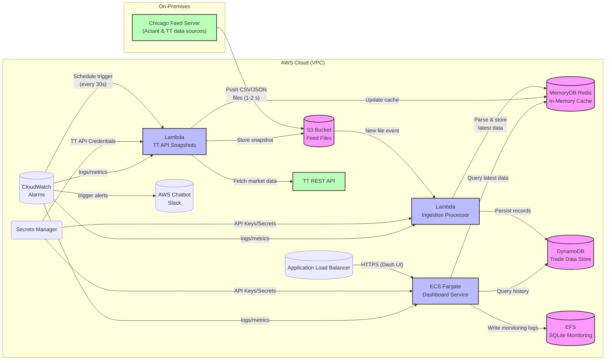

# Enhanced Architecture Diagram

## Key Enhancements:
1. **EFS for SQLite**: Shows where monitoring logs are stored persistently
2. **TT API Lambda**: Separate Lambda for scheduled TT snapshots (satisfies CTO requirement)
3. **Clear data flow**: No direct ECS → TT API connection
4. **CloudWatch scheduling**: Shows how TT snapshots are triggered 