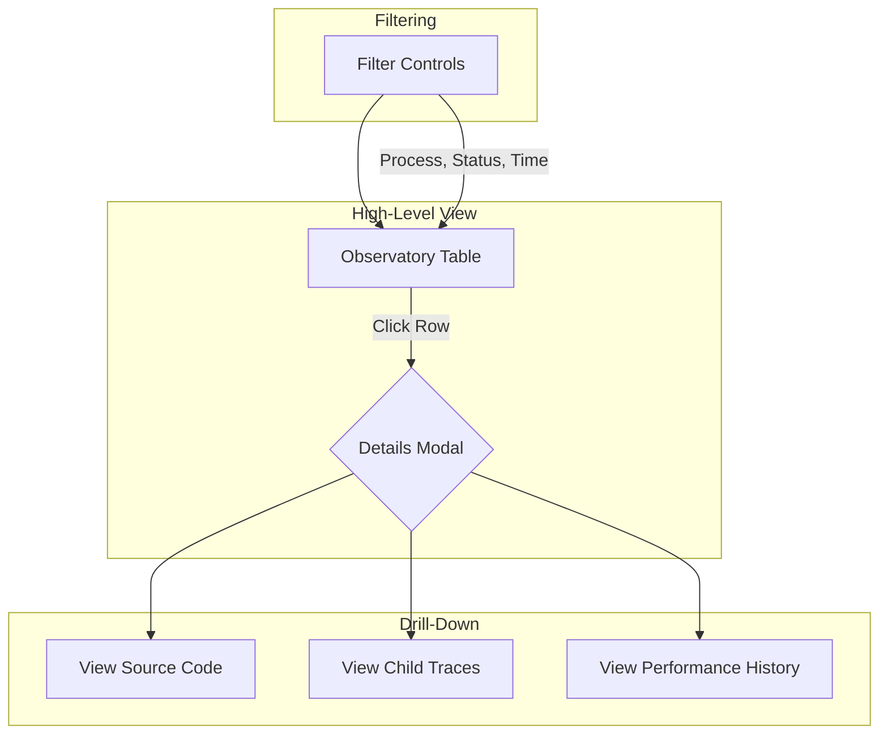
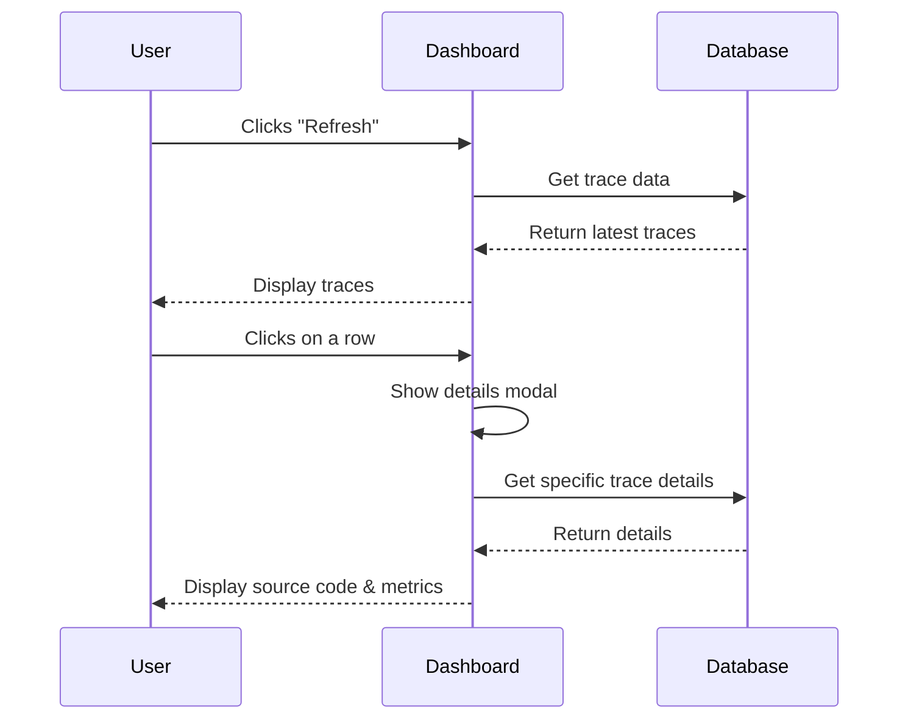

# Observatory Dashboard - Architecture Brainstorm

*This document stores conceptual diagrams brainstormed for the future evolution of the Observatory Dashboard. These are not final designs but represent architectural ideas for features like filtering, drill-downs, and data flow.*

## Filtering & Drill-Down Architecture



## Technical Architecture

```mermaid
graph TD
    subgraph "Frontend (Dash)"
        A[Dashboard UI] -->|HTTP Request| B[DataService]
    end

    subgraph "Backend (Python)"
        C[@monitor Decorator] --> D[ObservatoryQueue]
        D --> E[BatchWriter]
        E --> F[SQLite Database]
        B --> F
    end

    subgraph "Data Flow"
        C -- "Captures data" --> D
        D -- "Buffers data" --> E
        E -- "Writes data" --> F
        B -- "Queries data" --> F
    end
```

## User Journey Flow

